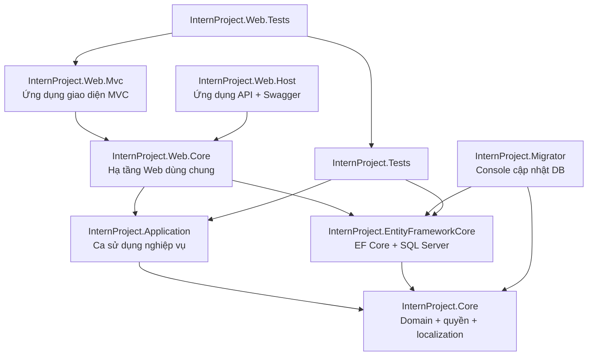
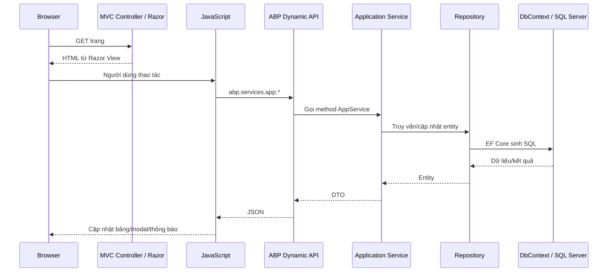
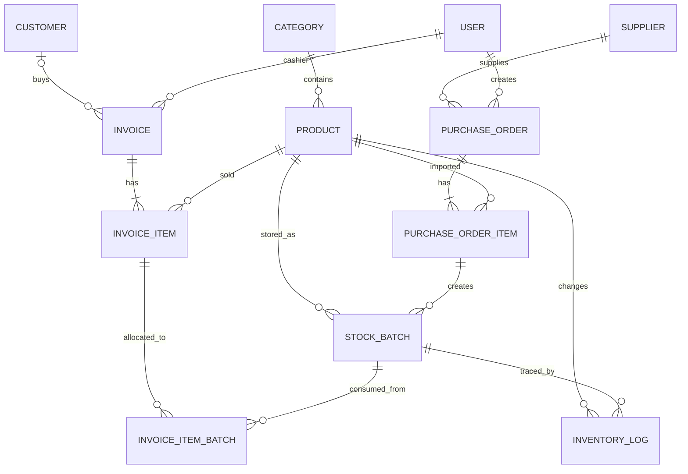
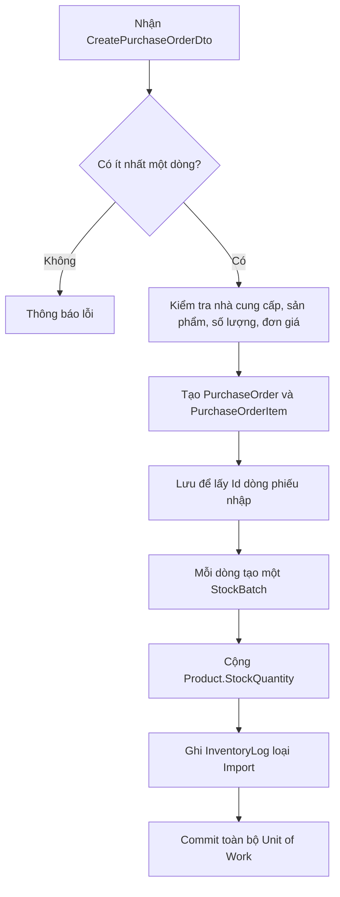
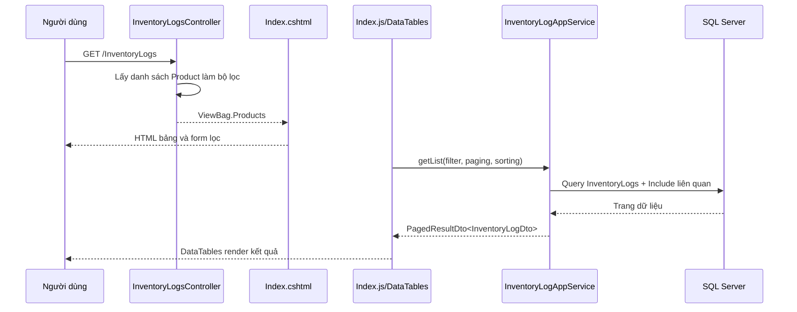

# Tài liệu đọc hiểu kiến trúc và ôn phản biện dự án Quản Lý Tạp Hóa

> Tài liệu này được viết dựa trực tiếp trên cấu trúc và mã nguồn hiện tại của solution `InternProject`.
> Mục tiêu là giúp người đọc hiểu dự án đang dùng công nghệ gì, mỗi thư mục làm gì, dữ liệu chạy qua các tầng như thế nào và có thể trả lời các câu hỏi phản biện phổ biến.

## 1. Giới thiệu ngắn gọn về dự án

Dự án là hệ thống quản lý cửa hàng tạp hóa, hỗ trợ các nhóm chức năng chính:

- Quản lý người dùng và phân quyền.
- Quản lý khách hàng.
- Quản lý nhà cung cấp.
- Quản lý danh mục và sản phẩm.
- Lập phiếu nhập hàng.
- Quản lý hàng tồn theo từng lô và hạn sử dụng.
- Bán hàng và lập hóa đơn.
- Hủy hóa đơn và hoàn kho đúng lô.
- Hủy hàng hết hạn.
- Ghi sổ lịch sử nhập, xuất và hủy kho.
- Báo cáo doanh thu, giá vốn, lợi nhuận, tồn kho và sản phẩm bán chạy.

Hệ thống không chỉ lưu tổng số lượng tồn của sản phẩm mà còn quản lý từng lô hàng. Nhờ đó hệ thống biết một sản phẩm được nhập với giá nào, còn bao nhiêu, hạn sử dụng khi nào và khi bán đã lấy hàng từ lô nào.

### Bài giới thiệu khoảng một phút

> Đề tài của em là hệ thống quản lý cửa hàng tạp hóa được xây dựng bằng ASP.NET Core trên .NET 9, sử dụng ASP.NET Boilerplate để tổ chức kiến trúc phân tầng, phân quyền, Unit of Work và Repository. Giao diện được xây dựng bằng ASP.NET Core MVC, Razor, jQuery, Bootstrap, AdminLTE và DataTables. Dữ liệu được truy cập bằng Entity Framework Core và lưu trên SQL Server. Điểm chính trong nghiệp vụ là hệ thống quản lý tồn kho theo từng lô, xuất kho theo FEFO, lưu giá vốn thực tế của lô đã bán, ghi nhật ký mọi biến động kho và sử dụng transaction mức Serializable cho các thao tác nhạy cảm như nhập hàng, bán hàng, hủy hóa đơn và hủy lô.

## 2. Những khái niệm phải phân biệt

### 2.1 Solution là gì?

`InternProject.sln` là solution của Visual Studio/.NET. Solution là một “hộp chứa” nhiều project có liên quan với nhau.

Solution không trực tiếp chứa logic nghiệp vụ. Nó giúp:

- Quản lý nhiều project cùng lúc.
- Khai báo cấu hình build.
- Thể hiện quan hệ tham chiếu giữa các project.
- Build và test toàn bộ hệ thống bằng một lệnh.

### 2.2 Project là gì?

Mỗi file `.csproj` đại diện cho một project .NET. Một project thường có trách nhiệm riêng, ví dụ:

- `InternProject.Core`: mô hình miền và thành phần cốt lõi.
- `InternProject.Application`: các ca sử dụng và nghiệp vụ ứng dụng.
- `InternProject.EntityFrameworkCore`: ánh xạ và truy cập cơ sở dữ liệu.
- `InternProject.Web.Mvc`: giao diện web MVC.

Khi build, mỗi class library tạo ra một assembly `.dll`; project chạy được như Web hoặc Migrator tạo ra chương trình có entry point.

### 2.3 “Application” có thể mang ba nghĩa

Đây là điểm dễ bị nhầm:

1. **Application theo nghĩa thông thường**: toàn bộ phần mềm quản lý tạp hóa.
2. **Project `InternProject.Application`**: tầng điều phối các ca sử dụng nghiệp vụ.
3. **Application Service**: một class cụ thể như `InvoiceAppService`, `ProductAppService` hoặc `ReportsAppService`.

Project `InternProject.Application` là class library, không phải chương trình chạy độc lập.

### 2.4 Framework và library khác nhau thế nào?

- **Library** là thư viện mà code của mình chủ động gọi.
- **Framework** cung cấp bộ khung và gọi ngược vào code của mình theo quy ước.

Ví dụ ABP quét các `AppService`, đăng ký Dependency Injection, mở transaction, kiểm tra quyền và tạo API động. Đây là đặc điểm của framework.

### 2.5 MVC là gì?

MVC viết tắt của Model – View – Controller:

- **Model**: dữ liệu dùng cho màn hình, trong dự án thường là DTO hoặc ViewModel.
- **View**: file Razor `.cshtml`, chịu trách nhiệm sinh HTML.
- **Controller**: nhận request của trình duyệt, chuẩn bị dữ liệu cho View và trả về View/PartialView/JSON.

Trong dự án này, nghiệp vụ chính không đặt trong MVC Controller. Controller chủ yếu phục vụ trang và modal; nghiệp vụ được đưa xuống Application Service.

Ví dụ màn hình sản phẩm:

- `ProductsController.Index()` lấy danh sách danh mục cần thiết cho trang.
- `Views/Products/Index.cshtml` tạo cấu trúc HTML.
- `wwwroot/view-resources/Views/Products/Index.js` gọi API động.
- `ProductAppService` thực hiện truy vấn, kiểm tra dữ liệu và cập nhật sản phẩm.

## 3. Kiến trúc tổng thể

Dự án sử dụng **kiến trúc phân tầng dựa trên ASP.NET Boilerplate**, có ảnh hưởng từ Domain-Driven Design nhưng không nên gọi là Clean Architecture thuần túy.

Lý do không gọi là Clean Architecture thuần túy: project `Web.Core` tham chiếu cả `Application` và `EntityFrameworkCore` để ghép các tầng tại runtime. Đây là cấu trúc tiêu chuẩn của template ASP.NET Boilerplate.

### 3.1 Luồng phụ thuộc giữa các project



Nguyên tắc quan trọng:

- Core không phụ thuộc Web.
- Application không phụ thuộc MVC hoặc EF Core cụ thể.
- EF Core phụ thuộc Core để ánh xạ entity.
- Web là tầng ngoài cùng, ghép Application và EF Core để chạy.

### 3.2 Luồng dữ liệu từ trình duyệt đến database



`InternProjectWebCoreModule` gọi `CreateControllersForAppServices(...)`. Vì vậy ABP tự biến Application Service thành endpoint HTTP và sinh JavaScript proxy như:

```javascript
abp.services.app.product.getList(...)
abp.services.app.invoice.create(...)
abp.services.app.inventoryLog.getList(...)
```

Lợi ích là JavaScript không phải tự viết URL, HTTP method và xử lý cấu trúc phản hồi cho từng API.

## 4. Stack công nghệ đang áp dụng

### 4.1 Backend

| Công nghệ | Phiên bản trong project | Vai trò |
|---|---:|---|
| .NET | 9.0 | Nền tảng chạy backend |
| C# | Theo .NET 9; một số Web project đặt `LangVersion 7.2` | Ngôn ngữ backend |
| ASP.NET Core MVC | 9.0 | Controller, Razor View, routing, middleware |
| ASP.NET Boilerplate | 10.2.0 | Module, DI, Repository, UoW, authorization, localization, auditing |
| ABP Zero | 10.2.0 | User, Role, Tenant, Permission và Identity |
| Entity Framework Core | 9.0.5 | ORM và LINQ truy cập dữ liệu |
| EF Core SQL Server | 9.0.5 | Provider kết nối SQL Server |
| AutoMapper qua ABP | 10.2.0 | Chuyển Entity ↔ DTO |
| ASP.NET Core Identity | Theo ASP.NET Core/ABP | Đăng nhập, người dùng, vai trò |
| JWT Bearer | 9.0.5 | Xác thực API bằng token |
| Swagger/Swashbuckle | 8.1.2 | Tài liệu và thử API ở Web.Host |
| SignalR | ABP SignalR + Microsoft SignalR | Hạ tầng thông báo thời gian thực |
| Castle Windsor | Qua ABP | IoC container/Dependency Injection |
| Log4Net | Qua ABP | Ghi log ứng dụng |

Lưu ý khi phản biện: dự án dùng **ASP.NET Boilerplate cổ điển**, nhận biết qua package namespace `Abp.*`. Nó không phải “ABP Framework mới” có namespace `Volo.Abp.*`.

### 4.2 Frontend

| Công nghệ | Phiên bản | Vai trò |
|---|---:|---|
| Razor View | ASP.NET Core 9 | Sinh HTML phía server |
| jQuery | 3.7.1 | DOM, event và AJAX |
| Bootstrap | 5.3.3 | Grid, form, modal và responsive UI |
| AdminLTE | 3.2.0 | Giao diện quản trị |
| DataTables | 2.2.2 | Bảng dữ liệu, phân trang, sắp xếp, lọc |
| Chart.js | 4.4.8 | Biểu đồ báo cáo |
| Font Awesome | 5.15.3 | Icon |
| jQuery Validation | 1.21.0 | Kiểm tra form phía client |
| SweetAlert | 2.1.2 | Hộp thoại xác nhận |
| Toastr | 2.1.4 | Thông báo nhanh |
| Moment/Timezone | 2.30.1/0.5.47 | Xử lý ngày giờ phía client |

### 4.3 Công cụ build frontend

- Yarn quản lý package frontend qua `package.json` và `yarn.lock`.
- Gulp thực hiện ghép, xử lý và minify tài nguyên.
- `bundleconfig.json` tạo các file `Index.min.js`, `Create.min.js` cho môi trường Staging/Production.
- ESLint kiểm tra JavaScript.
- Prettier định dạng code frontend.

Điểm cần nhớ: môi trường Development thường tải file `.js`; Staging/Production tải file `.min.js`. Sau khi sửa JavaScript phải build lại bundle trước khi deploy production.

### 4.4 Kiểm thử

| Công nghệ | Vai trò |
|---|---|
| xUnit 2.9.3 | Framework viết test |
| Shouldly 4.3.0 | Assertion dễ đọc |
| NSubstitute 5.3.0 | Tạo mock/substitute |
| EF Core InMemory 9.0.5 | Database trong bộ nhớ khi test |
| ABP TestBase | Khởi tạo module và DI cho integration test |
| AngleSharp | Hỗ trợ kiểm tra HTML trong Web Tests |

Test nghiệp vụ hiện có tập trung vào khách hàng và kiểm tra hóa đơn có dòng sản phẩm trùng không được bán vượt tồn.

## 5. Cấu trúc thư mục gốc

```text
QuanLyTapHoa/
├── InternProject.sln
├── src/
│   ├── InternProject.Core/
│   ├── InternProject.Application/
│   ├── InternProject.EntityFrameworkCore/
│   ├── InternProject.Web.Core/
│   ├── InternProject.Web.Mvc/
│   ├── InternProject.Web.Host/
│   └── InternProject.Migrator/
├── test/
│   ├── InternProject.Tests/
│   └── InternProject.Web.Tests/
├── build/
├── docker/
└── .github/
```

### Ý nghĩa các thư mục gốc

- `src`: mã nguồn chạy thật.
- `test`: mã nguồn kiểm thử.
- `build`: script/cấu hình hỗ trợ build.
- `docker`: cấu hình chạy bằng container.
- `.github`: workflow hoặc cấu hình liên quan GitHub.
- `.git`: lịch sử Git, không phải code nghiệp vụ.
- `.vs`: dữ liệu cục bộ của Visual Studio, không phải thành phần hệ thống.

## 6. Vai trò từng project

### 6.1 `InternProject.Core`

Đây là tầng cốt lõi. Nó chứa các khái niệm ổn định nhất của hệ thống:

```text
InternProject.Core/
├── Grocery/                 Entity và enum nghiệp vụ tạp hóa
├── Authorization/           Permission, Role, User
├── MultiTenancy/            Tenant và cấu hình đa tenant
├── Localization/            Chuỗi đa ngôn ngữ
├── Configuration/           Setting provider
├── Timing/                  Cấu hình thời gian
├── InternProjectConsts.cs   Hằng số dùng chung
└── InternProjectCoreModule.cs
```

`Grocery` là phần domain quan trọng nhất của đề tài. Nó chứa `Product`, `StockBatch`, `Invoice`, `PurchaseOrder`, `InventoryLog`...

`InternProjectCoreModule` thực hiện:

- Khai báo các entity User/Role/Tenant cho ABP Zero.
- Cấu hình localization.
- Cấu hình multi-tenancy.
- Cấu hình role và setting.
- Đăng ký các class vào IoC container theo convention.

`InternProjectConsts.MultiTenancyEnabled = false`, nghĩa là phiên bản hiện tại vận hành như một cửa hàng/hệ thống đơn tenant, dù template vẫn giữ sẵn hạ tầng Tenant.

### 6.2 `InternProject.Application`

Đây là tầng chứa các **ca sử dụng** của hệ thống.

```text
InternProject.Application/
├── Grocery/
│   ├── Categories/
│   ├── Customers/
│   ├── Suppliers/
│   ├── Products/
│   ├── PurchaseOrders/
│   ├── StockBatches/
│   ├── Invoices/
│   ├── InventoryLogs/
│   └── Reports/
├── Users/
├── Roles/
├── Sessions/
├── MultiTenancy/
├── Authorization/
├── InternProjectAppServiceBase.cs
└── InternProjectApplicationModule.cs
```

Mỗi module thường có:

- Interface, ví dụ `IInvoiceAppService`.
- Class thực thi, ví dụ `InvoiceAppService`.
- Thư mục `Dto` chứa dữ liệu vào/ra.

Application Service chịu trách nhiệm:

- Kiểm tra quyền.
- Validate dữ liệu theo nghiệp vụ.
- Điều phối nhiều Repository.
- Mở Unit of Work/transaction.
- Tạo hoặc cập nhật nhiều entity trong cùng một ca sử dụng.
- Chuyển entity sang DTO để trả về ngoài.

Không nên đặt HTML, Razor hoặc thao tác DOM trong tầng này.

### 6.3 `InternProject.EntityFrameworkCore`

Đây là tầng hạ tầng dữ liệu:

```text
InternProject.EntityFrameworkCore/
├── EntityFrameworkCore/
│   ├── InternProjectDbContext.cs
│   ├── InternProjectDbContextConfigurer.cs
│   ├── InternProjectDbContextFactory.cs
│   ├── InternProjectEntityFrameworkModule.cs
│   └── Seed/
└── Migrations/
```

Vai trò:

- Khai báo các `DbSet`.
- Ánh xạ entity với bảng bằng Fluent API.
- Khai báo precision, index, khóa ngoại và hành vi xóa.
- Cấu hình SQL Server.
- Chứa migration thay đổi schema.
- Seed dữ liệu ban đầu.

`InternProjectDbContext` kế thừa `AbpZeroDbContext`, nên database chứa cả bảng nghiệp vụ tạp hóa và bảng hệ thống của ABP như User, Role, Permission, Setting, AuditLog...

### 6.4 `InternProject.Web.Core`

Đây là hạ tầng Web dùng chung cho cả MVC và API Host.

Vai trò chính:

- Tham chiếu Application và EntityFrameworkCore để ghép hệ thống.
- Cấu hình connection string cho ABP.
- Tạo API Controller động cho Application Service.
- Cấu hình JWT.
- Cung cấp controller nền, authentication và các tài nguyên dùng chung.
- Tích hợp SignalR.

`InternProjectControllerBase` kế thừa `AbpController`, nhờ đó MVC Controller dùng được localization `L(...)`, Logger, PermissionChecker và các dịch vụ ABP.

### 6.5 `InternProject.Web.Mvc`

Đây là **ứng dụng giao diện chính** mà người dùng cửa hàng thao tác.

```text
InternProject.Web.Mvc/
├── Controllers/             MVC Controller
├── Views/                   Razor View và Partial View
├── Models/                  ViewModel của giao diện
├── Startup/                 Startup, module, navigation, page name
├── wwwroot/
│   ├── view-resources/      JavaScript/CSS theo từng màn hình
│   ├── dist/                Theme và asset build
│   ├── libs/                Thư viện frontend
│   └── uploads/products/    Ảnh sản phẩm upload
├── appsettings.json
├── package.json
├── yarn.lock
└── bundleconfig.json
```

Controller MVC chủ yếu trả View và chuẩn bị lookup data. JavaScript trên View gọi Application Service thông qua ABP proxy để lấy dữ liệu JSON và cập nhật màn hình.

`Startup` cấu hình:

- MVC và Razor.
- Anti-forgery token.
- Identity và authentication.
- SignalR.
- Static files.
- Routing.
- Authorization.
- Log4Net.
- ABP module `InternProjectWebMvcModule`.

`InternProjectNavigationProvider` tạo menu và gắn permission cho từng mục. Người không có quyền sẽ không thấy hoặc không truy cập được chức năng tương ứng.

### 6.6 `InternProject.Web.Host`

Đây là ứng dụng host thiên về API:

- Chạy các API động của Application Service.
- Cấu hình CORS cho client khác domain.
- Cung cấp Swagger tại `/swagger`.
- Hỗ trợ JWT Bearer.
- Có thể phục vụ frontend khác như SPA hoặc mobile app.

Phân biệt:

- `Web.Mvc`: có Razor View, là giao diện quản trị đang sử dụng.
- `Web.Host`: tập trung vào API và Swagger.

Hai project đều phụ thuộc `Web.Core`, vì `Web.Core` chứa hạ tầng web dùng chung.

### 6.7 `InternProject.Migrator`

Đây là console application dùng để:

- Đọc connection string.
- Chạy migration.
- Cập nhật database lên schema mới nhất.
- Seed dữ liệu cần thiết.

Tách Migrator ra giúp cập nhật database mà không cần mở giao diện web.

### 6.8 Các project test

#### `InternProject.Tests`

Kiểm thử tầng Application và EntityFrameworkCore. Test khởi tạo ABP module, DI và EF Core InMemory để gọi Application Service gần giống khi chạy thật.

#### `InternProject.Web.Tests`

Kiểm thử phần Web MVC, có tham chiếu `Web.Mvc` và dùng AngleSharp khi cần phân tích HTML.

## 7. Các thành phần cốt lõi trong ABP

### 7.1 Module và `[DependsOn]`

Mỗi tầng có một class kế thừa `AbpModule`. Thuộc tính `[DependsOn]` khai báo module nào phải được khởi tạo trước.

Ba giai đoạn chính:

- `PreInitialize`: cấu hình framework trước khi đăng ký hoàn tất.
- `Initialize`: đăng ký dependency theo convention.
- `PostInitialize`: chạy tác vụ sau khi module đã sẵn sàng, ví dụ seed database.

### 7.2 Dependency Injection

Dependency Injection là truyền dependency từ bên ngoài thay vì tự `new` bên trong class.

Ví dụ:

```csharp
public InvoiceAppService(
    IRepository<Invoice, Guid> invoiceRepository,
    IRepository<Product, Guid> productRepository,
    IRepository<InventoryLog, Guid> inventoryLogRepository,
    IRepository<StockBatch, Guid> stockBatchRepository)
```

Lợi ích:

- Giảm phụ thuộc cứng.
- Dễ thay thế implementation.
- Dễ test.
- Vòng đời object do container quản lý.

ABP/Castle Windsor tự đăng ký nhiều class theo quy ước, nên không cần cấu hình thủ công từng AppService.

### 7.3 Repository

Repository là lớp trừu tượng hóa truy cập dữ liệu.

Ví dụ `IRepository<Product, Guid>` cung cấp:

- `GetAll()` để bắt đầu LINQ query.
- `GetAsync()` hoặc `FirstOrDefaultAsync()` để lấy entity.
- `InsertAsync()`.
- `UpdateAsync()`.
- `DeleteAsync()`.

Application Service không cần trực tiếp viết SQL hoặc tự tạo `DbContext`.

### 7.4 Unit of Work và transaction

Unit of Work gom nhiều thao tác database thành một đơn vị công việc.

Nếu một bước lỗi, transaction rollback để tránh trạng thái nửa thành công, ví dụ đã tạo hóa đơn nhưng chưa trừ kho.

Các nghiệp vụ nhạy cảm được đánh dấu:

```csharp
[UnitOfWork(IsolationLevel.Serializable)]
```

Mức `Serializable` được sử dụng ở:

- Tạo phiếu nhập.
- Tạo hóa đơn.
- Hủy hóa đơn.
- Hủy hàng hết hạn.

Mục đích chính là hạn chế race condition khi nhiều người cùng thay đổi tồn kho.

### 7.5 Entity

Entity là đối tượng có định danh và vòng đời trong domain. Các entity nghiệp vụ dùng `Guid` làm khóa chính và kế thừa `FullAuditedEntity<Guid>`.

Ngoài thuộc tính nghiệp vụ, `FullAuditedEntity` cung cấp:

- `Id`.
- `CreationTime`, `CreatorUserId`.
- `LastModificationTime`, `LastModifierUserId`.
- `IsDeleted`, `DeletionTime`, `DeleterUserId`.

Nhờ `IsDeleted`, nhiều thao tác xóa là soft delete: dữ liệu không mất vật lý nhưng mặc định bị query filter ẩn đi.

### 7.6 DTO

DTO là Data Transfer Object, dùng để truyền dữ liệu qua biên Application/API.

Không trả entity trực tiếp vì:

- Tránh lộ toàn bộ cấu trúc database.
- Kiểm soát field client được gửi và nhận.
- Tránh vòng lặp navigation property khi serialize.
- Có validation riêng cho từng ca sử dụng.
- Giữ API ổn định hơn khi entity thay đổi.

Ví dụ:

- `CreateInvoiceDto`: dữ liệu client gửi để lập hóa đơn.
- `InvoiceDto`: dữ liệu server trả về.
- `PagedInvoiceResultRequestDto`: điều kiện lọc, sort và phân trang.

### 7.7 AutoMapper

Các attribute như `[AutoMapTo]` và `[AutoMapFrom]` giúp chuyển object có field cùng tên:

```text
CreateProductDto → Product
Product → ProductDto
```

Trường hợp DTO cần dữ liệu tổng hợp từ nhiều navigation property, code có thể map thủ công như `PurchaseOrderAppService.MapToDto()`.

### 7.8 Authorization và Permission

Quyền được khai báo trong `PermissionNames`, ví dụ:

```text
Pages.Products
Pages.Products.Create
Pages.Products.Edit
Pages.Products.Delete
```

Bảo vệ được thực hiện nhiều lớp:

- Menu chỉ hiện khi có permission.
- MVC Controller dùng `[AbpMvcAuthorize]`.
- Application Service dùng `[AbpAuthorize]`.
- Method nhạy cảm dùng quyền chi tiết Create/Edit/Delete/Cancel/Dispose.

Không nên chỉ ẩn nút trên giao diện vì người dùng vẫn có thể tự gọi API. Kiểm tra quyền ở server mới là lớp bảo vệ quyết định.

### 7.9 Localization

Localization tách chuỗi hiển thị ra file XML:

- `InternProject.xml`: tiếng Anh.
- `InternProject-vi.xml`: tiếng Việt.

Code gọi `L("Products")` thay vì viết cứng chuỗi. Điều này giúp đổi ngôn ngữ và quản lý thông báo tập trung.

## 8. Mô hình dữ liệu nghiệp vụ

### 8.1 Các entity chính

| Entity | Ý nghĩa |
|---|---|
| `Category` | Danh mục sản phẩm |
| `Product` | Thông tin sản phẩm và tổng tồn đọc nhanh |
| `Customer` | Khách mua hàng |
| `Supplier` | Nhà cung cấp |
| `PurchaseOrder` | Phiếu nhập hàng |
| `PurchaseOrderItem` | Dòng sản phẩm trong phiếu nhập |
| `StockBatch` | Một lô tồn kho có giá nhập, số lượng và hạn dùng riêng |
| `Invoice` | Hóa đơn bán hàng |
| `InvoiceItem` | Dòng sản phẩm trên hóa đơn |
| `InvoiceItemBatch` | Phân bổ dòng bán hàng vào các lô đã xuất |
| `InventoryLog` | Sổ lịch sử biến động tồn kho |

### 8.2 Quan hệ chính



### 8.3 Vì sao cần cả `Product.StockQuantity` và `StockBatch.RemainingQuantity`?

- `StockBatch.RemainingQuantity` là dữ liệu chi tiết theo lô.
- `Product.StockQuantity` là tổng tồn được lưu sẵn để màn hình sản phẩm và POS đọc nhanh.

Đây là một dạng denormalization có kiểm soát. Đổi lại hiệu năng đọc tốt hơn, hệ thống phải cập nhật cả hai trong cùng transaction để tránh lệch dữ liệu.

Công thức kiểm tra tính nhất quán:

```text
Product.StockQuantity
= Tổng StockBatch.RemainingQuantity của sản phẩm
```

### 8.4 Vì sao `InvoiceItem` lưu lại tên, SKU và đơn giá?

Đó là snapshot tại thời điểm bán. Nếu sau này sản phẩm đổi tên hoặc đổi giá, hóa đơn lịch sử vẫn phải thể hiện đúng thông tin khi giao dịch xảy ra.

### 8.5 Vì sao cần `InvoiceItemBatch`?

Một dòng hóa đơn có thể lấy hàng từ nhiều lô. Bảng này lưu:

- Dòng hóa đơn nào.
- Lấy từ lô nào.
- Số lượng bao nhiêu.
- Giá vốn tại thời điểm xuất.

Nhờ đó:

- Tính lợi nhuận chính xác.
- Hủy hóa đơn và hoàn đúng lô.
- Truy vết nguồn gốc hàng đã bán.

### 8.6 Vai trò hiện tại của `Product.CostPrice`

Giá vốn thực tế nằm ở `StockBatch.ImportPrice` và được chụp sang `InvoiceItemBatch.CostPrice` khi bán.

`Product.CostPrice` hiện được giữ để:

- Tương thích dữ liệu cũ.
- Là giá dự phòng trong báo cáo nếu hóa đơn cũ chưa có thông tin lô.
- Hỗ trợ seed dữ liệu/lô ban đầu.

Trường này đã được ẩn khỏi form tạo và sửa sản phẩm, không phải nguồn giá vốn chính của giao dịch mới.

### 8.7 Index và ràng buộc đáng chú ý

- `Customer.Code`: unique khi khác null.
- `Customer.Phone`: unique khi khác null.
- `Category.Name`: unique.
- `Supplier.Code`: unique.
- `Product.Sku`: unique khi khác null.
- `Invoice.InvoiceNumber`: unique.
- `PurchaseOrder.OrderNumber`: unique.
- Các trường tiền dùng `decimal(18,2)` để tránh sai số của `float/double`.

### 8.8 Cascade và Restrict

- Xóa `Invoice` sẽ cascade xuống `InvoiceItem`.
- Xóa `InvoiceItem` sẽ cascade xuống `InvoiceItemBatch`.
- Nhiều quan hệ với Product, Supplier, User và StockBatch dùng `Restrict` để không xóa nhầm dữ liệu đã tham gia giao dịch.

## 9. Các module nghiệp vụ

### 9.1 Danh mục sản phẩm

`CategoryAppService` hỗ trợ:

- Danh sách có tìm kiếm, lọc, sort, phân trang.
- Tạo và cập nhật danh mục.
- Kiểm tra tên trùng.
- Xóa/khóa theo quy tắc nghiệp vụ.
- Thống kê số danh mục và sản phẩm liên quan.

### 9.2 Sản phẩm

`ProductAppService` hỗ trợ:

- CRUD thông tin sản phẩm.
- Lọc theo từ khóa, danh mục và trạng thái.
- Kiểm tra SKU trùng.
- Không cho sửa tồn kho trực tiếp từ form sản phẩm.
- Không cho sửa giá vốn trực tiếp từ form/API cập nhật.
- Sản phẩm mới bắt đầu với tồn bằng 0.
- Nếu đã có giao dịch thì thao tác xóa chuyển sang ngừng hoạt động thay vì làm mất lịch sử.

Tồn kho chỉ nên thay đổi qua nghiệp vụ nhập hàng, bán hàng, hủy hóa đơn hoặc hủy lô.

### 9.3 Khách hàng

`CustomerAppService` quản lý khách hàng và chuẩn hóa dữ liệu đầu vào. Số điện thoại được trim và kiểm tra trùng ở tầng ứng dụng, đồng thời database có unique index để bảo vệ ở lớp cuối.

Hóa đơn cho phép `CustomerId` null, tức là có thể bán cho khách lẻ không cần lưu hồ sơ khách hàng.

### 9.4 Nhà cung cấp

`SupplierAppService` quản lý mã, tên, số điện thoại, email, địa chỉ, người liên hệ và trạng thái nhà cung cấp.

Nhà cung cấp liên kết với phiếu nhập, lô tồn kho và sổ kho để truy vết nguồn hàng.

### 9.5 Nhập hàng

Luồng tạo phiếu nhập trong `PurchaseOrderAppService`:



Mỗi dòng nhập lưu:

- Sản phẩm.
- Số lượng.
- Đơn giá nhập.
- Thành tiền.
- Mã lô.
- Hạn sử dụng.

Nếu người dùng không nhập mã lô, hệ thống tự sinh mã dựa trên số phiếu nhập và sản phẩm.

### 9.6 Bán hàng

Luồng tạo hóa đơn trong `InvoiceAppService`:

1. Kiểm tra hóa đơn có dòng hàng.
2. Kiểm tra phương thức thanh toán.
3. Kiểm tra số lượng dương.
4. Gộp các dòng trùng sản phẩm trước khi kiểm tra tồn.
5. Tải sản phẩm và các lô còn tồn.
6. Kiểm tra sản phẩm đang hoạt động.
7. Phân biệt thiếu tổng tồn và thiếu hàng còn hạn.
8. Lấy giá bán từ server, không tin giá do client gửi.
9. Kiểm tra số tiền khách đưa.
10. Tạo Invoice và InvoiceItem snapshot.
11. Xuất kho theo FEFO.
12. Lưu `InvoiceItemBatch` với giá vốn thực tế.
13. Trừ tồn lô và tổng tồn sản phẩm.
14. Ghi một `InventoryLog` cho mỗi lô bị xuất.
15. Commit transaction.

#### FEFO là gì?

FEFO là First Expired, First Out: lô có hạn sử dụng gần nhất được xuất trước.

Hệ thống sắp xếp:

- Lô có hạn sử dụng lên trước.
- Hạn gần nhất trước.
- Lô không có hạn sử dụng xuống sau.
- Không xuất lô đã hết hạn.

FEFO phù hợp hàng tạp hóa hơn FIFO thuần túy vì giảm nguy cơ hàng hết hạn trong kho.

### 9.7 Hủy hóa đơn

Hóa đơn không bị xóa. Hệ thống:

- Chỉ cho hủy hóa đơn chưa hủy.
- Chỉ cho hủy trong vòng 24 giờ.
- Chuyển trạng thái sang `Cancelled`.
- Lưu lý do hủy.
- Đọc `InvoiceItemBatch` để hoàn đúng số lượng vào đúng lô.
- Cộng lại tổng tồn sản phẩm.
- Ghi log nhập hoàn kho.

Giữ hóa đơn đã hủy giúp audit và báo cáo minh bạch hơn so với xóa vật lý.

### 9.8 Quản lý lô và hủy hàng hết hạn

`StockBatchAppService.DisposeBatchAsync()`:

- Chỉ cho hủy lô đã hết hạn.
- Không cho hủy quá số lượng còn lại.
- Có thể hủy một phần hoặc toàn bộ lô.
- Trừ `StockBatch.RemainingQuantity`.
- Trừ `Product.StockQuantity`.
- Không xóa bản ghi lô.
- Ghi `InventoryLog` loại `Dispose` cùng lý do.

### 9.9 Sổ kho

`InventoryLog` là audit trail nghiệp vụ cho biến động hàng hóa.

Các loại:

| Loại | Ý nghĩa |
|---|---|
| `Import` | Nhập hàng hoặc hoàn kho |
| `Export` | Bán/xuất hàng |
| `Dispose` | Hủy hàng hết hạn |
| `Adjust` | Dự phòng cho nghiệp vụ điều chỉnh kho |

Mỗi log có thể lưu sản phẩm, người thao tác, số lượng biến động, tồn sau biến động, lô, hạn dùng, nhà cung cấp, chứng từ tham chiếu và ghi chú.

`InventoryLogAppService` dùng `IgnoreQueryFilters()` để vẫn xem được lịch sử của sản phẩm đã bị soft delete/ngừng sử dụng.

### 9.10 Báo cáo

`ReportsAppService` cung cấp:

- Dashboard hôm nay.
- Doanh thu và lợi nhuận theo khoảng ngày.
- Biểu đồ theo ngày hoặc tháng.
- Tồn kho và giá trị tồn.
- Cảnh báo lô gần hết hạn/đã hết hạn.
- Top sản phẩm theo số lượng, doanh thu hoặc lợi nhuận.

Công thức chính:

```text
Doanh thu = Tổng TotalAmount của hóa đơn Completed

Giá vốn = Tổng (số lượng xuất từ lô × giá nhập của lô)

Lợi nhuận = Doanh thu - Giá vốn

Biên lợi nhuận (%) = Lợi nhuận / Doanh thu × 100

Giá trị tồn kho = Tổng (số lượng còn lại từng lô × giá nhập từng lô)
```

Hóa đơn `Cancelled` không được tính vào doanh thu và top bán chạy.

`AsNoTracking()` được dùng cho nhiều truy vấn báo cáo vì dữ liệu chỉ đọc, giúp giảm chi phí tracking của EF Core.

## 10. Luồng cụ thể của màn hình Nhật ký kho

Đây là luồng liên quan trực tiếp tới `Views/InventoryLogs/Index.cshtml`:



Khi người dùng thay đổi từ khóa, sản phẩm, loại log hoặc ngày, JavaScript reload DataTables. Server thực hiện lọc và phân trang, vì vậy không cần tải toàn bộ lịch sử kho về trình duyệt.

## 11. Cách Entity Framework Core làm việc trong dự án

### 11.1 `DbSet`

Mỗi `DbSet<T>` đại diện cho tập entity có thể truy vấn/cập nhật:

```csharp
public DbSet<Product> Products { get; set; }
public DbSet<StockBatch> StockBatches { get; set; }
public DbSet<Invoice> Invoices { get; set; }
```

### 11.2 LINQ thành SQL

Ví dụ:

```csharp
_productRepository.GetAll()
    .Where(x => x.IsActive)
    .OrderBy(x => x.Name)
    .Skip(input.SkipCount)
    .Take(input.MaxResultCount)
```

EF Core dịch biểu thức LINQ này thành SQL có `WHERE`, `ORDER BY`, `OFFSET` và `FETCH`.

### 11.3 `Include`

`Include` tải navigation property cần dùng, ví dụ hóa đơn kèm khách hàng và thu ngân. Nếu không Include hoặc không project trực tiếp trong query, navigation data có thể không sẵn sàng sau khi query kết thúc.

### 11.4 Migration

Migration là lịch sử thay đổi schema có kiểm soát.

Các migration nghiệp vụ quan trọng:

- Khởi tạo quản lý bán hàng.
- Cập nhật cấu trúc hóa đơn và sổ kho.
- Thêm `StockBatch` và `InvoiceItemBatch`.
- Thêm unique index cho số điện thoại khách hàng.

Model snapshot thể hiện schema EF Core mong đợi ở thời điểm hiện tại.

### 11.5 Seed

`InitialGroceryDbBuilder` tạo dữ liệu mẫu như danh mục, sản phẩm, khách hàng, nhà cung cấp, lô ban đầu và phiếu nhập mẫu.

Seed có kiểm tra dữ liệu đã tồn tại để hạn chế tạo trùng khi khởi động lại.

## 12. Bảo mật và tính toàn vẹn dữ liệu

### 12.1 Authentication và Authorization

- Authentication trả lời: “Người dùng là ai?”.
- Authorization trả lời: “Người dùng được làm gì?”.

Project sử dụng ASP.NET Core Identity/ABP Zero cho User và Role, đồng thời có cấu hình JWT Bearer cho API.

### 12.2 Anti-forgery

MVC thêm `AutoValidateAntiforgeryTokenAttribute` để giảm nguy cơ CSRF. Các request thay đổi dữ liệu phải mang token hợp lệ.

### 12.3 Validation nhiều lớp

- HTML/JavaScript giúp phản hồi nhanh cho người dùng.
- DTO Data Annotation kiểm tra kiểu, required, range và độ dài.
- Application Service kiểm tra quy tắc nghiệp vụ.
- Database bảo vệ bằng unique index, foreign key và precision.

Không được chỉ dựa vào JavaScript vì client có thể bị chỉnh sửa hoặc API có thể được gọi trực tiếp.

### 12.4 Không tin dữ liệu giá từ client

Khi bán hàng, client chỉ gửi `ProductId` và `Quantity`; server lấy `SalePrice` hiện tại từ database để tính tiền. Điều này tránh việc người dùng sửa request để mua với giá thấp hơn.

### 12.5 Logging

- Log kỹ thuật dùng Log4Net, phục vụ debug và vận hành.
- `InventoryLog` là log nghiệp vụ, phục vụ truy vết hàng hóa.
- Audit field của ABP lưu người tạo/sửa/xóa và thời gian.

Ba loại log này có mục tiêu khác nhau và không thay thế nhau.

## 13. Điểm mạnh của thiết kế hiện tại

- Tách tầng khá rõ: Web, Application, Core và Data Access.
- Quyền được kiểm tra cả MVC và Application Service.
- DTO tách API khỏi entity.
- Quản lý lô và hạn sử dụng phù hợp nghiệp vụ tạp hóa.
- Xuất kho theo FEFO.
- Lưu snapshot giá bán và giá vốn.
- Hủy hóa đơn hoàn đúng lô.
- Dùng transaction `Serializable` cho biến động kho.
- Có sổ kho để truy vết.
- Dùng soft delete/trạng thái để bảo toàn lịch sử.
- Báo cáo loại trừ hóa đơn đã hủy.
- Có unique index ở database cho dữ liệu cần duy nhất.
- Có test cho một số quy tắc quan trọng.

## 14. Hạn chế hiện tại và hướng phát triển

Khi phản biện, không nên nói hệ thống hoàn hảo. Nêu đúng giới hạn và hướng khắc phục thể hiện hiểu hệ thống.

### 14.1 `Product.CostPrice` là trường tương thích

Giá vốn chính xác đã chuyển sang theo lô, nhưng `Product.CostPrice` vẫn còn để fallback dữ liệu cũ và seed. Hướng phát triển là migration dữ liệu cũ đầy đủ rồi loại bỏ fallback hoặc biến nó thành giá vốn bình quân chỉ đọc.

### 14.2 Tổng tồn là dữ liệu lưu lặp

`Product.StockQuantity` giúp đọc nhanh nhưng phải luôn đồng bộ với tổng tồn lô. Có thể bổ sung job/check định kỳ để phát hiện chênh lệch.

### 14.3 Test nghiệp vụ chưa phủ hết

Nên bổ sung test cho:

- FEFO nhiều lô.
- Không bán hàng hết hạn.
- Hủy hóa đơn hoàn đúng lô.
- Hủy lô hết hạn.
- Hai request bán hàng đồng thời.
- Công thức giá vốn và lợi nhuận.
- Quyền truy cập theo vai trò.

### 14.4 Phiếu nhập đang hoàn tất ngay

`PurchaseOrder` có trạng thái Pending/Completed/Cancelled nhưng luồng hiện tại tạo trực tiếp ở `Completed`. Nếu mở rộng nghiệp vụ, có thể tách lập phiếu, duyệt phiếu và nhận hàng.

### 14.5 Điều chỉnh kho chưa có luồng hoàn chỉnh

Enum có `Adjust` nhưng màn hình/nghiệp vụ điều chỉnh kiểm kê chưa phải chức năng chính hiện tại. Có thể mở rộng bằng phiếu kiểm kê và yêu cầu quyền riêng.

### 14.6 Ảnh sản phẩm lưu local filesystem

Phù hợp môi trường đồ án/một server. Khi scale nhiều server nên chuyển sang object storage và lưu URL.

### 14.7 Multi-tenancy đang tắt

ABP có hạ tầng Tenant nhưng `MultiTenancyEnabled = false`. Muốn phục vụ nhiều cửa hàng độc lập phải bật và kiểm tra lại toàn bộ dữ liệu, quyền và seed theo tenant.

### 14.8 Một số package là hạ tầng sẵn có

Hangfire, Redis và SignalR có dependency/hạ tầng trong template nhưng không phải trọng tâm của luồng quản lý tạp hóa hiện tại. Không nên khẳng định đã dùng chúng sâu trong nghiệp vụ nếu chưa có job/cache/hub riêng tương ứng.

## 15. Các câu hỏi phản biện thường gặp và câu trả lời gợi ý

### Câu 1: Tại sao phải chia nhiều project, sao không viết tất cả trong MVC?

Chia tầng giúp mỗi phần có một trách nhiệm, giảm phụ thuộc, dễ test và dễ thay đổi giao diện hoặc database. Nếu toàn bộ nghiệp vụ nằm trong Controller thì Controller sẽ rất lớn, khó tái sử dụng cho API/mobile và khó kiểm thử.

### Câu 2: Core khác Application thế nào?

Core chứa khái niệm miền ổn định như entity, enum, permission và localization. Application chứa từng ca sử dụng cụ thể, điều phối repository và kiểm tra quy tắc nghiệp vụ.

### Câu 3: MVC Controller khác Application Service thế nào?

MVC Controller phục vụ HTTP và View. Application Service thực hiện nghiệp vụ và có thể được gọi từ MVC, API hoặc test. Nghiệp vụ quan trọng đặt ở Application Service để không phụ thuộc giao diện.

### Câu 4: Web.Mvc khác Web.Host thế nào?

Web.Mvc là ứng dụng có Razor View cho người dùng. Web.Host thiên về API, CORS, JWT và Swagger, phù hợp client SPA/mobile hoặc kiểm thử API.

### Câu 5: Vì sao dùng DTO mà không trả entity?

DTO giúp kiểm soát contract API, validation và field được phép truyền; tránh lộ navigation/audit nhạy cảm và tránh client sửa field không được phép.

### Câu 6: Repository có tác dụng gì?

Repository tách Application Service khỏi cách truy cập database cụ thể, cung cấp CRUD/LINQ thống nhất và tích hợp Unit of Work của ABP.

### Câu 7: Unit of Work giải quyết vấn đề gì?

Nó đảm bảo nhiều thay đổi liên quan được commit hoặc rollback cùng nhau. Ví dụ tạo hóa đơn, trừ nhiều lô và ghi log phải thành công toàn bộ.

### Câu 8: Vì sao dùng isolation level Serializable?

Để giảm nguy cơ hai giao dịch cùng đọc một mức tồn rồi cùng bán, dẫn tới âm kho. Serializable ưu tiên tính đúng nhưng có chi phí khóa và throughput cao hơn các mức thấp.

### Câu 9: Vì sao dùng decimal cho tiền?

`decimal` biểu diễn số thập phân phù hợp tiền tệ và tránh sai số nhị phân thường gặp ở `float`/`double`.

### Câu 10: Vì sao cần quản lý lô?

Vì cùng một sản phẩm có thể được nhập nhiều lần với giá và hạn dùng khác nhau. Quản lý lô giúp FEFO, truy xuất nguồn gốc, tính giá vốn và xử lý hàng hết hạn.

### Câu 11: FEFO khác FIFO thế nào?

FIFO xuất lô nhập trước; FEFO xuất lô hết hạn trước. Hàng tạp hóa có hạn dùng nên FEFO phù hợp hơn.

### Câu 12: Vì sao không tính giá vốn bằng `Product.CostPrice`?

Vì một sản phẩm có nhiều lô giá nhập khác nhau. Giá vốn chính xác phải dựa trên lô thực tế đã xuất và được lưu trong `InvoiceItemBatch`.

### Câu 13: Vì sao vẫn giữ `Product.CostPrice`?

Để tương thích dữ liệu cũ và làm fallback cho bản ghi chưa có lô. Với giao dịch mới, trường này không cho chỉnh trực tiếp và không phải nguồn giá vốn chính.

### Câu 14: Vì sao lưu cả tồn sản phẩm và tồn lô?

Tồn lô phục vụ tính đúng; tổng tồn sản phẩm phục vụ đọc nhanh. Hệ thống cập nhật chúng trong cùng transaction và có thể kiểm tra bằng phép tổng tồn lô.

### Câu 15: Vì sao lưu giá bán trong InvoiceItem?

Để giữ snapshot. Giá sản phẩm thay đổi sau này không được làm thay đổi hóa đơn lịch sử.

### Câu 16: Vì sao khi hủy hóa đơn không xóa hóa đơn?

Chuyển trạng thái giúp giữ lịch sử, lý do hủy, người thao tác và báo cáo audit. Xóa vật lý làm mất dấu giao dịch.

### Câu 17: Hủy hóa đơn hoàn kho thế nào?

Hệ thống đọc `InvoiceItemBatch` để biết trước đó đã xuất bao nhiêu từ lô nào, cộng lại đúng lô, cộng tổng tồn và ghi log hoàn kho.

### Câu 18: Tại sao chỉ cho hủy trong 24 giờ?

Đây là quy tắc nghiệp vụ để hạn chế chỉnh sửa giao dịch quá cũ gây sai lệch vận hành và báo cáo. Nếu yêu cầu cửa hàng khác, thời hạn có thể đưa thành setting.

### Câu 19: Soft delete là gì?

Soft delete đánh dấu `IsDeleted` thay vì xóa vật lý. Query filter mặc định ẩn bản ghi, nhưng lịch sử và khóa ngoại vẫn được bảo toàn.

### Câu 20: `IgnoreQueryFilters()` dùng khi nào?

Dùng khi nghiệp vụ cần xem cả dữ liệu soft-deleted, ví dụ sổ kho phải vẫn hiển thị lịch sử của sản phẩm đã ngừng hoặc xóa mềm.

### Câu 21: `AsNoTracking()` có tác dụng gì?

Nó nói với EF Core rằng dữ liệu chỉ đọc, không cần theo dõi thay đổi, giúp giảm bộ nhớ và chi phí xử lý trong báo cáo.

### Câu 22: DataTables server-side hoạt động thế nào?

Client gửi điều kiện lọc, sort, `skipCount` và `maxResultCount`; server query đúng một trang và trả tổng số bản ghi cùng danh sách trang hiện tại.

### Câu 23: Phân quyền được bảo vệ ở đâu?

Menu, MVC Controller và Application Service. Application Service là lớp quyết định vì API vẫn có thể được gọi trực tiếp dù nút đã bị ẩn.

### Câu 24: AutoMapper dùng để làm gì?

Giảm code gán field lặp lại giữa entity và DTO. Trường tổng hợp/phức tạp vẫn map thủ công để rõ logic.

### Câu 25: Migration khác seed thế nào?

Migration thay đổi cấu trúc database; seed thêm dữ liệu ban đầu. Migration trả lời “bảng/cột nào tồn tại”, seed trả lời “dữ liệu mẫu/mặc định nào được tạo”.

### Câu 26: Tại sao database vẫn cần unique index khi Application đã kiểm tra trùng?

Kiểm tra Application tạo thông báo thân thiện, nhưng hai request đồng thời vẫn có thể cùng vượt qua. Unique index là lớp bảo vệ cuối đảm bảo database không chứa dữ liệu trùng.

### Câu 27: ABP tự tạo API như thế nào?

`CreateControllersForAppServices` quét assembly Application, tạo endpoint cho các method public của AppService và cung cấp dynamic JavaScript proxy dưới `abp.services.app`.

### Câu 28: Hệ thống tính lợi nhuận ra sao?

Chỉ lấy hóa đơn Completed. Doanh thu lấy tổng bán; giá vốn lấy số lượng phân bổ từng lô nhân giá nhập lô; lợi nhuận bằng doanh thu trừ giá vốn.

### Câu 29: Nếu thao tác giữa chừng bị lỗi thì sao?

Vì các nghiệp vụ thay đổi kho nằm trong Unit of Work/transaction, exception làm rollback các thay đổi chưa commit.

### Câu 30: Điểm muốn cải thiện tiếp theo là gì?

Có thể trả lời: tăng test cho FEFO và concurrency, thêm kiểm kê/điều chỉnh kho, hoàn thiện workflow duyệt phiếu nhập, kiểm tra tự động chênh lệch tổng tồn và chuyển ảnh sang object storage khi triển khai nhiều server.

## 16. Cách đọc một chức năng trong source code

Khi cần hiểu một màn hình, đọc theo thứ tự sau:

1. `PageNames.cs` và `InternProjectNavigationProvider.cs`: tên trang và menu.
2. `PermissionNames.cs`: quyền liên quan.
3. MVC Controller: request mở trang đi đâu.
4. Razor View: HTML, form và bảng nào được tạo.
5. JavaScript trong `wwwroot/view-resources/Views/...`: event và API nào được gọi.
6. Interface AppService: các ca sử dụng public.
7. AppService: validation và nghiệp vụ.
8. DTO: dữ liệu vào/ra.
9. Entity trong `Core/Grocery`: trạng thái được lưu.
10. `InternProjectDbContext`: quan hệ, index và precision.
11. Migration: schema được tạo/thay đổi thế nào.
12. Test: hành vi nào đã được xác nhận tự động.

## 17. Lệnh thường dùng

Chạy build toàn solution:

```powershell
dotnet build InternProject.sln
```

Chạy test:

```powershell
dotnet test InternProject.sln
```

Chạy giao diện MVC:

```powershell
dotnet run --project src/InternProject.Web.Mvc
```

Chạy API Host:

```powershell
dotnet run --project src/InternProject.Web.Host
```

Chạy Migrator:

```powershell
dotnet run --project src/InternProject.Migrator
```

Tạo migration mới, cần kiểm tra startup project và môi trường trước khi chạy:

```powershell
dotnet ef migrations add TenMigrationMoi --project src/InternProject.EntityFrameworkCore --startup-project src/InternProject.Web.Mvc
```

Build frontend bundle:

```powershell
cd src/InternProject.Web.Mvc
yarn
yarn build
```

## 18. Lộ trình ôn nhanh trước phản biện

### Vòng 1: Nắm bức tranh tổng thể

- Đọc mục 1 đến mục 6.
- Tự nói lại vai trò của 7 project mà không nhìn tài liệu.
- Vẽ lại luồng Browser → MVC → AppService → Repository → DbContext → SQL Server.

### Vòng 2: Nắm database và nghiệp vụ

- Đọc mục 8 và mục 9.
- Tự giải thích quan hệ Invoice → InvoiceItem → InvoiceItemBatch → StockBatch.
- Tự mô tả luồng nhập, bán, hủy hóa đơn và hủy lô.

### Vòng 3: Nắm kỹ thuật

- Đọc mục 7, 11 và 12.
- Học các khái niệm DTO, Repository, DI, UoW, migration, soft delete, authorization và anti-forgery.

### Vòng 4: Luyện trả lời

- Đọc 30 câu hỏi ở mục 15.
- Trả lời bằng lời của mình, mỗi câu khoảng 20–40 giây.
- Khi nói về điểm yếu, luôn kèm hướng cải thiện.

## 19. Cheat sheet một trang

```text
Kiến trúc:
Web.Mvc/Web.Host → Web.Core → Application + EntityFrameworkCore → Core

Backend:
.NET 9, ASP.NET Core MVC, ASP.NET Boilerplate 10.2,
EF Core 9, SQL Server, AutoMapper, Identity, JWT, Swagger

Frontend:
Razor, jQuery, Bootstrap, AdminLTE, DataTables, Chart.js

Core domain:
Product, Category, Customer, Supplier,
PurchaseOrder, PurchaseOrderItem, StockBatch,
Invoice, InvoiceItem, InvoiceItemBatch, InventoryLog

Nhập hàng:
PurchaseOrder → PurchaseOrderItem → StockBatch
→ cộng Product.StockQuantity → InventoryLog Import

Bán hàng:
Validate → snapshot InvoiceItem → FEFO StockBatch
→ InvoiceItemBatch → trừ tồn → InventoryLog Export

Hủy hóa đơn:
Cancelled → hoàn đúng InvoiceItemBatch/StockBatch
→ cộng tồn → InventoryLog Import

Hủy hàng:
Chỉ lô hết hạn → trừ tồn lô + tổng tồn
→ InventoryLog Dispose

Giá vốn:
Theo lô thực tế; Product.CostPrice chỉ là fallback dữ liệu cũ

An toàn dữ liệu:
Permission + validation + foreign key + unique index
+ Unit of Work Serializable + audit/soft delete
```

---

Khi trình bày, ưu tiên giải thích bằng luồng nghiệp vụ thật của hệ thống. Không cần thuộc từng dòng code; quan trọng là biết trách nhiệm của mỗi tầng, lý do tồn tại của từng bảng và cách hệ thống giữ dữ liệu kho nhất quán.
