d

# Phân tích & Thiết kế Hệ thống Quản lý Tạp hóa (InternProject)

<aside>
📌

Tài liệu phân tích & thiết kế (PTTK) hệ thống được xây dựng dựa trên mã nguồn dự án **InternProject** — Hệ thống Quản lý Tạp hóa, phát triển trên nền tảng [ASP.NET](http://ASP.NET) Boilerplate (ABP 10.2.0), .NET 9, Entity Framework Core và SQL Server theo kiến trúc phân lớp Domain-Driven Design.

</aside>

## 1. Xác định tác nhân và chức năng hệ thống

### 1.1. Xác định tác nhân (Actor)

Qua phân tích cơ chế phân quyền (RBAC) và các Application Service trong mã nguồn, đồng thời căn cứ quy mô một cửa hàng tạp hóa nhỏ, hệ thống xác định **hai nhóm tác nhân chính**. Do quy mô nhỏ, các nghiệp vụ kho (nhập hàng, quản lý và hủy lô hàng) được gộp vào vai trò Quản trị viên (chủ cửa hàng kiêm thủ kho) thay vì tách riêng một tác nhân thủ kho:

| Tác nhân                         | Vai trò                                                            | Quyền hạn chính                                                                                                                                                                                                                                                                          |
| ---------------------------------- | ------------------------------------------------------------------- | ------------------------------------------------------------------------------------------------------------------------------------------------------------------------------------------------------------------------------------------------------------------------------------------- |
| **Quản trị viên (Admin)** | Chủ cửa hàng / Người quản lý (kiêm thủ kho và bán hàng) | Toàn quyền: quản lý danh mục, sản phẩm, nhà cung cấp, khách hàng; nhập hàng và quản lý lô hàng theo hạn sử dụng; hủy lô hàng hết hạn; quản lý người dùng & phân quyền; xem báo cáo thống kê; trực tiếp bán hàng (POS) và hủy hóa đơn khi cần |
| **Thu ngân (Cashier)**      | Nhân viên bán hàng                                              | Lập hóa đơn bán hàng (POS), hủy hóa đơn trong 24 giờ, tra cứu sản phẩm và khách hàng                                                                                                                                                                                       |

### 1.2. Mô tả các chức năng chính của hệ thống

Hệ thống cung cấp các nhóm chức năng nghiệp vụ sau:

1. **Quản lý danh mục (Category):** Thêm, sửa, xóa và phân loại nhóm sản phẩm.
2. **Quản lý sản phẩm (Product):** Quản lý thông tin hàng hóa, mã SKU, giá vốn, giá bán, đơn vị tính, định mức tồn kho tối thiểu (MinStock) và trạng thái tồn kho (Còn hàng / Sắp hết / Hết hàng).
3. **Quản lý nhà cung cấp (Supplier) và khách hàng (Customer):** Lưu trữ thông tin đối tác và khách hàng phục vụ giao dịch nhập – xuất.
4. **Nhập hàng (Purchase Order):** Lập phiếu nhập theo nhà cung cấp, tự động sinh lô hàng (Stock Batch) kèm hạn sử dụng, cập nhật tồn kho và ghi nhật ký kho.
5. **Bán hàng – POS (Invoice):** Lập hóa đơn, kiểm tra tồn kho và hạn sử dụng, trừ kho theo nguyên tắc FEFO (hết hạn trước – xuất trước), tính tiền và tiền thừa, hỗ trợ nhiều phương thức thanh toán.
6. **Quản lý lô hàng (Stock Batch):** Theo dõi tồn kho theo từng lô, hạn sử dụng và hủy lô hàng hết hạn.
7. **Nhật ký kho (Inventory Log):** Ghi nhận toàn bộ biến động tồn kho (Nhập / Xuất / Hủy / Điều chỉnh) phục vụ truy vết.
8. **Báo cáo & Thống kê (Reports):** Báo cáo doanh thu, tồn kho, sản phẩm bán chạy và tổng quan dashboard.
9. **Quản trị hệ thống:** Quản lý người dùng, vai trò và phân quyền chức năng.

### 1.3. Biểu đồ Use Case tổng quát

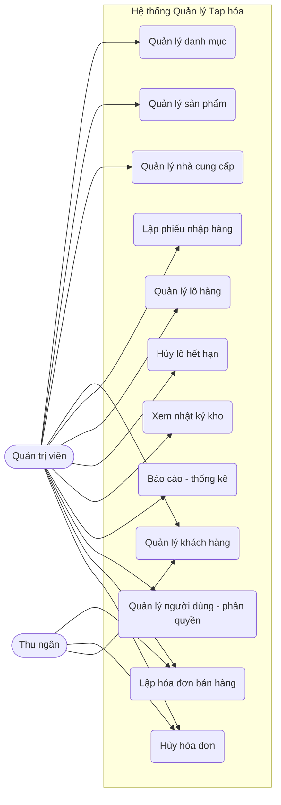
```mermaid
flowchart LR
    Admin([Quản trị viên])
    Cashier([Thu ngân])

    subgraph HT["Hệ thống Quản lý Tạp hóa"]
        UC1("Quản lý danh mục")
        UC2("Quản lý sản phẩm")
        UC3("Quản lý nhà cung cấp")
        UC4("Quản lý khách hàng")
        UC5("Lập phiếu nhập hàng")
        UC6("Quản lý lô hàng")
        UC7("Hủy lô hết hạn")
        UC8("Lập hóa đơn bán hàng")
        UC9("Hủy hóa đơn")
        UC10("Xem nhật ký kho")
        UC11("Báo cáo - thống kê")
        UC12("Quản lý người dùng - phân quyền")
    end

    Admin --> UC1
    Admin --> UC2
    Admin --> UC3
    Admin --> UC4
    Admin --> UC5
    Admin --> UC6
    Admin --> UC7
    Admin --> UC10
    Admin --> UC11
    Admin --> UC12
    Admin --> UC8
    Admin --> UC9

    Cashier --> UC8
    Cashier --> UC9
    Cashier --> UC4
```

### 1.4. Đặc tả chi tiết các Use Case chính

Mỗi use case trong biểu đồ tổng quát được đặc tả chi tiết kèm sơ đồ use case phân rã, trong đó quan hệ « include » thể hiện các bước bắt buộc và « extend » thể hiện các nhánh ngoại lệ.

#### UC-01: Quản lý danh mục sản phẩm

| **Hậu điều kiện**                                                                     | Danh mục được tạo, cập nhật hoặc xóa và lưu vào cơ sở dữ liệu                    |
| ----------------------------------------------------------------------------------------------- | ------------------------------------------------------------------------------------------------ |
| **Tiền điều kiện**                                                                    | Đã đăng nhập với quyền quản lý danh mục                                                |
| **Tác nhân**                                                                            | Quản trị viên                                                                                 |
| **Mô tả**                                                                               | Quản trị viên thêm, sửa, xóa và tra cứu các danh mục dùng để phân loại sản phẩm |
| **Tên Use Case**                                                                         | Quản lý danh mục sản phẩm                                                                   |
| Nội dung                                                                                       | Mô tả                                                                                          |
| **Luồng chính**                                                                         | 1. Quản trị viên mở màn hình quản lý danh mục.                                          |
| 2. Hệ thống hiển thị danh sách danh mục hiện có.                                        |                                                                                                  |
| 3. Chọn thao tác Thêm / Sửa / Xóa.                                                         |                                                                                                  |
| 4. Với Thêm hoặc Sửa: nhập tên và mô tả danh mục.                                     |                                                                                                  |
| 5. Hệ thống kiểm tra hợp lệ (tên không trống, không trùng).                           |                                                                                                  |
| 6. Hệ thống lưu danh mục và cập nhật lại danh sách.                                    |                                                                                                  |
| **Luồng thay thế**                                                                      | 5a. Tên danh mục trống hoặc trùng → báo lỗi và dừng.                                   |
| 3a. Xóa danh mục đang chứa sản phẩm → cảnh báo, yêu cầu xác nhận hoặc chặn xóa. |                                                                                                  |

#### Sơ đồ Use Case chi tiết — UC-01

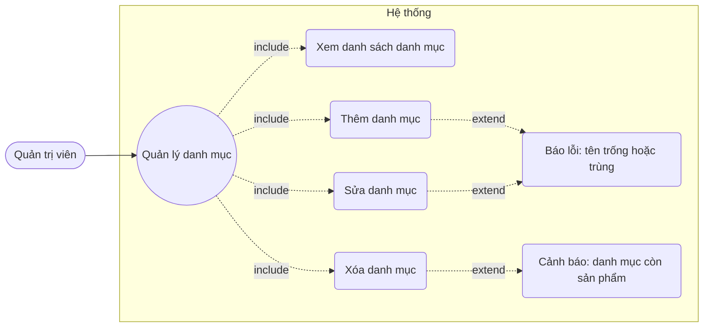
```mermaid
flowchart LR
    QT([Quản trị viên])
    subgraph SYS["Hệ thống"]
        BASE(("Quản lý danh mục"))
        UCa("Xem danh sách danh mục")
        UCb("Thêm danh mục")
        UCc("Sửa danh mục")
        UCd("Xóa danh mục")
        EXa("Báo lỗi: tên trống hoặc trùng")
        EXb("Cảnh báo: danh mục còn sản phẩm")
    end
    QT --> BASE
    BASE -.->|include| UCa
    BASE -.->|include| UCb
    BASE -.->|include| UCc
    BASE -.->|include| UCd
    UCb -.->|extend| EXa
    UCc -.->|extend| EXa
    UCd -.->|extend| EXb
```

#### UC-02: Quản lý sản phẩm

| **Tiền điều kiện**                                                                                              | Đã đăng nhập với quyền quản lý sản phẩm; đã có ít nhất một danh mục                                                             |
| ------------------------------------------------------------------------------------------------------------------------- | ------------------------------------------------------------------------------------------------------------------------------------------------- |
| **Hậu điều kiện**                                                                                               | Sản phẩm được lưu, cập nhật hoặc ngừng kinh doanh; trạng thái tồn kho được tính lại                                             |
| **Tác nhân**                                                                                                      | Quản trị viên                                                                                                                                  |
| **Mô tả**                                                                                                         | Quản trị viên thêm, sửa, xóa sản phẩm, gán danh mục và thiết lập giá vốn, giá bán, đơn vị tính, định mức tồn tối thiểu |
| **Tên Use Case**                                                                                                   | Quản lý sản phẩm                                                                                                                              |
| Nội dung                                                                                                                 | Mô tả                                                                                                                                           |
| **Luồng chính**                                                                                                   | 1. Mở màn hình quản lý sản phẩm.                                                                                                           |
| 2. Hệ thống hiển thị danh sách sản phẩm kèm tồn kho và trạng thái.                                            |                                                                                                                                                   |
| 3. Chọn thao tác Thêm / Sửa / Xóa.                                                                                   |                                                                                                                                                   |
| 4. Nhập thông tin: tên, mã SKU, danh mục, giá vốn, giá bán, đơn vị tính, định mức tồn tối thiểu, ảnh. |                                                                                                                                                   |
| 5. Hệ thống kiểm tra hợp lệ (tên không trống, giá ≥ 0).                                                         |                                                                                                                                                   |
| 6. Hệ thống lưu và cập nhật trạng thái tồn kho (Còn hàng / Sắp hết / Hết hàng).                            |                                                                                                                                                   |
| **Luồng thay thế**                                                                                                | 5a. Dữ liệu không hợp lệ (giá âm, thiếu tên) → báo lỗi và dừng.                                                                     |
| 3a. Xóa sản phẩm đã phát sinh giao dịch → chuyển sang trạng thái Ngừng kinh doanh thay vì xóa cứng.        |                                                                                                                                                   |

#### Sơ đồ Use Case chi tiết — UC-02

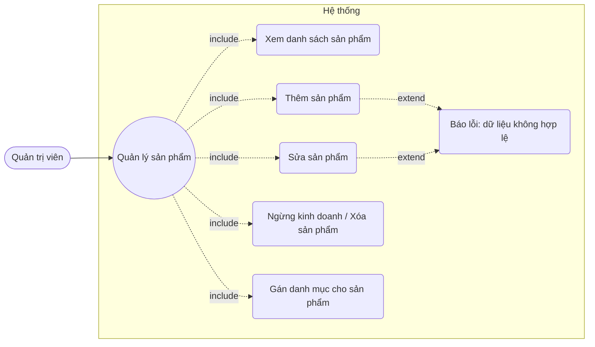
```mermaid
flowchart LR
    QT([Quản trị viên])
    subgraph SYS["Hệ thống"]
        BASE(("Quản lý sản phẩm"))
        UCa("Xem danh sách sản phẩm")
        UCb("Thêm sản phẩm")
        UCc("Sửa sản phẩm")
        UCd("Ngừng kinh doanh / Xóa sản phẩm")
        UCe("Gán danh mục cho sản phẩm")
        EXa("Báo lỗi: dữ liệu không hợp lệ")
    end
    QT --> BASE
    BASE -.->|include| UCa
    BASE -.->|include| UCb
    BASE -.->|include| UCc
    BASE -.->|include| UCd
    BASE -.->|include| UCe
    UCb -.->|extend| EXa
    UCc -.->|extend| EXa
```

#### UC-03: Quản lý nhà cung cấp

| **Tiền điều kiện**                                                   | Đã đăng nhập với quyền quản lý nhà cung cấp                                           |
| ------------------------------------------------------------------------------ | ------------------------------------------------------------------------------------------------ |
| **Hậu điều kiện**                                                    | Nhà cung cấp được lưu, cập nhật hoặc xóa                                               |
| **Tác nhân**                                                           | Quản trị viên                                                                                 |
| **Mô tả**                                                              | Quản trị viên thêm, sửa, xóa và tra cứu nhà cung cấp phục vụ nghiệp vụ nhập hàng |
| **Tên Use Case**                                                        | Quản lý nhà cung cấp                                                                         |
| Nội dung                                                                      | Mô tả                                                                                          |
| **Luồng chính**                                                        | 1. Mở màn hình quản lý nhà cung cấp.                                                      |
| 2. Hệ thống hiển thị danh sách nhà cung cấp.                            |                                                                                                  |
| 3. Chọn thao tác Thêm / Sửa / Xóa.                                        |                                                                                                  |
| 4. Nhập tên, số điện thoại, địa chỉ.                                  |                                                                                                  |
| 5. Hệ thống kiểm tra hợp lệ.                                              |                                                                                                  |
| 6. Lưu và cập nhật danh sách.                                             |                                                                                                  |
| **Luồng thay thế**                                                     | 5a. Thiếu thông tin bắt buộc → báo lỗi.                                                   |
| 3a. Xóa nhà cung cấp đã gắn phiếu nhập → cảnh báo hoặc chặn xóa. |                                                                                                  |

#### Sơ đồ Use Case chi tiết — UC-03

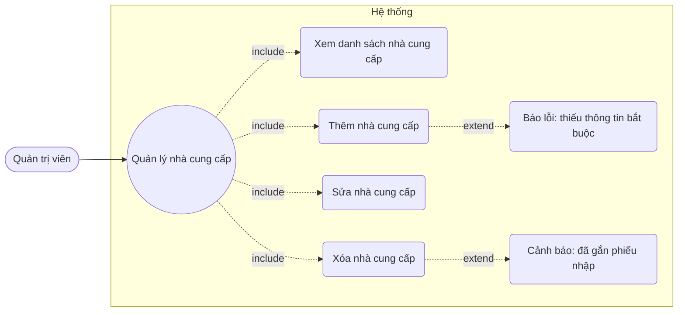
```mermaid
flowchart LR
    QT([Quản trị viên])
    subgraph SYS["Hệ thống"]
        BASE(("Quản lý nhà cung cấp"))
        UCa("Xem danh sách nhà cung cấp")
        UCb("Thêm nhà cung cấp")
        UCc("Sửa nhà cung cấp")
        UCd("Xóa nhà cung cấp")
        EXa("Báo lỗi: thiếu thông tin bắt buộc")
        EXb("Cảnh báo: đã gắn phiếu nhập")
    end
    QT --> BASE
    BASE -.->|include| UCa
    BASE -.->|include| UCb
    BASE -.->|include| UCc
    BASE -.->|include| UCd
    UCb -.->|extend| EXa
    UCd -.->|extend| EXb
```

#### UC-04: Quản lý khách hàng

| **Hậu điều kiện**                                         | Khách hàng được lưu, cập nhật hoặc xóa                                                             |
| ------------------------------------------------------------------- | ------------------------------------------------------------------------------------------------------------ |
| **Tiền điều kiện**                                        | Đã đăng nhập vào hệ thống                                                                            |
| **Tác nhân**                                                | Quản trị viên, Thu ngân                                                                                  |
| **Mô tả**                                                   | Thêm, sửa, xóa và tra cứu khách hàng; thu ngân có thể thêm nhanh khách hàng ngay khi bán hàng |
| **Tên Use Case**                                             | Quản lý khách hàng                                                                                       |
| Nội dung                                                           | Mô tả                                                                                                      |
| **Luồng chính**                                             | 1. Mở màn hình quản lý khách hàng hoặc thêm nhanh tại màn hình POS.                              |
| 2. Hệ thống hiển thị danh sách khách hàng.                   |                                                                                                              |
| 3. Chọn thao tác Thêm / Sửa / Xóa.                             |                                                                                                              |
| 4. Nhập tên và số điện thoại.                                |                                                                                                              |
| 5. Hệ thống kiểm tra hợp lệ (số điện thoại không trùng). |                                                                                                              |
| 6. Lưu và cập nhật danh sách.                                  |                                                                                                              |
| **Luồng thay thế**                                          | 5a. Số điện thoại đã tồn tại → báo trùng và dừng.                                               |

#### Sơ đồ Use Case chi tiết — UC-04

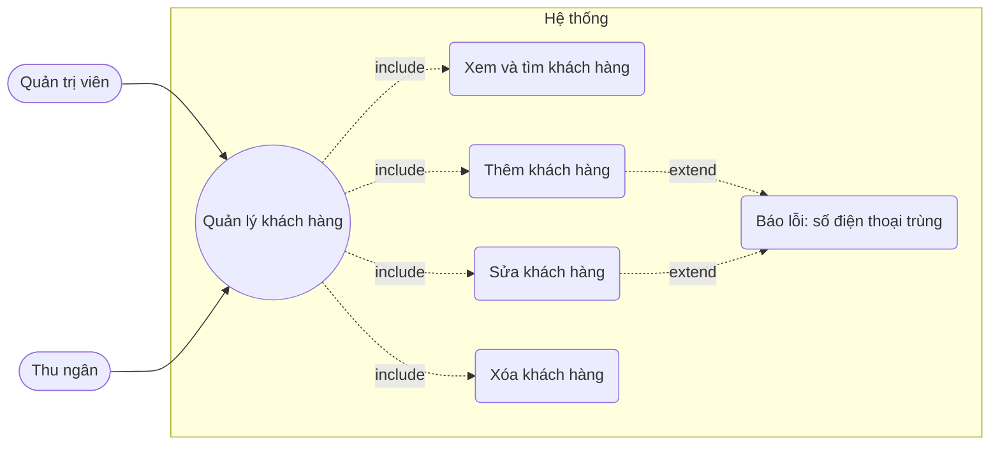
```mermaid
flowchart LR
    QT([Quản trị viên])
    TN([Thu ngân])
    subgraph SYS["Hệ thống"]
        BASE(("Quản lý khách hàng"))
        UCa("Xem và tìm khách hàng")
        UCb("Thêm khách hàng")
        UCc("Sửa khách hàng")
        UCd("Xóa khách hàng")
        EXa("Báo lỗi: số điện thoại trùng")
    end
    QT --> BASE
    TN --> BASE
    BASE -.->|include| UCa
    BASE -.->|include| UCb
    BASE -.->|include| UCc
    BASE -.->|include| UCd
    UCb -.->|extend| EXa
    UCc -.->|extend| EXa
```

#### UC-05: Lập phiếu nhập hàng

| **Hậu điều kiện**                                             | Phiếu nhập được tạo; mỗi mặt hàng sinh một lô hàng (Stock Batch); tồn kho tăng; phát sinh nhật ký kho loại Nhập |
| ----------------------------------------------------------------------- | ---------------------------------------------------------------------------------------------------------------------------------- |
| **Tiền điều kiện**                                            | Người dùng đã đăng nhập và có quyền`Pages.PurchaseOrders.Create`; nhà cung cấp tồn tại                            |
| **Tác nhân**                                                    | Quản trị viên                                                                                                                   |
| **Mô tả**                                                       | Quản trị viên lập phiếu nhập theo nhà cung cấp; hệ thống tạo lô hàng mới, cập nhật tồn kho và ghi nhật ký      |
| **Tên Use Case**                                                 | Lập phiếu nhập hàng                                                                                                            |
| Nội dung                                                               | Mô tả                                                                                                                            |
| **Luồng chính**                                                 | 1. Quản trị viên chọn nhà cung cấp.                                                                                          |
| 2. Thêm các mặt hàng kèm số lượng, giá nhập, hạn sử dụng.  |                                                                                                                                    |
| 3. Hệ thống tính tổng tiền và sinh số phiếu (PO-yyyyMMdd-xxxx). |                                                                                                                                    |
| 4. Hệ thống tạo lô hàng cho từng mặt hàng.                      |                                                                                                                                    |
| 5. Hệ thống cộng tồn kho sản phẩm.                                |                                                                                                                                    |
| 6. Hệ thống ghi nhật ký kho loại Nhập.                            |                                                                                                                                    |
| **Luồng thay thế**                                              | 2a. Phiếu nhập không có mặt hàng nào → báo lỗi và dừng.                                                                |

#### Sơ đồ Use Case chi tiết — UC-05

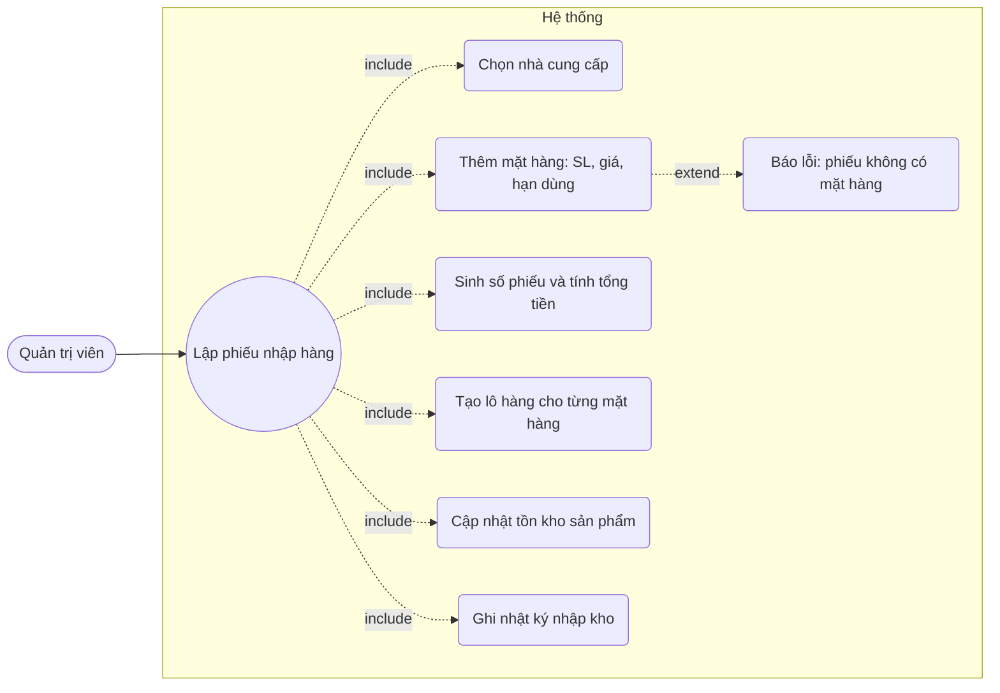
```mermaid
flowchart LR
    QT([Quản trị viên])
    subgraph SYS["Hệ thống"]
        BASE(("Lập phiếu nhập hàng"))
        UCa("Chọn nhà cung cấp")
        UCb("Thêm mặt hàng: SL, giá, hạn dùng")
        UCc("Sinh số phiếu và tính tổng tiền")
        UCd("Tạo lô hàng cho từng mặt hàng")
        UCe("Cập nhật tồn kho sản phẩm")
        UCf("Ghi nhật ký nhập kho")
        EXa("Báo lỗi: phiếu không có mặt hàng")
    end
    QT --> BASE
    BASE -.->|include| UCa
    BASE -.->|include| UCb
    BASE -.->|include| UCc
    BASE -.->|include| UCd
    BASE -.->|include| UCe
    BASE -.->|include| UCf
    UCb -.->|extend| EXa
```

#### UC-06: Quản lý lô hàng

| Nội dung                                                                                   | Mô tả                                                                                                                                    |
| ------------------------------------------------------------------------------------------- | ------------------------------------------------------------------------------------------------------------------------------------------ |
| **Tên Use Case**                                                                     | Quản lý lô hàng                                                                                                                        |
| **Tác nhân**                                                                        | Quản trị viên                                                                                                                           |
| **Mô tả**                                                                           | Theo dõi và tra cứu các lô hàng theo sản phẩm, hạn sử dụng và số lượng còn lại; phát hiện lô sắp hoặc đã hết hạn |
| **Tiền điều kiện**                                                                | Đã đăng nhập với quyền xem lô hàng; đã tồn tại lô hàng (sinh từ phiếu nhập)                                              |
| **Hậu điều kiện**                                                                 | Thông tin lô hàng được hiển thị; có thể chuyển sang chức năng hủy lô hết hạn                                              |
| **Luồng chính**                                                                     | 1. Mở màn hình quản lý lô hàng.                                                                                                     |
| 2. Hệ thống hiển thị danh sách lô (mã lô, sản phẩm, hạn dùng, tồn còn lại).  |                                                                                                                                            |
| 3. Người dùng lọc hoặc tìm theo sản phẩm / trạng thái hạn dùng.                 |                                                                                                                                            |
| 4. Hệ thống hiển thị các lô phù hợp và đánh dấu lô sắp hoặc đã hết hạn.  |                                                                                                                                            |
| 5. (Tùy chọn) Chọn lô hết hạn để chuyển sang chức năng Hủy lô hàng hết hạn. |                                                                                                                                            |
| **Luồng thay thế**                                                                  | 4a. Không có lô nào phù hợp → hiển thị danh sách rỗng.                                                                          |

#### Sơ đồ Use Case chi tiết — UC-06

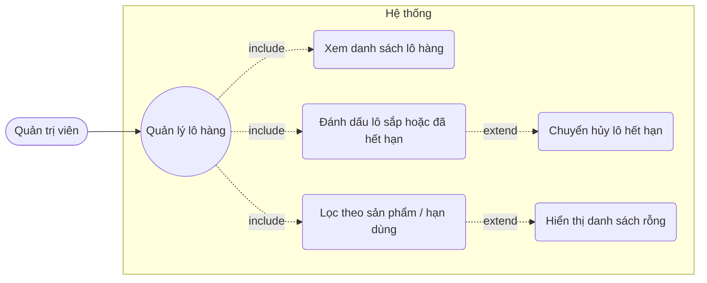
```mermaid
flowchart LR
    QT([Quản trị viên])
    subgraph SYS["Hệ thống"]
        BASE(("Quản lý lô hàng"))
        UCa("Xem danh sách lô hàng")
        UCb("Lọc theo sản phẩm / hạn dùng")
        UCc("Đánh dấu lô sắp hoặc đã hết hạn")
        UCd("Chuyển hủy lô hết hạn")
        EXa("Hiển thị danh sách rỗng")
    end
    QT --> BASE
    BASE -.->|include| UCa
    BASE -.->|include| UCb
    BASE -.->|include| UCc
    UCc -.->|extend| UCd
    UCb -.->|extend| EXa
```

#### UC-07: Hủy lô hàng hết hạn

| Nội dung                                        | Mô tả                                                                                                           |
| ------------------------------------------------ | ----------------------------------------------------------------------------------------------------------------- |
| **Tên Use Case**                          | Hủy lô hàng hết hạn                                                                                          |
| **Tác nhân**                             | Quản trị viên                                                                                                  |
| **Mô tả**                                | Người quản lý hủy toàn bộ hoặc một phần lô hàng hết hạn, cập nhật tồn kho và ghi nhật ký hủy |
| **Tiền điều kiện**                     | Người dùng có quyền`Pages.StockBatches.Dispose`; lô hàng còn tồn lớn hơn 0                           |
| **Hậu điều kiện**                      | Số lượng tồn của lô và của sản phẩm giảm; phát sinh nhật ký kho loại Hủy                          |
| **Luồng chính**                          | 1. Người dùng chọn lô hàng cần hủy.                                                                       |
| 2. Nhập số lượng hủy và lý do.            |                                                                                                                   |
| 3. Hệ thống kiểm tra số lượng hợp lệ.    |                                                                                                                   |
| 4. Hệ thống trừ tồn lô và tồn sản phẩm. |                                                                                                                   |
| 5. Hệ thống ghi nhật ký kho loại Hủy.      |                                                                                                                   |
| **Luồng thay thế**                       | 3a. Số lượng hủy vượt tồn còn lại → báo lỗi và dừng.                                                |
| 3b. Lô đã hết tồn → báo lỗi và dừng.   |                                                                                                                   |

#### Sơ đồ Use Case chi tiết — UC-07

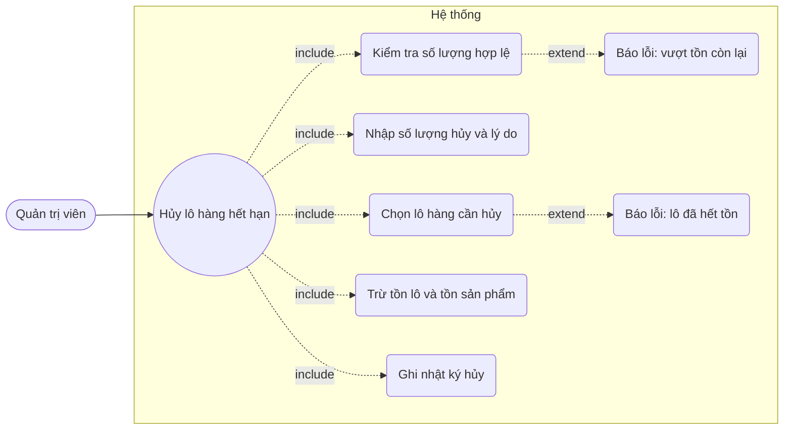
```mermaid
flowchart LR
    QT([Quản trị viên])
    subgraph SYS["Hệ thống"]
        BASE(("Hủy lô hàng hết hạn"))
        UCa("Chọn lô hàng cần hủy")
        UCb("Nhập số lượng hủy và lý do")
        UCc("Kiểm tra số lượng hợp lệ")
        UCd("Trừ tồn lô và tồn sản phẩm")
        UCe("Ghi nhật ký hủy")
        EXa("Báo lỗi: vượt tồn còn lại")
        EXb("Báo lỗi: lô đã hết tồn")
    end
    QT --> BASE
    BASE -.->|include| UCa
    BASE -.->|include| UCb
    BASE -.->|include| UCc
    BASE -.->|include| UCd
    BASE -.->|include| UCe
    UCc -.->|extend| EXa
    UCa -.->|extend| EXb
```

#### UC-08: Lập hóa đơn bán hàng (POS)

| Nội dung                                                                               | Mô tả                                                                                                                                                                           |
| --------------------------------------------------------------------------------------- | --------------------------------------------------------------------------------------------------------------------------------------------------------------------------------- |
| **Tên Use Case**                                                                 | Lập hóa đơn bán hàng                                                                                                                                                        |
| **Tác nhân**                                                                    | Thu ngân, Quản trị viên                                                                                                                                                       |
| **Mô tả**                                                                       | Thu ngân (hoặc quản trị viên khi cần) tạo hóa đơn cho khách, hệ thống kiểm tra tồn kho – hạn sử dụng, trừ kho theo nguyên tắc FEFO và ghi nhận giao dịch |
| **Tiền điều kiện**                                                            | Thu ngân đã đăng nhập và có quyền`Pages.Invoices.Create`; sản phẩm tồn tại và đang kinh doanh                                                                    |
| **Hậu điều kiện**                                                             | Hóa đơn được tạo ở trạng thái Hoàn thành; tồn kho theo lô và tồn sản phẩm được giảm; phát sinh bản ghi nhật ký kho loại Xuất                          |
| **Luồng chính**                                                                 | 1. Thu ngân chọn sản phẩm và số lượng.                                                                                                                                    |
| 2. Hệ thống kiểm tra sản phẩm còn kinh doanh.                                     |                                                                                                                                                                                   |
| 3. Hệ thống kiểm tra tồn kho đủ và lô chưa hết hạn.                          |                                                                                                                                                                                   |
| 4. Hệ thống tính tổng tiền.                                                        |                                                                                                                                                                                   |
| 5. Thu ngân nhập tiền khách đưa, chọn phương thức thanh toán.                |                                                                                                                                                                                   |
| 6. Hệ thống kiểm tra tiền đủ, tạo hóa đơn và sinh số hóa đơn.            |                                                                                                                                                                                   |
| 7. Hệ thống trừ kho theo lô (hết hạn trước – xuất trước) và ghi nhật ký. |                                                                                                                                                                                   |
| 8. Hệ thống trả về hóa đơn và tiền thừa.                                      |                                                                                                                                                                                   |
| **Luồng thay thế**                                                              | 3a. Tồn kho không đủ → báo lỗi và dừng.                                                                                                                                  |
| 3b. Còn hàng nhưng đã quá hạn → báo lỗi, yêu cầu Admin hủy lô.            |                                                                                                                                                                                   |
| 6a. Tiền khách đưa không đủ → báo lỗi và dừng.                              |                                                                                                                                                                                   |

#### Sơ đồ Use Case chi tiết — UC-08

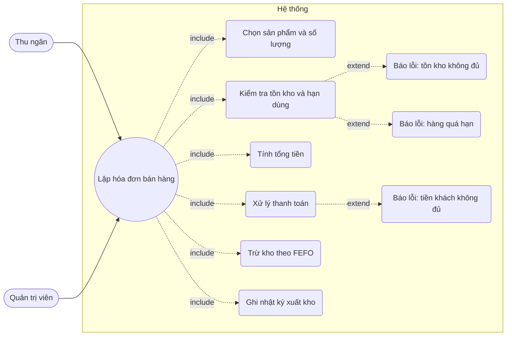
```mermaid
flowchart LR
    TN([Thu ngân])
    QT([Quản trị viên])
    subgraph SYS["Hệ thống"]
        BASE(("Lập hóa đơn bán hàng"))
        UCa("Chọn sản phẩm và số lượng")
        UCb("Kiểm tra tồn kho và hạn dùng")
        UCc("Tính tổng tiền")
        UCd("Xử lý thanh toán")
        UCe("Trừ kho theo FEFO")
        UCf("Ghi nhật ký xuất kho")
        EXa("Báo lỗi: tồn kho không đủ")
        EXb("Báo lỗi: hàng quá hạn")
        EXc("Báo lỗi: tiền khách không đủ")
    end
    TN --> BASE
    QT --> BASE
    BASE -.->|include| UCa
    BASE -.->|include| UCb
    BASE -.->|include| UCc
    BASE -.->|include| UCd
    BASE -.->|include| UCe
    BASE -.->|include| UCf
    UCb -.->|extend| EXa
    UCb -.->|extend| EXb
    UCd -.->|extend| EXc
```

#### UC-09: Hủy hóa đơn

| Nội dung                                                             | Mô tả                                                                                                                                               |
| --------------------------------------------------------------------- | ----------------------------------------------------------------------------------------------------------------------------------------------------- |
| **Tên Use Case**                                               | Hủy hóa đơn                                                                                                                                       |
| **Tác nhân**                                                  | Thu ngân, Quản trị viên                                                                                                                           |
| **Mô tả**                                                     | Thu ngân hoặc quản trị viên hủy hóa đơn đã lập trong vòng 24 giờ và hoàn trả hàng về đúng các lô đã xuất                    |
| **Tiền điều kiện**                                          | Người dùng có quyền`Pages.Invoices.Cancel`; hóa đơn chưa bị hủy và được tạo trong 24 giờ                                           |
| **Hậu điều kiện**                                           | Hóa đơn chuyển trạng thái Đã hủy; tồn kho theo lô và tồn sản phẩm được hoàn lại; phát sinh nhật ký kho loại Nhập (hoàn kho) |
| **Luồng chính**                                               | 1. Thu ngân chọn hóa đơn và nhập lý do hủy.                                                                                                  |
| 2. Hệ thống kiểm tra hóa đơn chưa hủy và còn trong 24 giờ. |                                                                                                                                                       |
| 3. Hệ thống cập nhật trạng thái Đã hủy.                      |                                                                                                                                                       |
| 4. Hệ thống hoàn hàng về từng lô đã xuất.                   |                                                                                                                                                       |
| 5. Hệ thống ghi nhật ký hoàn kho.                                |                                                                                                                                                       |
| **Luồng thay thế**                                            | 2a. Hóa đơn đã hủy trước đó → báo lỗi.                                                                                                   |
| 2b. Hóa đơn quá 24 giờ → báo lỗi và dừng.                   |                                                                                                                                                       |

#### Sơ đồ Use Case chi tiết — UC-09

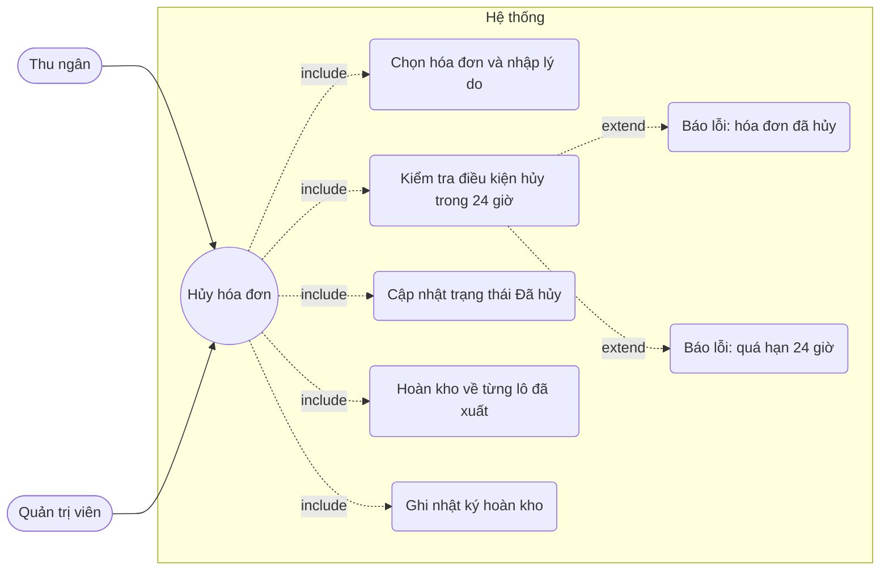
```mermaid
flowchart LR
    TN([Thu ngân])
    QT([Quản trị viên])
    subgraph SYS["Hệ thống"]
        BASE(("Hủy hóa đơn"))
        UCa("Chọn hóa đơn và nhập lý do")
        UCb("Kiểm tra điều kiện hủy trong 24 giờ")
        UCc("Cập nhật trạng thái Đã hủy")
        UCd("Hoàn kho về từng lô đã xuất")
        UCe("Ghi nhật ký hoàn kho")
        EXa("Báo lỗi: hóa đơn đã hủy")
        EXb("Báo lỗi: quá hạn 24 giờ")
    end
    TN --> BASE
    QT --> BASE
    BASE -.->|include| UCa
    BASE -.->|include| UCb
    BASE -.->|include| UCc
    BASE -.->|include| UCd
    BASE -.->|include| UCe
    UCb -.->|extend| EXa
    UCb -.->|extend| EXb
```

#### UC-10: Xem nhật ký kho

| Nội dung                                                                                                           | Mô tả                                                                                                                                 |
| ------------------------------------------------------------------------------------------------------------------- | --------------------------------------------------------------------------------------------------------------------------------------- |
| **Tên Use Case**                                                                                             | Xem nhật ký kho                                                                                                                       |
| **Tác nhân**                                                                                                | Quản trị viên                                                                                                                        |
| **Mô tả**                                                                                                   | Tra cứu toàn bộ biến động tồn kho (Nhập / Xuất / Hủy / Điều chỉnh) theo sản phẩm, lô và thời gian phục vụ truy vết |
| **Tiền điều kiện**                                                                                        | Đã đăng nhập với quyền xem nhật ký kho                                                                                         |
| **Hậu điều kiện**                                                                                         | Hiển thị danh sách bản ghi nhật ký theo bộ lọc                                                                                  |
| **Luồng chính**                                                                                             | 1. Mở màn hình nhật ký kho.                                                                                                        |
| 2. Chọn bộ lọc: sản phẩm, loại biến động, khoảng thời gian.                                              |                                                                                                                                         |
| 3. Hệ thống truy vấn và hiển thị danh sách (loại, số lượng, tồn sau giao dịch, chứng từ liên quan). |                                                                                                                                         |
| **Luồng thay thế**                                                                                          | 3a. Không có dữ liệu phù hợp → hiển thị danh sách rỗng.                                                                      |

#### Sơ đồ Use Case chi tiết — UC-10

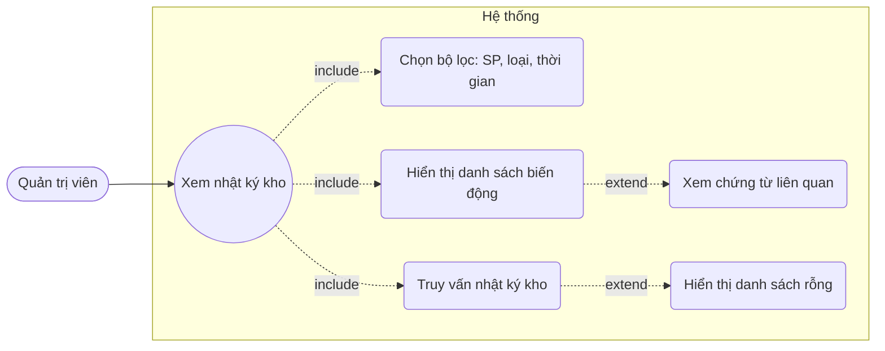
```mermaid
flowchart LR
    QT([Quản trị viên])
    subgraph SYS["Hệ thống"]
        BASE(("Xem nhật ký kho"))
        UCa("Chọn bộ lọc: SP, loại, thời gian")
        UCb("Truy vấn nhật ký kho")
        UCc("Hiển thị danh sách biến động")
        UCd("Xem chứng từ liên quan")
        EXa("Hiển thị danh sách rỗng")
    end
    QT --> BASE
    BASE -.->|include| UCa
    BASE -.->|include| UCb
    BASE -.->|include| UCc
    UCc -.->|extend| UCd
    UCb -.->|extend| EXa
```

#### UC-11: Báo cáo & thống kê

| Nội dung                                                                  | Mô tả                                                                                           |
| -------------------------------------------------------------------------- | ------------------------------------------------------------------------------------------------- |
| **Tên Use Case**                                                    | Báo cáo & thống kê                                                                            |
| **Tác nhân**                                                       | Quản trị viên                                                                                  |
| **Mô tả**                                                          | Xem báo cáo doanh thu, tồn kho, sản phẩm bán chạy và tổng quan dashboard theo thời gian |
| **Tiền điều kiện**                                               | Đã đăng nhập với quyền xem báo cáo                                                       |
| **Hậu điều kiện**                                                | Hiển thị số liệu thống kê và biểu đồ                                                    |
| **Luồng chính**                                                    | 1. Mở màn hình báo cáo / dashboard.                                                          |
| 2. Chọn loại báo cáo và khoảng thời gian.                           |                                                                                                   |
| 3. Hệ thống tổng hợp dữ liệu từ hóa đơn, tồn kho và nhật ký. |                                                                                                   |
| 4. Hệ thống hiển thị bảng số liệu và biểu đồ.                   |                                                                                                   |
| **Luồng thay thế**                                                 | 3a. Không có dữ liệu trong kỳ → hiển thị giá trị 0 hoặc rỗng.                         |

#### Sơ đồ Use Case chi tiết — UC-11

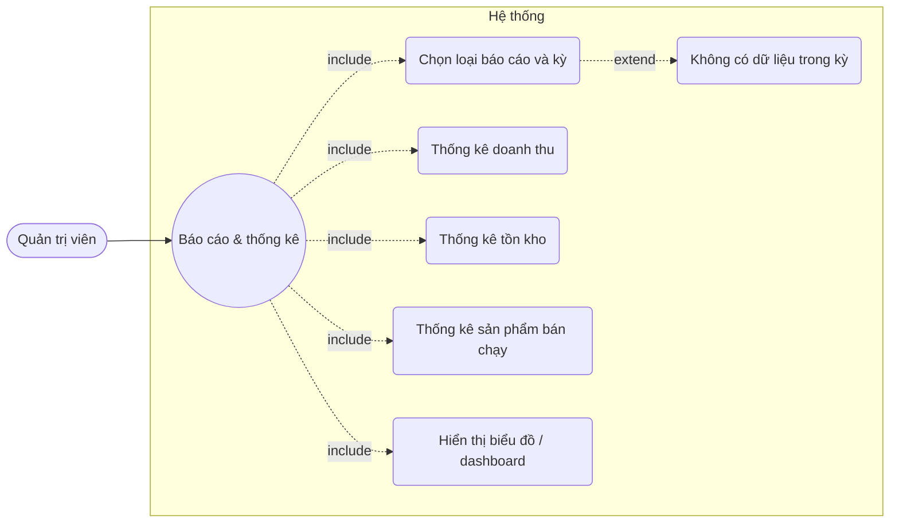
```mermaid
flowchart LR
    QT([Quản trị viên])
    subgraph SYS["Hệ thống"]
        BASE(("Báo cáo & thống kê"))
        UCa("Chọn loại báo cáo và kỳ")
        UCb("Thống kê doanh thu")
        UCc("Thống kê tồn kho")
        UCd("Thống kê sản phẩm bán chạy")
        UCe("Hiển thị biểu đồ / dashboard")
        EXa("Không có dữ liệu trong kỳ")
    end
    QT --> BASE
    BASE -.->|include| UCa
    BASE -.->|include| UCb
    BASE -.->|include| UCc
    BASE -.->|include| UCd
    BASE -.->|include| UCe
    UCa -.->|extend| EXa
```

#### UC-12: Quản lý người dùng & phân quyền

| Nội dung                                                           | Mô tả                                                                                                                                 |
| ------------------------------------------------------------------- | --------------------------------------------------------------------------------------------------------------------------------------- |
| **Tên Use Case**                                             | Quản lý người dùng & phân quyền                                                                                                  |
| **Tác nhân**                                                | Quản trị viên                                                                                                                        |
| **Mô tả**                                                   | Tạo, sửa, khóa tài khoản người dùng, gán vai trò (Admin / Thu ngân) và phân quyền chức năng theo cơ chế RBAC của ABP |
| **Tiền điều kiện**                                        | Đã đăng nhập với quyền quản trị hệ thống                                                                                     |
| **Hậu điều kiện**                                         | Tài khoản, vai trò và quyền được cập nhật và áp dụng                                                                       |
| **Luồng chính**                                             | 1. Mở màn hình quản lý người dùng.                                                                                              |
| 2. Chọn thao tác Thêm / Sửa / Khóa người dùng.              |                                                                                                                                         |
| 3. Nhập thông tin tài khoản và gán vai trò.                  |                                                                                                                                         |
| 4. Hệ thống kiểm tra hợp lệ (tên đăng nhập không trùng). |                                                                                                                                         |
| 5. Hệ thống lưu và áp dụng quyền.                            |                                                                                                                                         |
| **Luồng thay thế**                                          | 4a. Tên đăng nhập đã tồn tại → báo lỗi.                                                                                      |
| 2a. Khóa chính tài khoản đang đăng nhập → cảnh báo.      |                                                                                                                                         |

#### Sơ đồ Use Case chi tiết — UC-12

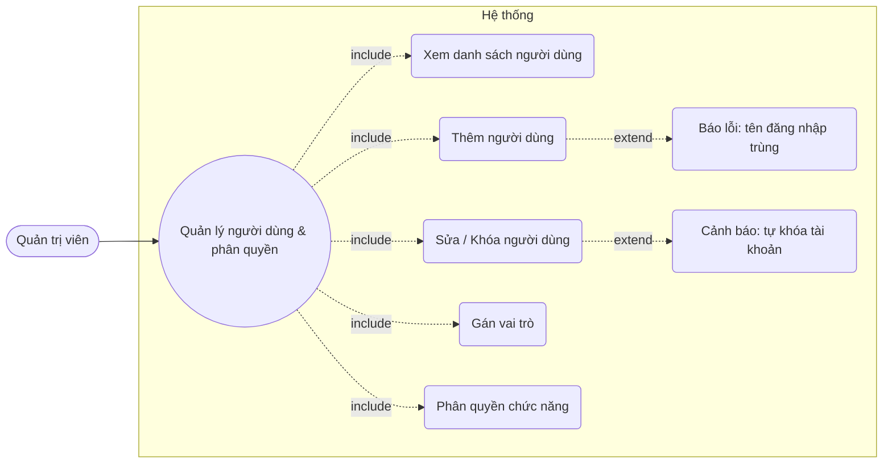
```mermaid
flowchart LR
    QT([Quản trị viên])
    subgraph SYS["Hệ thống"]
        BASE(("Quản lý người dùng & phân quyền"))
        UCa("Xem danh sách người dùng")
        UCb("Thêm người dùng")
        UCc("Sửa / Khóa người dùng")
        UCd("Gán vai trò")
        UCe("Phân quyền chức năng")
        EXa("Báo lỗi: tên đăng nhập trùng")
        EXb("Cảnh báo: tự khóa tài khoản")
    end
    QT --> BASE
    BASE -.->|include| UCa
    BASE -.->|include| UCb
    BASE -.->|include| UCc
    BASE -.->|include| UCd
    BASE -.->|include| UCe
    UCb -.->|extend| EXa
    UCc -.->|extend| EXb
```

---

## 2. Biểu đồ hoạt động (Activity Diagram)

### 2.1. Luồng lập hóa đơn bán hàng (FEFO)

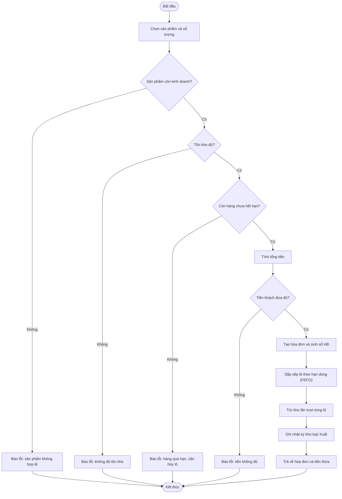
```mermaid
flowchart TD
    A([Bắt đầu]) --> B["Chọn sản phẩm và số lượng"]
    B --> C{"Sản phẩm còn kinh doanh?"}
    C -- Không --> E1["Báo lỗi: sản phẩm không hợp lệ"] --> Z([Kết thúc])
    C -- Có --> D{"Tồn kho đủ?"}
    D -- Không --> E2["Báo lỗi: không đủ tồn kho"] --> Z
    D -- Có --> F{"Còn hàng chưa hết hạn?"}
    F -- Không --> E3["Báo lỗi: hàng quá hạn, cần hủy lô"] --> Z
    F -- Có --> G["Tính tổng tiền"]
    G --> H{"Tiền khách đưa đủ?"}
    H -- Không --> E4["Báo lỗi: tiền không đủ"] --> Z
    H -- Có --> I["Tạo hóa đơn và sinh số HĐ"]
    I --> J["Sắp xếp lô theo hạn dùng (FEFO)"]
    J --> K["Trừ kho lần lượt từng lô"]
    K --> L["Ghi nhật ký kho loại Xuất"]
    L --> M["Trả về hóa đơn và tiền thừa"]
    M --> Z
```

### 2.2. Luồng lập phiếu nhập hàng

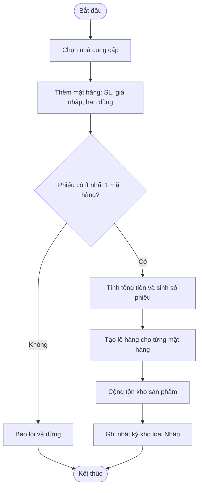
```mermaid
flowchart TD
    A([Bắt đầu]) --> B["Chọn nhà cung cấp"]
    B --> C["Thêm mặt hàng: SL, giá nhập, hạn dùng"]
    C --> D{"Phiếu có ít nhất 1 mặt hàng?"}
    D -- Không --> E["Báo lỗi và dừng"] --> Z([Kết thúc])
    D -- Có --> F["Tính tổng tiền và sinh số phiếu"]
    F --> G["Tạo lô hàng cho từng mặt hàng"]
    G --> H["Cộng tồn kho sản phẩm"]
    H --> I["Ghi nhật ký kho loại Nhập"]
    I --> Z
```

### 2.3. Luồng hủy lô hàng hết hạn

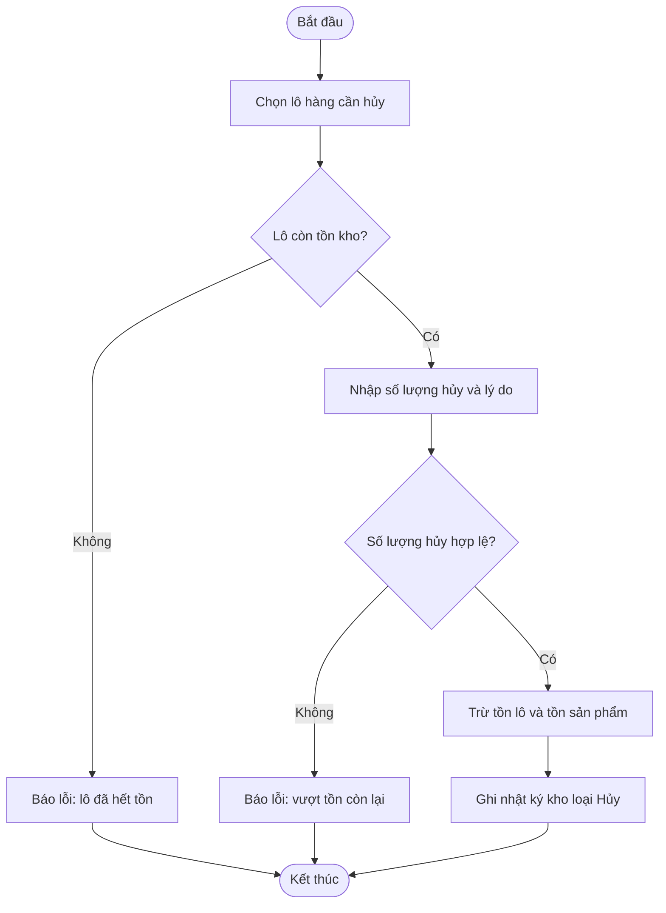
```mermaid
flowchart TD
    A([Bắt đầu]) --> B["Chọn lô hàng cần hủy"]
    B --> C{"Lô còn tồn kho?"}
    C -- Không --> E1["Báo lỗi: lô đã hết tồn"] --> Z([Kết thúc])
    C -- Có --> D["Nhập số lượng hủy và lý do"]
    D --> F{"Số lượng hủy hợp lệ?"}
    F -- Không --> E2["Báo lỗi: vượt tồn còn lại"] --> Z
    F -- Có --> G["Trừ tồn lô và tồn sản phẩm"]
    G --> H["Ghi nhật ký kho loại Hủy"]
    H --> Z
```

---

## 3. Biểu đồ tuần tự (Sequence Diagram)

### 3.1. Nghiệp vụ lập hóa đơn bán hàng

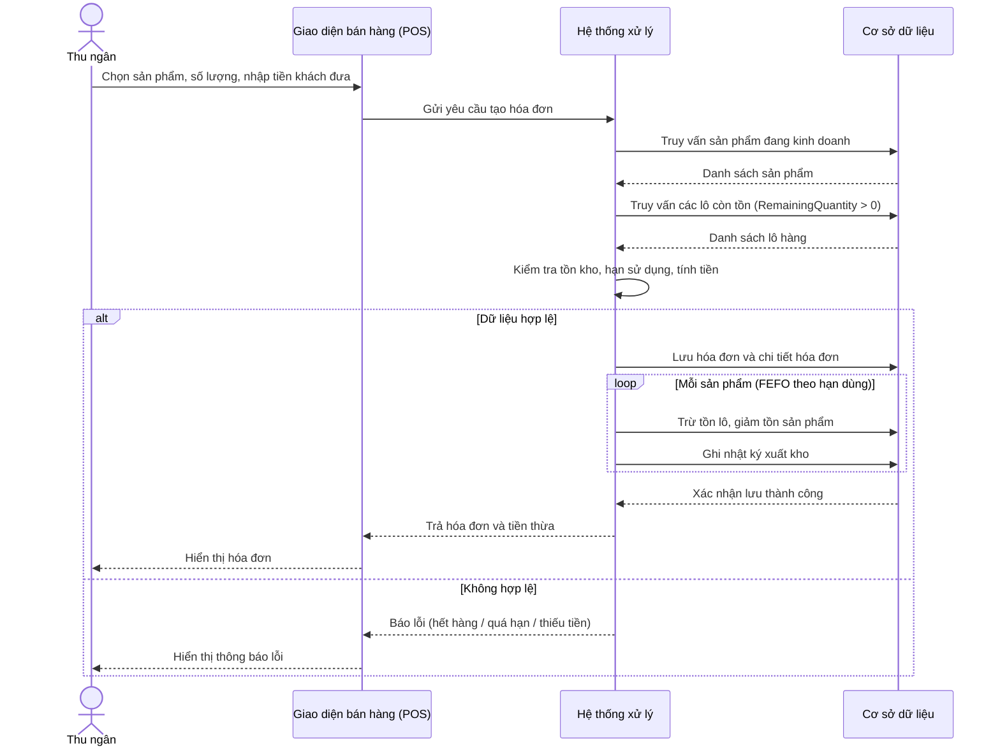
```mermaid
sequenceDiagram
    actor TN as Thu ngân
    participant GD as Giao diện bán hàng (POS)
    participant HT as Hệ thống xử lý
    participant DB as Cơ sở dữ liệu

    TN->>GD: Chọn sản phẩm, số lượng, nhập tiền khách đưa
    GD->>HT: Gửi yêu cầu tạo hóa đơn
    HT->>DB: Truy vấn sản phẩm đang kinh doanh
    DB-->>HT: Danh sách sản phẩm
    HT->>DB: Truy vấn các lô còn tồn (RemainingQuantity > 0)
    DB-->>HT: Danh sách lô hàng
    HT->>HT: Kiểm tra tồn kho, hạn sử dụng, tính tiền
    alt Dữ liệu hợp lệ
        HT->>DB: Lưu hóa đơn và chi tiết hóa đơn
        loop Mỗi sản phẩm (FEFO theo hạn dùng)
            HT->>DB: Trừ tồn lô, giảm tồn sản phẩm
            HT->>DB: Ghi nhật ký xuất kho
        end
        DB-->>HT: Xác nhận lưu thành công
        HT-->>GD: Trả hóa đơn và tiền thừa
        GD-->>TN: Hiển thị hóa đơn
    else Không hợp lệ
        HT-->>GD: Báo lỗi (hết hàng / quá hạn / thiếu tiền)
        GD-->>TN: Hiển thị thông báo lỗi
    end
```

### 3.2. Nghiệp vụ lập phiếu nhập hàng

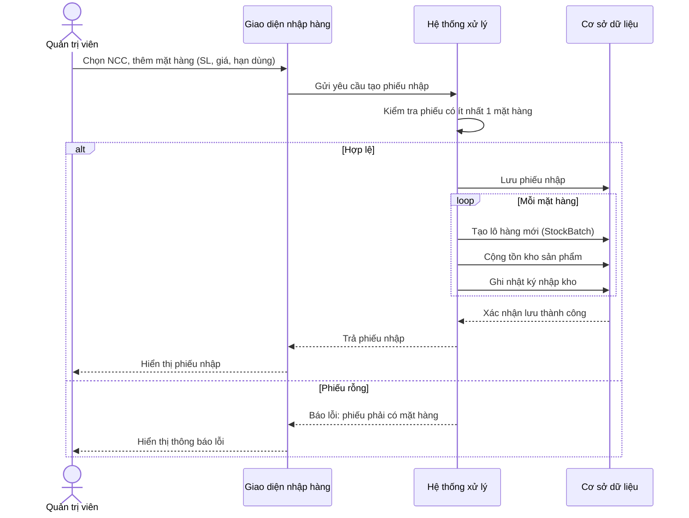
```mermaid
sequenceDiagram
    actor NV as Quản trị viên
    participant GD as Giao diện nhập hàng
    participant HT as Hệ thống xử lý
    participant DB as Cơ sở dữ liệu

    NV->>GD: Chọn NCC, thêm mặt hàng (SL, giá, hạn dùng)
    GD->>HT: Gửi yêu cầu tạo phiếu nhập
    HT->>HT: Kiểm tra phiếu có ít nhất 1 mặt hàng
    alt Hợp lệ
        HT->>DB: Lưu phiếu nhập
        loop Mỗi mặt hàng
            HT->>DB: Tạo lô hàng mới (StockBatch)
            HT->>DB: Cộng tồn kho sản phẩm
            HT->>DB: Ghi nhật ký nhập kho
        end
        DB-->>HT: Xác nhận lưu thành công
        HT-->>GD: Trả phiếu nhập
        GD-->>NV: Hiển thị phiếu nhập
    else Phiếu rỗng
        HT-->>GD: Báo lỗi: phiếu phải có mặt hàng
        GD-->>NV: Hiển thị thông báo lỗi
    end
```

### 3.3. Nghiệp vụ hủy hóa đơn (hoàn kho)

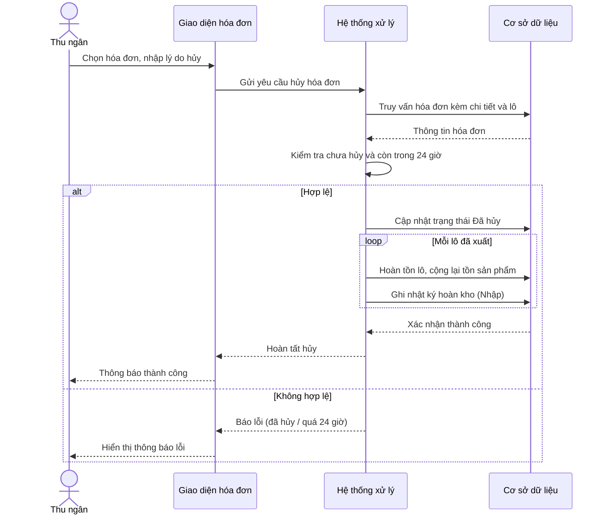
```mermaid
sequenceDiagram
    actor TN as Thu ngân
    participant GD as Giao diện hóa đơn
    participant HT as Hệ thống xử lý
    participant DB as Cơ sở dữ liệu

    TN->>GD: Chọn hóa đơn, nhập lý do hủy
    GD->>HT: Gửi yêu cầu hủy hóa đơn
    HT->>DB: Truy vấn hóa đơn kèm chi tiết và lô
    DB-->>HT: Thông tin hóa đơn
    HT->>HT: Kiểm tra chưa hủy và còn trong 24 giờ
    alt Hợp lệ
        HT->>DB: Cập nhật trạng thái Đã hủy
        loop Mỗi lô đã xuất
            HT->>DB: Hoàn tồn lô, cộng lại tồn sản phẩm
            HT->>DB: Ghi nhật ký hoàn kho (Nhập)
        end
        DB-->>HT: Xác nhận thành công
        HT-->>GD: Hoàn tất hủy
        GD-->>TN: Thông báo thành công
    else Không hợp lệ
        HT-->>GD: Báo lỗi (đã hủy / quá 24 giờ)
        GD-->>TN: Hiển thị thông báo lỗi
    end
```

---

## 4. Xác định các thực thể trong hệ thống

### 4.1. Biểu đồ lớp (Class Diagram)

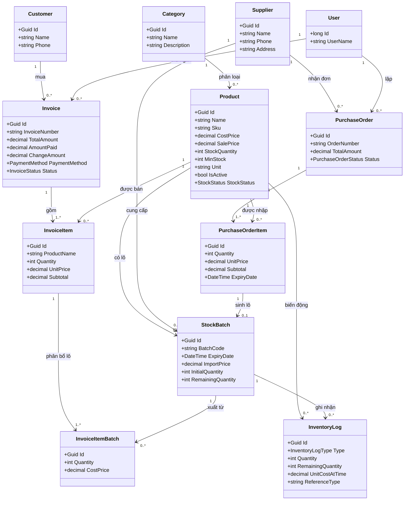
```mermaid
classDiagram
    class Category {
        +Guid Id
        +string Name
        +string Description
    }
    class Product {
        +Guid Id
        +string Name
        +string Sku
        +decimal CostPrice
        +decimal SalePrice
        +int StockQuantity
        +int MinStock
        +string Unit
        +bool IsActive
        +StockStatus StockStatus
    }
    class Supplier {
        +Guid Id
        +string Name
        +string Phone
        +string Address
    }
    class Customer {
        +Guid Id
        +string Name
        +string Phone
    }
    class PurchaseOrder {
        +Guid Id
        +string OrderNumber
        +decimal TotalAmount
        +PurchaseOrderStatus Status
    }
    class PurchaseOrderItem {
        +Guid Id
        +int Quantity
        +decimal UnitPrice
        +decimal Subtotal
        +DateTime ExpiryDate
    }
    class StockBatch {
        +Guid Id
        +string BatchCode
        +DateTime ExpiryDate
        +decimal ImportPrice
        +int InitialQuantity
        +int RemainingQuantity
    }
    class Invoice {
        +Guid Id
        +string InvoiceNumber
        +decimal TotalAmount
        +decimal AmountPaid
        +decimal ChangeAmount
        +PaymentMethod PaymentMethod
        +InvoiceStatus Status
    }
    class InvoiceItem {
        +Guid Id
        +string ProductName
        +int Quantity
        +decimal UnitPrice
        +decimal Subtotal
    }
    class InvoiceItemBatch {
        +Guid Id
        +int Quantity
        +decimal CostPrice
    }
    class InventoryLog {
        +Guid Id
        +InventoryLogType Type
        +int Quantity
        +int RemainingQuantity
        +decimal UnitCostAtTime
        +string ReferenceType
    }
    class User {
        +long Id
        +string UserName
    }

    Category "1" --> "0..*" Product : phân loại
    Product "1" --> "0..*" StockBatch : có lô
    Supplier "1" --> "0..*" StockBatch : cung cấp
    Supplier "1" --> "0..*" PurchaseOrder : nhận đơn
    PurchaseOrder "1" --> "1..*" PurchaseOrderItem : gồm
    Product "1" --> "0..*" PurchaseOrderItem : được nhập
    PurchaseOrderItem "1" --> "0..1" StockBatch : sinh lô
    User "1" --> "0..*" PurchaseOrder : lập
    Customer "1" --> "0..*" Invoice : mua
    User "1" --> "0..*" Invoice : thu ngân
    Invoice "1" --> "1..*" InvoiceItem : gồm
    Product "1" --> "0..*" InvoiceItem : được bán
    InvoiceItem "1" --> "1..*" InvoiceItemBatch : phân bổ lô
    StockBatch "1" --> "0..*" InvoiceItemBatch : xuất từ
    Product "1" --> "0..*" InventoryLog : biến động
    StockBatch "1" --> "0..*" InventoryLog : ghi nhận
```

### 4.2. Mô tả các mối quan hệ giữa các thực thể

Dựa trên biểu đồ lớp trên, các mối quan hệ giữa các thực thể được xác định như sau:

- **Category – Product (1 – N):** Một danh mục chứa nhiều sản phẩm; một sản phẩm thuộc tối đa một danh mục.
- **Product – StockBatch (1 – N):** Một sản phẩm có nhiều lô hàng tồn kho khác nhau theo từng đợt nhập và hạn sử dụng.
- **Supplier – PurchaseOrder (1 – N):** Một nhà cung cấp có thể có nhiều phiếu nhập.
- **PurchaseOrder – PurchaseOrderItem (1 – N):** Một phiếu nhập gồm nhiều dòng mặt hàng.
- **PurchaseOrderItem – StockBatch (1 – 1):** Mỗi dòng nhập sinh ra một lô hàng tương ứng kèm hạn sử dụng và giá nhập.
- **Customer – Invoice (1 – N):** Một khách hàng có thể có nhiều hóa đơn (khách lẻ có thể để trống).
- **User – Invoice / PurchaseOrder (1 – N):** Người dùng (thu ngân lập hóa đơn, quản trị viên lập phiếu nhập) là người tạo chứng từ tương ứng.
- **Invoice – InvoiceItem (1 – N):** Một hóa đơn gồm nhiều dòng chi tiết sản phẩm.
- **InvoiceItem – InvoiceItemBatch (1 – N):** Một dòng bán có thể được trừ kho từ nhiều lô (do cơ chế FEFO), mỗi bản ghi lưu số lượng và giá vốn của lô tương ứng.
- **StockBatch – InvoiceItemBatch (1 – N):** Một lô hàng có thể xuất cho nhiều dòng hóa đơn khác nhau.
- **Product / StockBatch – InventoryLog (1 – N):** Mọi biến động tồn kho (Nhập / Xuất / Hủy / Điều chỉnh) đều được ghi nhận chi tiết theo sản phẩm và lô.

---

## 5. Thiết kế cơ sở dữ liệu

### 5.1. Biểu đồ quan hệ thực thể (ERD)

```mermaid
erDiagram
    Category ||--o{ Product : has
    Product ||--o{ StockBatch : has
    Supplier ||--o{ StockBatch : supplies
    Supplier ||--o{ PurchaseOrder : receives
    PurchaseOrder ||--|{ PurchaseOrderItem : contains
    Product ||--o{ PurchaseOrderItem : in
    PurchaseOrderItem ||--o| StockBatch : creates
    Customer ||--o{ Invoice : places
    AbpUsers ||--o{ Invoice : cashier
    AbpUsers ||--o{ PurchaseOrder : creates
    Invoice ||--|{ InvoiceItem : contains
    Product ||--o{ InvoiceItem : sold_in
    InvoiceItem ||--|{ InvoiceItemBatch : allocates
    StockBatch ||--o{ InvoiceItemBatch : from
    Product ||--o{ InventoryLog : logs
    StockBatch ||--o{ InventoryLog : logs
```

### 5.2. Mô tả chi tiết các bảng

#### Bảng `Categories` — Danh mục sản phẩm

| Cột        | Kiểu dữ liệu  | Ràng buộc | Mô tả        |
| ----------- | ---------------- | ----------- | -------------- |
| Id          | uniqueidentifier | PK          | Khóa chính   |
| Name        | nvarchar(200)    | NOT NULL    | Tên danh mục |
| Description | nvarchar         | NULL        | Mô tả        |

#### Bảng `Products` — Sản phẩm

| Cột          | Kiểu dữ liệu  | Ràng buộc      | Mô tả                      |
| ------------- | ---------------- | ---------------- | ---------------------------- |
| Id            | uniqueidentifier | PK               | Khóa chính                 |
| Name          | nvarchar(200)    | NOT NULL         | Tên sản phẩm              |
| Sku           | nvarchar(50)     | NULL             | Mã hàng                    |
| CategoryId    | uniqueidentifier | FK → Categories | Danh mục                    |
| ImageUrl      | nvarchar(500)    | NULL             | Ảnh sản phẩm              |
| CostPrice     | decimal          | NOT NULL         | Giá vốn                    |
| SalePrice     | decimal          | NOT NULL         | Giá bán                    |
| StockQuantity | int              | NOT NULL         | Tồn kho hiện tại          |
| MinStock      | int              | DEFAULT 10       | Định mức tồn tối thiểu |
| Unit          | nvarchar(20)     | NULL             | Đơn vị tính              |
| IsActive      | bit              | NOT NULL         | Trạng thái kinh doanh      |

#### Bảng `Suppliers` / `Customers` — Nhà cung cấp / Khách hàng

| Cột    | Kiểu dữ liệu  | Ràng buộc | Mô tả                        |
| ------- | ---------------- | ----------- | ------------------------------ |
| Id      | uniqueidentifier | PK          | Khóa chính                   |
| Name    | nvarchar         | NOT NULL    | Tên đối tác / khách hàng |
| Phone   | nvarchar         | NULL        | Số điện thoại              |
| Address | nvarchar         | NULL        | Địa chỉ                     |

#### Bảng `PurchaseOrders` — Phiếu nhập

| Cột        | Kiểu dữ liệu  | Ràng buộc     | Mô tả                                    |
| ----------- | ---------------- | --------------- | ------------------------------------------ |
| Id          | uniqueidentifier | PK              | Khóa chính                               |
| OrderNumber | nvarchar(50)     | NOT NULL        | Số phiếu (PO-yyyyMMdd-xxxx)              |
| SupplierId  | uniqueidentifier | FK → Suppliers | Nhà cung cấp                             |
| UserId      | bigint           | FK → AbpUsers  | Người lập phiếu                        |
| TotalAmount | decimal          | NOT NULL        | Tổng tiền                                |
| Status      | int              | NOT NULL        | Trạng thái (Pending/Completed/Cancelled) |
| Note        | nvarchar(500)    | NULL            | Ghi chú                                   |

#### Bảng `PurchaseOrderItems` — Chi tiết phiếu nhập

| Cột            | Kiểu dữ liệu  | Ràng buộc          | Mô tả           |
| --------------- | ---------------- | -------------------- | ----------------- |
| Id              | uniqueidentifier | PK                   | Khóa chính      |
| PurchaseOrderId | uniqueidentifier | FK → PurchaseOrders | Phiếu nhập      |
| ProductId       | uniqueidentifier | FK → Products       | Sản phẩm        |
| Quantity        | int              | NOT NULL             | Số lượng nhập |
| UnitPrice       | decimal          | NOT NULL             | Đơn giá nhập  |
| Subtotal        | decimal          | NOT NULL             | Thành tiền      |
| ExpiryDate      | datetime         | NULL                 | Hạn sử dụng    |

#### Bảng `StockBatches` — Lô hàng tồn kho

| Cột                | Kiểu dữ liệu  | Ràng buộc              | Mô tả               |
| ------------------- | ---------------- | ------------------------ | --------------------- |
| Id                  | uniqueidentifier | PK                       | Khóa chính          |
| ProductId           | uniqueidentifier | FK → Products           | Sản phẩm            |
| SupplierId          | uniqueidentifier | FK → Suppliers          | Nhà cung cấp        |
| PurchaseOrderItemId | uniqueidentifier | FK → PurchaseOrderItems | Dòng nhập nguồn    |
| BatchCode           | nvarchar(50)     | NOT NULL                 | Mã lô               |
| ExpiryDate          | datetime         | NULL                     | Hạn sử dụng        |
| ImportPrice         | decimal          | NOT NULL                 | Giá nhập của lô   |
| InitialQuantity     | int              | NOT NULL                 | Số lượng ban đầu |
| RemainingQuantity   | int              | NOT NULL                 | Số lượng còn lại |

#### Bảng `Invoices` — Hóa đơn bán

| Cột          | Kiểu dữ liệu  | Ràng buộc     | Mô tả                                     |
| ------------- | ---------------- | --------------- | ------------------------------------------- |
| Id            | uniqueidentifier | PK              | Khóa chính                                |
| InvoiceNumber | nvarchar(50)     | NOT NULL        | Số hóa đơn (HD-yyyyMMdd-xxxx)           |
| CustomerId    | uniqueidentifier | FK → Customers | Khách hàng                                |
| CashierUserId | bigint           | FK → AbpUsers  | Thu ngân                                   |
| TotalAmount   | decimal          | NOT NULL        | Tổng tiền                                 |
| AmountPaid    | decimal          | NOT NULL        | Tiền khách đưa                          |
| ChangeAmount  | decimal          | NOT NULL        | Tiền thừa                                 |
| PaymentMethod | int              | NOT NULL        | Phương thức (Cash/Transfer/Momo/ZaloPay) |
| Status        | int              | NOT NULL        | Trạng thái (Completed/Cancelled)          |
| CancelReason  | nvarchar(500)    | NULL            | Lý do hủy                                 |

#### Bảng `InvoiceItems` — Chi tiết hóa đơn

| Cột        | Kiểu dữ liệu  | Ràng buộc    | Mô tả                        |
| ----------- | ---------------- | -------------- | ------------------------------ |
| Id          | uniqueidentifier | PK             | Khóa chính                   |
| InvoiceId   | uniqueidentifier | FK → Invoices | Hóa đơn                     |
| ProductId   | uniqueidentifier | FK → Products | Sản phẩm                     |
| ProductName | nvarchar(200)    | NOT NULL       | Tên SP tại thời điểm bán |
| Quantity    | int              | NOT NULL       | Số lượng                    |
| UnitPrice   | decimal          | NOT NULL       | Đơn giá bán                |
| Subtotal    | decimal          | NOT NULL       | Thành tiền                   |

#### Bảng `InvoiceItemBatches` — Phân bổ lô khi bán (FEFO)

| Cột          | Kiểu dữ liệu  | Ràng buộc        | Mô tả                   |
| ------------- | ---------------- | ------------------ | ------------------------- |
| Id            | uniqueidentifier | PK                 | Khóa chính              |
| InvoiceItemId | uniqueidentifier | FK → InvoiceItems | Dòng hóa đơn          |
| StockBatchId  | uniqueidentifier | FK → StockBatches | Lô xuất hàng           |
| Quantity      | int              | NOT NULL           | Số lượng xuất từ lô |
| CostPrice     | decimal          | NOT NULL           | Giá vốn của lô        |

#### Bảng `InventoryLogs` — Nhật ký kho

| Cột              | Kiểu dữ liệu  | Ràng buộc        | Mô tả                                             |
| ----------------- | ---------------- | ------------------ | --------------------------------------------------- |
| Id                | uniqueidentifier | PK                 | Khóa chính                                        |
| ProductId         | uniqueidentifier | FK → Products     | Sản phẩm                                          |
| UserId            | bigint           | FK → AbpUsers     | Người thao tác                                   |
| Type              | int              | NOT NULL           | Loại (Import/Export/Dispose/Adjust)                |
| Quantity          | int              | NOT NULL           | Số lượng thay đổi (tuyệt đối)               |
| RemainingQuantity | int              | NOT NULL           | Tồn kho sau giao dịch                             |
| UnitCostAtTime    | decimal          | NULL               | Giá vốn tại thời điểm ghi                     |
| StockBatchId      | uniqueidentifier | FK → StockBatches | Lô liên quan                                      |
| ReferenceId       | uniqueidentifier | NULL               | Khóa chứng từ gốc                               |
| ReferenceType     | nvarchar(100)    | NULL               | Loại chứng từ (Invoice/PurchaseOrder/StockBatch) |
| Note              | nvarchar(500)    | NULL               | Ghi chú                                            |

<aside>
🗄️

Toàn bộ thực thể nghiệp vụ kế thừa `FullAuditedEntity<Guid>` của ABP, do đó mỗi bảng còn có các cột kiểm toán hệ thống: `CreationTime`, `CreatorUserId`, `LastModificationTime`, `LastModifierUserId`, `IsDeleted`, `DeleterUserId`, `DeletionTime` (hỗ trợ xóa mềm — soft delete).

</aside>

## 6. Yêu cầu bổ sung và trạng thái triển khai

### 6.1. Chuyển đổi ngôn ngữ Anh – Việt

Hệ thống hỗ trợ hai ngôn ngữ `en` (English) và `vi` (Tiếng Việt). Người dùng có thể đổi ngôn ngữ từ thanh điều hướng; lựa chọn được lưu theo cơ chế culture của ABP và áp dụng cho giao diện, thông báo validation, thông báo nghiệp vụ và JavaScript.

Các nguyên tắc bắt buộc:

1. Không ghi cứng nội dung hiển thị trong `.cshtml`, `.js` hoặc `UserFriendlyException`; mọi nội dung phải dùng key của nguồn localization `InternProject`.
2. Hai file `InternProject.xml` và `InternProject-vi.xml` phải có cùng tập key.
3. Ngày, số lượng và tiền tệ phải được định dạng theo culture hiện tại.
4. Khi thiếu bản dịch, hệ thống dùng bản tiếng Anh làm fallback và phải ghi nhận key còn thiếu để bổ sung.

### 6.2. Use case UC-13: Chuyển đổi ngôn ngữ

| Nội dung          | Mô tả                                                                                                                            |
| ------------------ | ---------------------------------------------------------------------------------------------------------------------------------- |
| Tác nhân         | Người dùng đã đăng nhập hoặc người dùng tại màn hình đăng nhập                                                   |
| Tiền điều kiện | Hệ thống đã đăng ký ngôn ngữ`en` và `vi`                                                                             |
| Luồng chính      | Người dùng mở danh sách ngôn ngữ, chọn English hoặc Tiếng Việt, hệ thống đổi culture và tải lại trang hiện tại |
| Hậu điều kiện  | Menu, biểu mẫu, thông báo, trạng thái và định dạng hiển thị theo ngôn ngữ đã chọn                                 |
| Luồng thay thế   | Key chưa có bản dịch → dùng fallback tiếng Anh và đưa key vào danh sách cần bổ sung                                  |

### 6.3. Kiểm thử chấp nhận nghiệp vụ

Các luồng phải có kiểm thử tự động hoặc kiểm thử chấp nhận tương ứng: nhập hàng tạo lô và log, bán hàng FEFO, gộp sản phẩm trùng trong một hóa đơn, hủy hóa đơn trong/quá 24 giờ, hủy lô hết hạn, lọc nhật ký kho, trùng SKU/số điện thoại, phân quyền Admin/Thu ngân và chuyển đổi Anh – Việt.
