### 2.3.2 Xác định tác nhân và chức năng hệ thống

#### a) Xác định các tác nhân

Hệ thống quản lý tạp hóa bao gồm các tác nhân chính sau:

- **Quản trị viên (Admin):** Là người có quyền cao nhất trong hệ thống, chịu trách nhiệm quản lý tài khoản người dùng, phân quyền truy cập và cấu hình hệ thống. Admin có thể quản lý danh mục, sản phẩm, khách hàng, nhà cung cấp, nhập hàng, kiểm kê kho, xem báo cáo và hủy hóa đơn.
- **Thu ngân (Cashier):** Là người trực tiếp vận hành màn POS, thực hiện nghiệp vụ bán hàng, thanh toán, in hóa đơn cho khách. Cashier có quyền tạo nhanh khách hàng mới và xem tồn kho hiện tại.

#### b) Biểu đồ Use Case tổng quát

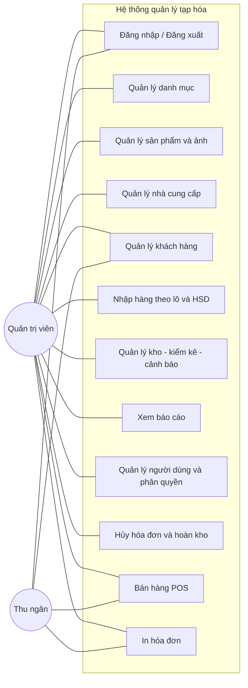

*Ghi chú: "Đăng nhập / Đăng xuất" là điều kiện tiên quyết cho mọi chức năng nghiệp vụ, nên biểu đồ không dùng quan hệ include từ các use case tới Đăng nhập; ràng buộc này được nêu trong phần "Tiền điều kiện" của từng use case.*

### 2.3.3 Mô tả Use Case chi tiết

Để bảo đảm tính nhất quán giữa yêu cầu chức năng (FR) và use case, hệ thống được tổ chức thành các use case dưới đây; trong đó các nghiệp vụ trọng tâm được mô tả chi tiết, các nghiệp vụ CRUD đơn giản được mô tả tóm tắt.

| Mã UC | Tên Use Case                                      | Actor                       | FR liên quan | Mức mô tả |
| ------ | -------------------------------------------------- | --------------------------- | ------------- | ------------ |
| UC-01  | Đăng nhập / Đăng xuất                        | Admin, Cashier              | FR-01         | Chi tiết    |
| UC-02  | Quản lý danh mục                                | Admin (Cashier chỉ xem)    | FR-02         | Chi tiết    |
| UC-03  | Quản lý sản phẩm                               | Admin (Cashier chỉ xem)    | FR-03         | Chi tiết    |
| UC-04  | Quản lý khách hàng                             | Admin, Cashier (tạo nhanh) | FR-04         | Tóm tắt    |
| UC-05  | Quản lý nhà cung cấp                           | Admin                       | FR-05         | Tóm tắt    |
| UC-06  | Nhập hàng theo lô và HSD                       | Admin                       | FR-06         | Chi tiết    |
| UC-07  | Bán hàng POS (gồm in hóa đơn)                | Admin, Cashier              | FR-07, FR-13  | Chi tiết    |
| UC-08  | Xuất kho thủ công / Hủy hàng                  | Admin                       | FR-08         | Tóm tắt    |
| UC-09  | Kiểm kê kho                                      | Admin                       | FR-09         | Tóm tắt    |
| UC-10  | Báo cáo và cảnh báo tồn kho / hạn sử dụng | Admin                       | FR-10, FR-11  | Chi tiết    |
| UC-11  | Hủy hóa đơn và hoàn kho                      | Admin                       | FR-12         | Chi tiết    |
| UC-12  | Quản lý người dùng và phân quyền           | Admin                       | FR-14         | Chi tiết    |

#### UC – Đăng nhập / Đăng xuất

| Nội dung                                                                                                                                                | Mô tả                                                                                                                                                                                                                                                                 |
| -------------------------------------------------------------------------------------------------------------------------------------------------------- | ----------------------------------------------------------------------------------------------------------------------------------------------------------------------------------------------------------------------------------------------------------------------- |
| Tên Usecase                                                                                                                                             | Đăng nhập / Đăng xuất                                                                                                                                                                                                                                             |
| Tác nhân                                                                                                                                               | Quản trị viên, Thu ngân                                                                                                                                                                                                                                             |
| Mô tả                                                                                                                                                  | Cho phép người dùng cung cấp thông tin xác thực để vào hệ thống và đóng phiên làm việc khi kết thúc ca trực. Đây là bước bắt buộc trước khi thực hiện bất kỳ thao tác nghiệp vụ nào trong hệ thống.                            |
| Tiền điều kiện                                                                                                                                       | Người dùng đã được quản trị viên cấp tài khoản và tài khoản đang ở trạng thái hoạt động.                                                                                                                                                        |
| Hậu điều kiện                                                                                                                                        | Sau đăng nhập thành công, người dùng được cấp phiên làm việc kèm vai trò tương ứng và vào được các chức năng được phép; sau đăng xuất, phiên làm việc bị đóng và mọi thao tác tiếp theo đều yêu cầu đăng nhập lại. |
| Luồng chính (Đăng nhập)                                                                                                                             | 1. Người dùng mở trang đăng nhập của hệ thống.                                                                                                                                                                                                                |
| 2. Hệ thống hiển thị biểu mẫu đăng nhập.                                                                                                        |                                                                                                                                                                                                                                                                         |
| 3. Người dùng nhập tên đăng nhập và mật khẩu.                                                                                                 |                                                                                                                                                                                                                                                                         |
| 4. Người dùng xác nhận đăng nhập.                                                                                                                |                                                                                                                                                                                                                                                                         |
| 5. Hệ thống đối chiếu thông tin xác thực với tài khoản đã đăng ký.                                                                       |                                                                                                                                                                                                                                                                         |
| 6. Hệ thống khởi tạo phiên làm việc, xác định vai trò của người dùng và chuyển đến trang chính phù hợp với vai trò đó.         |                                                                                                                                                                                                                                                                         |
| Luồng chính (Đăng xuất)                                                                                                                             | 1. Người dùng chọn chức năng “Đăng xuất” từ menu cá nhân.                                                                                                                                                                                                 |
| 2. Hệ thống hiển thị hộp thoại xác nhận.                                                                                                         |                                                                                                                                                                                                                                                                         |
| 3. Người dùng xác nhận thao tác.                                                                                                                   |                                                                                                                                                                                                                                                                         |
| 4. Hệ thống đóng phiên làm việc hiện tại và quay về trang đăng nhập.                                                                       |                                                                                                                                                                                                                                                                         |
| Luồng thay thế                                                                                                                                         | • Người dùng nhập sai tên đăng nhập hoặc mật khẩu → Hệ thống thông báo thông tin không chính xác và đề nghị nhập lại.                                                                                                                        |
| • Tài khoản đang ở trạng thái bị khóa → Hệ thống thông báo tài khoản đã bị khóa và đề nghị liên hệ quản trị viên.           |                                                                                                                                                                                                                                                                         |
| • Người dùng nhập sai quá số lần cho phép → Hệ thống tạm khóa tài khoản trong một khoảng thời gian để phòng tránh dò mật khẩu. |                                                                                                                                                                                                                                                                         |
| • Phiên làm việc hết hạn do không hoạt động → Hệ thống tự động đăng xuất và yêu cầu người dùng đăng nhập lại.               |                                                                                                                                                                                                                                                                         |
| • Người dùng hủy thao tác đăng xuất ở hộp thoại xác nhận → Hệ thống giữ nguyên phiên làm việc hiện tại.                          |                                                                                                                                                                                                                                                                         |
| • Hệ thống gặp sự cố trong quá trình xác thực → Hiển thị thông báo lỗi và đề nghị người dùng thử lại.                           |                                                                                                                                                                                                                                                                         |

#### UC - Quản lý danh mục

- Tên Use Case: Quản lý danh mục
- Tác nhân: Quản trị viên
- Mô tả: Quản trị viên quản lý các danh mục dùng để phân loại hàng hóa trong cửa hàng tạp hóa (đồ uống, bánh kẹo, đồ gia dụng, hóa mỹ phẩm, …), giúp việc tra cứu, bán hàng và lập báo cáo theo nhóm hàng trở nên thuận tiện.
- Bao gồm: Thêm danh mục, Sửa danh mục, Xóa danh mục, Xem danh sách danh mục.

#### UC – Thêm danh mục

| Nội dung                                                                                                                                           | Mô tả                                                                                                                      |
| --------------------------------------------------------------------------------------------------------------------------------------------------- | ---------------------------------------------------------------------------------------------------------------------------- |
| Tên Usecase                                                                                                                                        | Thêm danh mục                                                                                                              |
| Tác nhân                                                                                                                                          | Quản trị viên                                                                                                             |
| Mô tả                                                                                                                                             | Cho phép quản trị viên khai báo một nhóm hàng hóa mới vào hệ thống để phục vụ việc phân loại sản phẩm. |
| Tiền điều kiện                                                                                                                                  | Quản trị viên đã đăng nhập vào hệ thống và được cấp quyền quản lý danh mục.                              |
| Hậu điều kiện                                                                                                                                   | Danh mục mới được ghi nhận vào hệ thống và sẵn sàng để gán cho các sản phẩm.                               |
| Luồng chính                                                                                                                                       | 1. Người dùng chọn chức năng “Thêm danh mục” trong màn hình quản lý danh mục.                                 |
| 2. Hệ thống hiển thị biểu mẫu nhập thông tin danh mục.                                                                                     |                                                                                                                              |
| 3. Người dùng nhập tên danh mục, mô tả ngắn và chọn trạng thái đang sử dụng.                                                        |                                                                                                                              |
| 4. Người dùng xác nhận lưu thông tin.                                                                                                        |                                                                                                                              |
| 5. Hệ thống kiểm tra tính đầy đủ của thông tin và đối chiếu để bảo đảm tên danh mục không bị trùng với danh mục đã có. |                                                                                                                              |
| 6. Hệ thống ghi nhận danh mục mới vào danh sách và hiển thị thông báo thêm thành công.                                               |                                                                                                                              |
| Luồng thay thế                                                                                                                                    | • Người dùng bỏ trống tên danh mục → Hệ thống thông báo trường bắt buộc và yêu cầu nhập lại.           |
| • Tên danh mục bị trùng với danh mục đã tồn tại → Hệ thống thông báo trùng và đề nghị người dùng nhập tên khác.          |                                                                                                                              |
| • Hệ thống gặp sự cố trong quá trình lưu → Hiển thị thông báo lỗi và đề nghị người dùng thực hiện lại.                     |                                                                                                                              |

#### UC – Sửa danh mục

| Nội dung                                                                                                           | Mô tả                                                                                                                                                                 |
| ------------------------------------------------------------------------------------------------------------------- | ----------------------------------------------------------------------------------------------------------------------------------------------------------------------- |
| Tên Usecase                                                                                                        | Sửa danh mục                                                                                                                                                          |
| Tác nhân                                                                                                          | Quản trị viên                                                                                                                                                        |
| Mô tả                                                                                                             | Cho phép quản trị viên cập nhật thông tin của một danh mục đã tồn tại (đổi tên, mô tả, tạm ngừng sử dụng) khi nghiệp vụ bán hàng thay đổi. |
| Tiền điều kiện                                                                                                  | 1. Quản trị viên đã đăng nhập và được cấp quyền quản lý danh mục.                                                                                      |
| 2. Danh mục cần chỉnh sửa đang tồn tại và hiển thị trong danh sách.                                      |                                                                                                                                                                         |
| Hậu điều kiện                                                                                                   | Thông tin của danh mục được cập nhật và phản ánh ngay trên toàn hệ thống.                                                                                |
| Luồng chính                                                                                                       | 1. Người dùng chọn danh mục cần chỉnh sửa từ danh sách.                                                                                                       |
| 2. Hệ thống hiển thị thông tin hiện có của danh mục trên biểu mẫu chỉnh sửa.                          |                                                                                                                                                                         |
| 3. Người dùng cập nhật tên, mô tả hoặc trạng thái sử dụng của danh mục.                              |                                                                                                                                                                         |
| 4. Người dùng xác nhận lưu thay đổi.                                                                        |                                                                                                                                                                         |
| 5. Hệ thống kiểm tra tính hợp lệ của thông tin và bảo đảm tên mới không trùng với danh mục khác. |                                                                                                                                                                         |
| 6. Hệ thống ghi nhận thay đổi và hiển thị thông báo cập nhật thành công.                              |                                                                                                                                                                         |
| Luồng thay thế                                                                                                    | • Không tìm thấy danh mục cần chỉnh sửa → Hệ thống thông báo danh mục không tồn tại và quay lại danh sách.                                          |
| • Tên mới trùng với danh mục khác → Hệ thống báo trùng và đề nghị người dùng nhập tên khác.   |                                                                                                                                                                         |
| • Thông tin nhập vào không hợp lệ → Hệ thống chỉ ra các trường bị sai và yêu cầu sửa lại.       |                                                                                                                                                                         |
| • Hệ thống gặp sự cố khi lưu thay đổi → Hiển thị thông báo lỗi và đề nghị thực hiện lại.      |                                                                                                                                                                         |

#### UC – Xóa danh mục

| Nội dung                                                                                                                  | Mô tả                                                                                                                                                                                                                             |
| -------------------------------------------------------------------------------------------------------------------------- | ----------------------------------------------------------------------------------------------------------------------------------------------------------------------------------------------------------------------------------- |
| Tên Usecase                                                                                                               | Xóa danh mục                                                                                                                                                                                                                      |
| Tác nhân                                                                                                                 | Quản trị viên                                                                                                                                                                                                                    |
| Mô tả                                                                                                                    | Cho phép quản trị viên ngừng sử dụng một danh mục không còn phù hợp với nghiệp vụ kinh doanh. Danh mục sau khi xóa sẽ ẩn khỏi các màn hình nhưng vẫn được lưu trữ để phục vụ tra cứu lịch sử. |
| Tiền điều kiện                                                                                                         | 1. Quản trị viên đã đăng nhập và được cấp quyền quản lý danh mục.                                                                                                                                                  |
| 2. Danh mục cần xóa đang tồn tại trong hệ thống.                                                                   |                                                                                                                                                                                                                                     |
| Hậu điều kiện                                                                                                          | Danh mục được đánh dấu ngừng sử dụng và không còn xuất hiện trong các danh sách nghiệp vụ.                                                                                                                       |
| Luồng chính                                                                                                              | 1. Người dùng chọn danh mục cần xóa từ danh sách.                                                                                                                                                                          |
| 2. Hệ thống hiển thị hộp thoại xác nhận kèm tóm tắt thông tin danh mục.                                       |                                                                                                                                                                                                                                     |
| 3. Người dùng xác nhận thao tác xóa.                                                                                |                                                                                                                                                                                                                                     |
| 4. Hệ thống kiểm tra xem danh mục có đang được gán cho sản phẩm nào không.                                   |                                                                                                                                                                                                                                     |
| 5. Hệ thống đánh dấu danh mục ở trạng thái ngừng sử dụng và ẩn khỏi danh sách hiện hành.                 |                                                                                                                                                                                                                                     |
| 6. Hệ thống hiển thị thông báo xóa thành công.                                                                    |                                                                                                                                                                                                                                     |
| Luồng thay thế                                                                                                           | • Danh mục đang được gán cho sản phẩm đang kinh doanh → Hệ thống cảnh báo và đề nghị người dùng chuyển các sản phẩm sang danh mục khác trước khi xóa.                                                |
| • Người dùng hủy thao tác xóa ở hộp thoại xác nhận → Hệ thống giữ nguyên trạng thái danh mục.          |                                                                                                                                                                                                                                     |
| • Hệ thống gặp sự cố trong khi xử lý → Hiển thị thông báo lỗi và đề nghị người dùng thực hiện lại. |                                                                                                                                                                                                                                     |

#### UC – Xem danh sách danh mục

| Nội dung                                                                                                                                                 | Mô tả                                                                                                                                                            |
| --------------------------------------------------------------------------------------------------------------------------------------------------------- | ------------------------------------------------------------------------------------------------------------------------------------------------------------------ |
| Tên Usecase                                                                                                                                              | Xem danh sách danh mục                                                                                                                                           |
| Tác nhân                                                                                                                                                | Quản trị viên, Thu ngân                                                                                                                                        |
| Mô tả                                                                                                                                                   | Cho phép người dùng tra cứu toàn bộ danh mục hàng hóa đang được sử dụng, phục vụ cho công tác quản lý sản phẩm và bán hàng hàng ngày. |
| Tiền điều kiện                                                                                                                                        | Người dùng đã đăng nhập vào hệ thống.                                                                                                                   |
| Hậu điều kiện                                                                                                                                         | Người dùng nhìn thấy danh sách danh mục kèm khả năng tìm kiếm và phân trang.                                                                         |
| Luồng chính                                                                                                                                             | 1. Người dùng chọn chức năng “Quản lý danh mục” từ menu.                                                                                               |
| 2. Hệ thống hiển thị danh sách các danh mục đang được sử dụng theo thứ tự tên.                                                            |                                                                                                                                                                    |
| 3. Người dùng có thể nhập từ khóa tìm kiếm theo tên hoặc chọn bộ lọc theo trạng thái sử dụng.                                          |                                                                                                                                                                    |
| 4. Hệ thống lọc và hiển thị các danh mục phù hợp với yêu cầu.                                                                                |                                                                                                                                                                    |
| 5. Người dùng có thể chuyển trang hoặc mở chi tiết một danh mục cụ thể để xem thông tin đầy đủ.                                       |                                                                                                                                                                    |
| Luồng thay thế                                                                                                                                          | • Hệ thống không có danh mục nào → Hiển thị thông báo danh sách trống và gợi ý tạo mới.                                                         |
| • Không có kết quả phù hợp với từ khóa tìm kiếm → Hệ thống thông báo không tìm thấy kết quả và đề nghị điều chỉnh từ khóa. |                                                                                                                                                                    |
| • Hệ thống gặp sự cố khi tải dữ liệu → Hiển thị thông báo lỗi và đề nghị tải lại trang.                                              |                                                                                                                                                                    |

#### UC – Quản lý sản phẩm

- Tên Use Case: Quản lý sản phẩm
- Tác nhân: Quản trị viên, Thu ngân (chỉ xem).
- Mô tả: Quản trị viên duy trì toàn bộ danh mục hàng hóa của cửa hàng, bao gồm khai báo sản phẩm mới (kèm ảnh đại diện), cập nhật thông tin kinh doanh, ngừng kinh doanh sản phẩm không còn phù hợp và tra cứu danh sách sản phẩm hiện hành.
- Bao gồm: Thêm sản phẩm, Sửa sản phẩm, Ngừng kinh doanh sản phẩm, Xem danh sách sản phẩm.

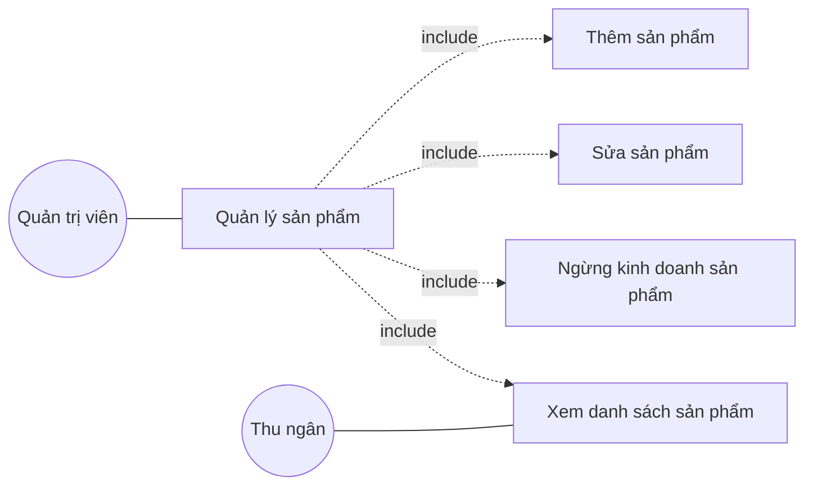

#### UC – Thêm sản phẩm

| Nội dung                                                                                                                                                  | Mô tả                                                                                                                                                        |
| ---------------------------------------------------------------------------------------------------------------------------------------------------------- | -------------------------------------------------------------------------------------------------------------------------------------------------------------- |
| Tên Usecase                                                                                                                                               | Thêm sản phẩm                                                                                                                                               |
| Tác nhân                                                                                                                                                 | Quản trị viên                                                                                                                                               |
| Mô tả                                                                                                                                                    | Cho phép quản trị viên khai báo một mặt hàng mới vào hệ thống cùng với ảnh đại diện để phục vụ nghiệp vụ bán hàng và quản lý kho. |
| Tiền điều kiện                                                                                                                                         | 1. Quản trị viên đã đăng nhập và được cấp quyền quản lý sản phẩm.                                                                            |
| 2. Đã có ít nhất một danh mục hàng hóa để gán cho sản phẩm.                                                                                  |                                                                                                                                                                |
| Hậu điều kiện                                                                                                                                          | Sản phẩm mới được ghi nhận trong hệ thống, sẵn sàng để nhập hàng và hiển thị trên màn hình bán hàng.                                    |
| Luồng chính                                                                                                                                              | 1. Người dùng chọn chức năng “Thêm sản phẩm”.                                                                                                       |
| 2. Hệ thống hiển thị biểu mẫu khai báo sản phẩm.                                                                                                  |                                                                                                                                                                |
| 3. Người dùng nhập tên sản phẩm, mã vạch, chọn danh mục, đơn vị tính, giá vốn, giá bán và mức tồn tối thiểu.                       |                                                                                                                                                                |
| 4. Người dùng tải lên ảnh đại diện cho sản phẩm.                                                                                                |                                                                                                                                                                |
| 5. Hệ thống kiểm tra định dạng và dung lượng ảnh, tự động chuẩn hóa kích thước để hiển thị đồng nhất trên màn hình bán hàng. |                                                                                                                                                                |
| 6. Người dùng xác nhận lưu.                                                                                                                          |                                                                                                                                                                |
| 7. Hệ thống kiểm tra tính hợp lệ của dữ liệu và bảo đảm mã vạch không bị trùng với sản phẩm đã có.                                 |                                                                                                                                                                |
| 8. Hệ thống ghi nhận sản phẩm mới và hiển thị thông báo thêm thành công.                                                                     |                                                                                                                                                                |
| Luồng thay thế                                                                                                                                           | • Mã vạch trùng với sản phẩm đã tồn tại → Hệ thống thông báo trùng và đề nghị nhập mã khác.                                            |
| • Tệp ảnh sai định dạng hoặc vượt quá dung lượng cho phép → Hệ thống thông báo lỗi và đề nghị chọn tệp khác.                     |                                                                                                                                                                |
| • Người dùng không tải ảnh → Hệ thống sử dụng ảnh mặc định tạm thời cho sản phẩm.                                                      |                                                                                                                                                                |
| • Thông tin bắt buộc bị bỏ trống → Hệ thống chỉ ra các trường cần bổ sung.                                                                 |                                                                                                                                                                |
| • Hệ thống gặp sự cố khi lưu → Hiển thị thông báo lỗi và đề nghị thực hiện lại.                                                        |                                                                                                                                                                |

#### UC – Sửa sản phẩm

| Nội dung                                                                                                              | Mô tả                                                                                                                                                                                        |
| ---------------------------------------------------------------------------------------------------------------------- | ---------------------------------------------------------------------------------------------------------------------------------------------------------------------------------------------- |
| Tên Usecase                                                                                                           | Sửa sản phẩm                                                                                                                                                                                |
| Tác nhân                                                                                                             | Quản trị viên                                                                                                                                                                               |
| Mô tả                                                                                                                | Cho phép quản trị viên cập nhật thông tin của một sản phẩm đã tồn tại như đổi giá bán, thay ảnh đại diện, chuyển danh mục hoặc điều chỉnh mức tồn tối thiểu. |
| Tiền điều kiện                                                                                                     | 1. Quản trị viên đã đăng nhập và được cấp quyền quản lý sản phẩm.                                                                                                            |
| 2. Sản phẩm cần chỉnh sửa đang tồn tại trong hệ thống.                                                       |                                                                                                                                                                                                |
| Hậu điều kiện                                                                                                      | Thông tin của sản phẩm được cập nhật và phản ánh ngay trên các màn hình nghiệp vụ.                                                                                           |
| Luồng chính                                                                                                          | 1. Người dùng chọn sản phẩm cần chỉnh sửa từ danh sách.                                                                                                                             |
| 2. Hệ thống hiển thị thông tin hiện có trên biểu mẫu chỉnh sửa.                                            |                                                                                                                                                                                                |
| 3. Người dùng cập nhật các thông tin cần thay đổi và có thể tải lên ảnh đại diện mới.              |                                                                                                                                                                                                |
| 4. Hệ thống kiểm tra định dạng, dung lượng và chuẩn hóa kích thước ảnh nếu có thay đổi.             |                                                                                                                                                                                                |
| 5. Người dùng xác nhận lưu thay đổi.                                                                           |                                                                                                                                                                                                |
| 6. Hệ thống kiểm tra tính hợp lệ và bảo đảm mã vạch mới không trùng với sản phẩm khác.              |                                                                                                                                                                                                |
| 7. Hệ thống ghi nhận thay đổi và hiển thị thông báo cập nhật thành công.                                 |                                                                                                                                                                                                |
| Luồng thay thế                                                                                                       | • Không tìm thấy sản phẩm cần chỉnh sửa → Hệ thống thông báo sản phẩm không tồn tại và quay lại danh sách.                                                               |
| • Mã vạch mới trùng với sản phẩm khác → Hệ thống báo trùng và đề nghị nhập mã khác.               |                                                                                                                                                                                                |
| • Ảnh mới sai định dạng hoặc vượt quá dung lượng → Hệ thống thông báo lỗi và giữ nguyên ảnh cũ. |                                                                                                                                                                                                |
| • Thông tin nhập vào không hợp lệ → Hệ thống chỉ ra các trường cần sửa.                                |                                                                                                                                                                                                |
| • Hệ thống gặp sự cố khi lưu thay đổi → Hiển thị thông báo lỗi và đề nghị thực hiện lại.         |                                                                                                                                                                                                |

#### UC – Ngừng kinh doanh sản phẩm

| Nội dung                                                                                                                     | Mô tả                                                                                                                                                                                                                                                  |
| ----------------------------------------------------------------------------------------------------------------------------- | -------------------------------------------------------------------------------------------------------------------------------------------------------------------------------------------------------------------------------------------------------- |
| Tên Usecase                                                                                                                  | Ngừng kinh doanh sản phẩm                                                                                                                                                                                                                             |
| Tác nhân                                                                                                                    | Quản trị viên                                                                                                                                                                                                                                         |
| Mô tả                                                                                                                       | Cho phép quản trị viên đánh dấu một sản phẩm ngừng kinh doanh khi không còn nhập hoặc bán nữa. Sản phẩm bị ẩn khỏi màn hình bán hàng nhưng vẫn được lưu trữ để phục vụ tra cứu hóa đơn và báo cáo lịch sử. |
| Tiền điều kiện                                                                                                            | 1. Quản trị viên đã đăng nhập và được cấp quyền quản lý sản phẩm.                                                                                                                                                                      |
| 2. Sản phẩm cần ngừng kinh doanh đang tồn tại trong hệ thống.                                                        |                                                                                                                                                                                                                                                          |
| Hậu điều kiện                                                                                                             | Sản phẩm được đánh dấu ngừng kinh doanh, không còn xuất hiện trên màn hình bán hàng và phiếu nhập hàng mới.                                                                                                                       |
| Luồng chính                                                                                                                 | 1. Người dùng chọn sản phẩm cần ngừng kinh doanh từ danh sách.                                                                                                                                                                                 |
| 2. Hệ thống hiển thị hộp thoại xác nhận kèm tóm tắt thông tin sản phẩm và số tồn kho hiện có.              |                                                                                                                                                                                                                                                          |
| 3. Người dùng xác nhận thao tác.                                                                                        |                                                                                                                                                                                                                                                          |
| 4. Hệ thống kiểm tra tình trạng tồn kho và lịch sử giao dịch của sản phẩm.                                       |                                                                                                                                                                                                                                                          |
| 5. Hệ thống đánh dấu sản phẩm ở trạng thái ngừng kinh doanh và ẩn khỏi các danh sách nghiệp vụ hiện hành. |                                                                                                                                                                                                                                                          |
| 6. Hệ thống hiển thị thông báo ngừng kinh doanh thành công.                                                          |                                                                                                                                                                                                                                                          |
| Luồng thay thế                                                                                                              | • Sản phẩm vẫn còn tồn kho lớn hơn 0 → Hệ thống cảnh báo và đề nghị người dùng xuất hết hàng hoặc hủy lô hàng tồn trước khi ngừng kinh doanh.                                                                             |
| • Người dùng hủy thao tác ở hộp thoại xác nhận → Hệ thống giữ nguyên trạng thái sản phẩm.                 |                                                                                                                                                                                                                                                          |
| • Hệ thống gặp sự cố trong khi xử lý → Hiển thị thông báo lỗi và đề nghị thực hiện lại.                  |                                                                                                                                                                                                                                                          |

#### UC – Xem danh sách sản phẩm

| Nội dung                                                                                                                                              | Mô tả                                                                                                                                                                             |
| ------------------------------------------------------------------------------------------------------------------------------------------------------ | ----------------------------------------------------------------------------------------------------------------------------------------------------------------------------------- |
| Tên Usecase                                                                                                                                           | Xem danh sách sản phẩm                                                                                                                                                           |
| Tác nhân                                                                                                                                             | Quản trị viên, Thu ngân                                                                                                                                                         |
| Mô tả                                                                                                                                                | Cho phép người dùng tra cứu toàn bộ sản phẩm đang kinh doanh kèm khả năng tìm kiếm theo tên, mã vạch và lọc theo danh mục, mức tồn kho hoặc hạn sử dụng. |
| Tiền điều kiện                                                                                                                                     | Người dùng đã đăng nhập vào hệ thống.                                                                                                                                    |
| Hậu điều kiện                                                                                                                                      | Hệ thống hiển thị danh sách sản phẩm theo điều kiện tra cứu, có khả năng phân trang và xem chi tiết.                                                               |
| Luồng chính                                                                                                                                          | 1. Người dùng chọn chức năng “Quản lý sản phẩm” hoặc “Danh sách sản phẩm” từ menu.                                                                               |
| 2. Hệ thống hiển thị danh sách sản phẩm đang kinh doanh kèm ảnh đại diện, tên, mã vạch, danh mục, giá bán và số tồn hiện có.   |                                                                                                                                                                                     |
| 3. Người dùng có thể nhập từ khóa tìm kiếm theo tên hoặc mã vạch.                                                                        |                                                                                                                                                                                     |
| 4. Người dùng có thể chọn bộ lọc theo danh mục, tình trạng tồn kho hoặc theo sản phẩm sắp hết hạn.                                   |                                                                                                                                                                                     |
| 5. Hệ thống lọc và hiển thị các sản phẩm phù hợp với yêu cầu.                                                                            |                                                                                                                                                                                     |
| 6. Người dùng có thể chuyển trang hoặc mở chi tiết một sản phẩm để xem đầy đủ thông tin.                                            |                                                                                                                                                                                     |
| Luồng thay thế                                                                                                                                       | • Hệ thống không có sản phẩm nào → Hiển thị thông báo danh sách trống và gợi ý tạo mới.                                                                         |
| • Không có kết quả phù hợp với từ khóa hoặc bộ lọc → Hệ thống thông báo không tìm thấy và đề nghị điều chỉnh điều kiện. |                                                                                                                                                                                     |
| • Hệ thống gặp sự cố khi tải dữ liệu → Hiển thị thông báo lỗi và đề nghị tải lại trang.                                           |                                                                                                                                                                                     |

#### UC – Quản lý khách hàng (tóm tắt)

- Tác nhân: Quản trị viên (đầy đủ), Thu ngân (tạo nhanh tại POS).
- Mô tả: Thêm, sửa, xem và tìm kiếm khách hàng phục vụ lập hóa đơn và làm cơ sở cho chương trình tích điểm về sau. Thu ngân có thể tạo nhanh khách hàng ngay trên màn hình bán hàng mà không rời quầy.
- Luồng chính: chọn chức năng quản lý khách hàng → nhập/cập nhật họ tên, số điện thoại, địa chỉ → hệ thống kiểm tra trùng số điện thoại → lưu và thông báo thành công.
- Luồng thay thế: số điện thoại trùng → cảnh báo và đề nghị nhập lại; bỏ trống trường bắt buộc → yêu cầu bổ sung.
- Tiền điều kiện: người dùng đã đăng nhập và có quyền tương ứng.

#### UC – Quản lý nhà cung cấp (tóm tắt)

- Tác nhân: Quản trị viên.
- Mô tả: Thêm, sửa, xóa (ẩn) và xem danh sách nhà cung cấp; thông tin nhà cung cấp được dùng khi lập phiếu nhập hàng.
- Luồng chính: chọn chức năng quản lý nhà cung cấp → nhập/cập nhật tên, số điện thoại, email, người liên hệ, địa chỉ → hệ thống kiểm tra hợp lệ → lưu và thông báo thành công.
- Luồng thay thế: trùng tên hoặc sai định dạng → cảnh báo; nhà cung cấp đang gắn với phiếu nhập → chỉ ẩn (ngừng sử dụng), không xóa cứng để giữ lịch sử.
- Tiền điều kiện: người dùng đã đăng nhập và có quyền quản lý nhà cung cấp.

#### UC – Nhập hàng theo lô và hạn sử dụng

| Nội dung                                                                                                                                                                    | Mô tả                                                                                                                                                                                                                      |
| ---------------------------------------------------------------------------------------------------------------------------------------------------------------------------- | ---------------------------------------------------------------------------------------------------------------------------------------------------------------------------------------------------------------------------- |
| Tên Usecase                                                                                                                                                                 | Nhập hàng theo lô và hạn sử dụng                                                                                                                                                                                      |
| Tác nhân                                                                                                                                                                   | Quản trị viên                                                                                                                                                                                                             |
| Mô tả                                                                                                                                                                      | Cho phép quản trị viên lập phiếu nhập hàng từ nhà cung cấp, ghi nhận chi tiết từng lô hàng (mã lô, hạn sử dụng, số lượng, giá nhập) để phục vụ việc xuất kho ưu tiên hàng sắp hết hạn. |
| Tiền điều kiện                                                                                                                                                           | 1. Quản trị viên đã đăng nhập và được cấp quyền nhập hàng.                                                                                                                                                   |
| 2. Nhà cung cấp và các sản phẩm cần nhập đã được khai báo trong hệ thống.                                                                                    |                                                                                                                                                                                                                              |
| Hậu điều kiện                                                                                                                                                            | Phiếu nhập hàng được lưu trữ và tồn kho của từng sản phẩm được cập nhật tương ứng với từng lô hàng vừa nhập.                                                                                     |
| Luồng chính                                                                                                                                                                | 1. Người dùng chọn chức năng “Nhập hàng”.                                                                                                                                                                          |
| 2. Hệ thống hiển thị màn hình lập phiếu nhập.                                                                                                                       |                                                                                                                                                                                                                              |
| 3. Người dùng chọn nhà cung cấp và bổ sung các dòng hàng hóa cần nhập; với mỗi dòng, nhập sản phẩm, số lượng, giá nhập, mã lô và hạn sử dụng. |                                                                                                                                                                                                                              |
| 4. Hệ thống tự tính tổng tiền của phiếu nhập.                                                                                                                       |                                                                                                                                                                                                                              |
| 5. Người dùng xác nhận lưu phiếu.                                                                                                                                     |                                                                                                                                                                                                                              |
| 6. Hệ thống tự sinh số phiếu nhập theo nguyên tắc đánh số của cửa hàng, ghi nhận phiếu nhập cùng các dòng hàng và cập nhật tồn kho theo từng lô.  |                                                                                                                                                                                                                              |
| 7. Hệ thống hiển thị thông báo nhập hàng thành công và cho phép in hoặc xem lại phiếu nhập.                                                                  |                                                                                                                                                                                                                              |
| Luồng thay thế                                                                                                                                                             | • Người dùng bỏ trống thông tin bắt buộc (nhà cung cấp, sản phẩm, số lượng, giá nhập) → Hệ thống chỉ ra các trường cần bổ sung.                                                                   |
| • Hạn sử dụng nhập vào là ngày trong quá khứ → Hệ thống cảnh báo và đề nghị người dùng xác nhận lại.                                                |                                                                                                                                                                                                                              |
| • Sản phẩm chưa có trong hệ thống → Hệ thống đề nghị tạo mới sản phẩm hoặc chọn sản phẩm khác.                                                         |                                                                                                                                                                                                                              |
| • Hệ thống gặp sự cố khi lưu phiếu → Toàn bộ thay đổi bị hủy bỏ, tồn kho giữ nguyên và hiển thị thông báo lỗi.                                      |                                                                                                                                                                                                                              |

#### UC – Bán hàng tại quầy (POS)

| Nội dung                                                                                                                                                                                                                          | Mô tả                                                                                                                                                                                                                                |
| ---------------------------------------------------------------------------------------------------------------------------------------------------------------------------------------------------------------------------------- | -------------------------------------------------------------------------------------------------------------------------------------------------------------------------------------------------------------------------------------- |
| Tên Usecase                                                                                                                                                                                                                       | Bán hàng tại quầy                                                                                                                                                                                                                  |
| Tác nhân                                                                                                                                                                                                                         | Thu ngân (hoặc Quản trị viên)                                                                                                                                                                                                     |
| Mô tả                                                                                                                                                                                                                            | Cho phép thu ngân thực hiện nghiệp vụ bán hàng cho khách tại quầy: lập hóa đơn, nhận thanh toán, in hóa đơn và tự động cập nhật tồn kho theo nguyên tắc ưu tiên xuất lô hàng sắp hết hạn trước. |
| Tiền điều kiện                                                                                                                                                                                                                 | Người dùng đã đăng nhập và được cấp quyền bán hàng.                                                                                                                                                                    |
| Hậu điều kiện                                                                                                                                                                                                                  | Hóa đơn ở trạng thái “Hoàn thành” được lưu trong hệ thống; tồn kho của các sản phẩm trên hóa đơn được giảm tương ứng.                                                                                  |
| Luồng chính                                                                                                                                                                                                                      | 1. Người dùng mở màn hình bán hàng.                                                                                                                                                                                            |
| 2. Hệ thống hiển thị danh sách sản phẩm đang kinh doanh kèm ảnh, tên, giá bán và số tồn hiện có.                                                                                                                 |                                                                                                                                                                                                                                        |
| 3. Người dùng chọn sản phẩm bằng cách bấm vào ảnh hoặc quét mã vạch; Hệ thống thêm sản phẩm vào giỏ hàng và tự cập nhật tổng tiền tạm tính.                                                         |                                                                                                                                                                                                                                        |
| 4. Người dùng điều chỉnh số lượng hoặc bỏ bớt các dòng hàng trên giỏ nếu cần.                                                                                                                                   |                                                                                                                                                                                                                                        |
| 5. Người dùng có thể chọn khách hàng quen hoặc bỏ qua nếu khách vãng lai.                                                                                                                                             |                                                                                                                                                                                                                                        |
| 6. Người dùng chọn phương thức thanh toán (tiền mặt, chuyển khoản, ví điện tử).                                                                                                                                    |                                                                                                                                                                                                                                        |
| 7. Với hình thức tiền mặt, người dùng nhập số tiền khách đưa; Hệ thống tự tính số tiền thừa.                                                                                                                  |                                                                                                                                                                                                                                        |
| 8. Người dùng xác nhận thanh toán.                                                                                                                                                                                           |                                                                                                                                                                                                                                        |
| 9. Hệ thống kiểm tra tồn kho thực tế, lập hóa đơn, giảm tồn kho theo nguyên tắc ưu tiên lô hàng có hạn sử dụng gần nhất và hiển thị thông báo thanh toán thành công kèm số tiền thừa.          |                                                                                                                                                                                                                                        |
| 10. Người dùng chọn in hóa đơn; Hệ thống xuất bản in cho khách hàng.                                                                                                                                                  |                                                                                                                                                                                                                                        |
| Luồng thay thế                                                                                                                                                                                                                   | • Sản phẩm không còn đủ tồn kho → Hệ thống thông báo hết hàng và đề nghị người dùng điều chỉnh số lượng hoặc thay thế sản phẩm.                                                                        |
| • Số tiền khách đưa nhỏ hơn tổng tiền cần thanh toán → Hệ thống thông báo thiếu tiền và yêu cầu nhập lại.                                                                                                  |                                                                                                                                                                                                                                        |
| • Hai thu ngân cùng bán những đơn vị cuối cùng của một sản phẩm → Hệ thống bảo đảm chỉ một giao dịch thành công, giao dịch còn lại được thông báo hết hàng và đề nghị làm mới giỏ hàng. |                                                                                                                                                                                                                                        |
| • Người dùng hủy giao dịch trước khi thanh toán → Hệ thống xóa giỏ hàng và không lưu hóa đơn.                                                                                                                 |                                                                                                                                                                                                                                        |
| • Hệ thống gặp sự cố khi lưu hóa đơn → Hiển thị thông báo lỗi, giữ nguyên tồn kho và đề nghị thực hiện lại.                                                                                              |                                                                                                                                                                                                                                        |

#### UC – Hủy hóa đơn và hoàn kho

| Nội dung                                                                                                                                            | Mô tả                                                                                                                                                                                                                                 |
| ---------------------------------------------------------------------------------------------------------------------------------------------------- | --------------------------------------------------------------------------------------------------------------------------------------------------------------------------------------------------------------------------------------- |
| Tên Usecase                                                                                                                                         | Hủy hóa đơn và hoàn kho                                                                                                                                                                                                           |
| Tác nhân                                                                                                                                           | Quản trị viên                                                                                                                                                                                                                        |
| Mô tả                                                                                                                                              | Cho phép quản trị viên hủy một hóa đơn đã hoàn thành khi khách trả lại hàng hoặc thu ngân lập sai. Hệ thống tự động hoàn số lượng đã bán về tồn kho để bảo đảm số liệu kinh doanh chính xác. |
| Tiền điều kiện                                                                                                                                   | 1. Quản trị viên đã đăng nhập và được cấp quyền hủy hóa đơn.                                                                                                                                                          |
| 2. Hóa đơn cần hủy đang ở trạng thái đã hoàn thành.                                                                                     |                                                                                                                                                                                                                                         |
| Hậu điều kiện                                                                                                                                    | Hóa đơn được chuyển sang trạng thái “Đã hủy” kèm lý do; tồn kho của các sản phẩm trên hóa đơn được hoàn lại đúng bằng số lượng đã bán.                                                           |
| Luồng chính                                                                                                                                        | 1. Người dùng mở danh sách hóa đơn và chọn hóa đơn cần hủy.                                                                                                                                                              |
| 2. Hệ thống hiển thị chi tiết hóa đơn.                                                                                                       |                                                                                                                                                                                                                                         |
| 3. Người dùng chọn chức năng “Hủy hóa đơn” và nhập lý do hủy.                                                                        |                                                                                                                                                                                                                                         |
| 4. Người dùng xác nhận thao tác.                                                                                                               |                                                                                                                                                                                                                                         |
| 5. Hệ thống chuyển hóa đơn sang trạng thái đã hủy, ghi nhận người hủy và thời điểm hủy.                                          |                                                                                                                                                                                                                                         |
| 6. Hệ thống tự động hoàn số lượng của từng dòng hàng về tồn kho và ghi nhận lịch sử biến động kho.                             |                                                                                                                                                                                                                                         |
| 7. Hệ thống hiển thị thông báo hủy hóa đơn thành công.                                                                                   |                                                                                                                                                                                                                                         |
| Luồng thay thế                                                                                                                                     | • Hóa đơn đã ở trạng thái đã hủy → Hệ thống thông báo không thể hủy lại.                                                                                                                                           |
| • Người dùng không nhập lý do hủy → Hệ thống yêu cầu nhập lý do trước khi xác nhận.                                               |                                                                                                                                                                                                                                         |
| • Người dùng hủy thao tác ở bước xác nhận → Hệ thống giữ nguyên trạng thái hóa đơn.                                             |                                                                                                                                                                                                                                         |
| • Hệ thống gặp sự cố khi hoàn kho → Toàn bộ thay đổi bị hủy bỏ, hóa đơn giữ nguyên trạng thái và hiển thị thông báo lỗi. |                                                                                                                                                                                                                                         |

#### UC – Xuất kho thủ công / Hủy hàng (tóm tắt)

- Tác nhân: Quản trị viên.
- Mô tả: Ghi nhận việc xuất kho không qua bán hàng (hàng hỏng, hết hạn, mất mát) hoặc hủy bỏ lô hàng. Hệ thống trừ số lượng còn lại của lô tương ứng và ghi nhật ký kho loại "Xuất/Hủy".
- Luồng chính: chọn sản phẩm và lô cần xuất/hủy → nhập số lượng và lý do → hệ thống kiểm tra tồn của lô → trừ tồn và ghi nhật ký kho.
- Luồng thay thế: số lượng vượt tồn của lô → cảnh báo; thiếu lý do → yêu cầu nhập.
- Tiền điều kiện: người dùng đã đăng nhập và có quyền quản lý kho.

#### UC – Kiểm kê kho (tóm tắt)

- Tác nhân: Quản trị viên.
- Mô tả: Đối chiếu tồn kho thực tế với tồn kho trên hệ thống, ghi nhận chênh lệch và điều chỉnh tồn kho kèm nhật ký điều chỉnh để bảo đảm số liệu chính xác.
- Luồng chính: chọn phạm vi kiểm kê → nhập số lượng thực tế từng sản phẩm/lô → hệ thống tính chênh lệch → xác nhận điều chỉnh → ghi nhật ký kho loại "Điều chỉnh".
- Luồng thay thế: không có chênh lệch → chỉ ghi nhận đã kiểm kê; người dùng hủy trước khi xác nhận → giữ nguyên tồn kho.
- Tiền điều kiện: người dùng đã đăng nhập và có quyền kiểm kê kho.

#### UC – Báo cáo doanh thu, lợi nhuận và tồn kho

- Ngoài các báo cáo doanh thu, lợi nhuận và tồn kho, hệ thống còn tự động cảnh báo (FR-10) các sản phẩm có tồn kho dưới mức tối thiểu và các lô hàng sắp hết hạn sử dụng để Quản trị viên kịp thời nhập bù hoặc xả hàng.

| Nội dung                                                                                                                                             | Mô tả                                                                                                                                                                                                           |
| ----------------------------------------------------------------------------------------------------------------------------------------------------- | ----------------------------------------------------------------------------------------------------------------------------------------------------------------------------------------------------------------- |
| Tên Usecase                                                                                                                                          | Xem báo cáo doanh thu, lợi nhuận và tồn kho                                                                                                                                                                 |
| Tác nhân                                                                                                                                            | Quản trị viên                                                                                                                                                                                                  |
| Mô tả                                                                                                                                               | Cho phép quản trị viên theo dõi tình hình kinh doanh của cửa hàng thông qua các báo cáo doanh thu, lợi nhuận và tồn kho theo nhiều mốc thời gian khác nhau để phục vụ ra quyết định. |
| Tiền điều kiện                                                                                                                                    | Quản trị viên đã đăng nhập và được cấp quyền xem báo cáo.                                                                                                                                         |
| Hậu điều kiện                                                                                                                                     | Hệ thống hiển thị biểu đồ và bảng số liệu theo yêu cầu; người dùng có thể xuất báo cáo ra tệp để lưu trữ.                                                                               |
| Luồng chính                                                                                                                                         | 1. Người dùng chọn chức năng “Báo cáo” từ menu.                                                                                                                                                        |
| 2. Hệ thống hiển thị bảng điều khiển với các loại báo cáo: doanh thu, lợi nhuận và tồn kho.                                          |                                                                                                                                                                                                                   |
| 3. Người dùng chọn loại báo cáo và khoảng thời gian (ngày, tuần, tháng hoặc khoảng tùy chọn).                                        |                                                                                                                                                                                                                   |
| 4. Hệ thống tổng hợp số liệu từ các hóa đơn và lịch sử biến động kho tương ứng.                                                   |                                                                                                                                                                                                                   |
| 5. Hệ thống hiển thị kết quả dưới dạng biểu đồ tổng quan và bảng chi tiết.                                                            |                                                                                                                                                                                                                   |
| 6. Người dùng có thể chọn xuất kết quả ra tệp để lưu trữ hoặc chia sẻ.                                                                |                                                                                                                                                                                                                   |
| Luồng thay thế                                                                                                                                      | • Khoảng thời gian được chọn không có dữ liệu → Hệ thống thông báo không có giao dịch trong khoảng đã chọn.                                                                                |
| • Người dùng chọn khoảng thời gian không hợp lệ (ngày bắt đầu lớn hơn ngày kết thúc) → Hệ thống nhắc người dùng chọn lại. |                                                                                                                                                                                                                   |
| • Hệ thống gặp sự cố khi tổng hợp số liệu → Hiển thị thông báo lỗi và đề nghị thử lại.                                          |                                                                                                                                                                                                                   |

#### UC – Quản lý người dùng và phân quyền

- Tên Use Case: Quản lý người dùng và phân quyền
- Tác nhân: Quản trị viên
- Mô tả: Quản trị viên quản lý toàn bộ tài khoản nhân viên trong cửa hàng (thu ngân, quản trị viên khác), bao gồm tạo mới, cập nhật thông tin, khóa/mở khóa tài khoản, gán vai trò để xác định phạm vi thao tác và tra cứu danh sách người dùng.
- Bao gồm: Thêm tài khoản, Sửa thông tin tài khoản, Khóa/Mở khóa tài khoản, Phân quyền vai trò, Xem danh sách người dùng.

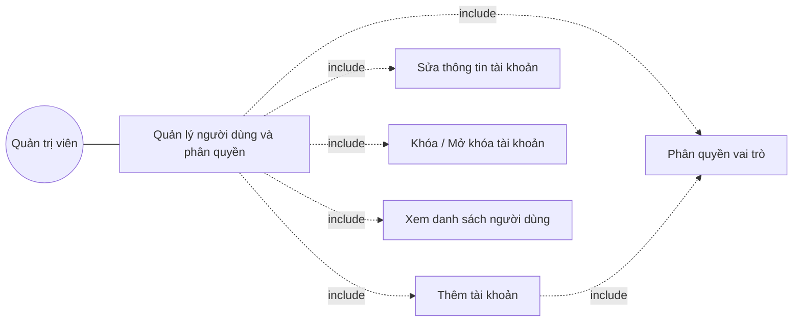

#### UC – Thêm tài khoản

| Nội dung                                                                                                                                                                   | Mô tả                                                                                                                                                                   |
| --------------------------------------------------------------------------------------------------------------------------------------------------------------------------- | ------------------------------------------------------------------------------------------------------------------------------------------------------------------------- |
| Tên Usecase                                                                                                                                                                | Thêm tài khoản người dùng                                                                                                                                           |
| Tác nhân                                                                                                                                                                  | Quản trị viên                                                                                                                                                          |
| Mô tả                                                                                                                                                                     | Cho phép quản trị viên tạo tài khoản đăng nhập cho nhân viên mới và gán vai trò ngay từ khi tạo để xác định phạm vi thao tác trong hệ thống.   |
| Tiền điều kiện                                                                                                                                                          | Quản trị viên đã đăng nhập và được cấp quyền quản lý người dùng.                                                                                       |
| Hậu điều kiện                                                                                                                                                           | Tài khoản mới được ghi nhận trong hệ thống và có hiệu lực ngay; nhân viên có thể dùng tên đăng nhập và mật khẩu khởi tạo để vào hệ thống. |
| Luồng chính                                                                                                                                                               | 1. Người dùng chọn chức năng “Thêm người dùng”.                                                                                                               |
| 2. Hệ thống hiển thị biểu mẫu khai báo tài khoản.                                                                                                                  |                                                                                                                                                                           |
| 3. Người dùng nhập tên đăng nhập, họ tên, email, số điện thoại và mật khẩu khởi tạo.                                                                     |                                                                                                                                                                           |
| 4. Người dùng chọn vai trò cho tài khoản (Quản trị viên hoặc Thu ngân).                                                                                         |                                                                                                                                                                           |
| 5. Người dùng xác nhận lưu.                                                                                                                                           |                                                                                                                                                                           |
| 6. Hệ thống kiểm tra tính đầy đủ và định dạng của thông tin, đồng thời bảo đảm tên đăng nhập và email không bị trùng với tài khoản đã có. |                                                                                                                                                                           |
| 7. Hệ thống lưu tài khoản kèm mật khẩu được bảo mật và hiển thị thông báo tạo mới thành công.                                                         |                                                                                                                                                                           |
| Luồng thay thế                                                                                                                                                            | • Tên đăng nhập hoặc email đã được sử dụng → Hệ thống thông báo trùng và đề nghị nhập giá trị khác.                                            |
| • Thông tin bắt buộc bị bỏ trống hoặc sai định dạng → Hệ thống chỉ ra các trường cần sửa.                                                               |                                                                                                                                                                           |
| • Mật khẩu không đạt yêu cầu độ mạnh tối thiểu → Hệ thống cảnh báo và đề nghị người dùng nhập lại mật khẩu chắc hơn.                         |                                                                                                                                                                           |
| • Người dùng chưa chọn vai trò → Hệ thống yêu cầu chọn ít nhất một vai trò trước khi lưu.                                                               |                                                                                                                                                                           |
| • Hệ thống gặp sự cố khi lưu → Hiển thị thông báo lỗi và đề nghị thực hiện lại.                                                                         |                                                                                                                                                                           |

#### UC – Sửa thông tin tài khoản

| Nội dung                                                                                                              | Mô tả                                                                                                                                                                 |
| ---------------------------------------------------------------------------------------------------------------------- | ----------------------------------------------------------------------------------------------------------------------------------------------------------------------- |
| Tên Usecase                                                                                                           | Sửa thông tin tài khoản                                                                                                                                             |
| Tác nhân                                                                                                             | Quản trị viên                                                                                                                                                        |
| Mô tả                                                                                                                | Cho phép quản trị viên cập nhật thông tin của một tài khoản đã có (họ tên, email, số điện thoại) hoặc đặt lại mật khẩu khi nhân viên quên. |
| Tiền điều kiện                                                                                                     | 1. Quản trị viên đã đăng nhập và được cấp quyền quản lý người dùng.                                                                                  |
| 2. Tài khoản cần chỉnh sửa đang tồn tại trong hệ thống.                                                      |                                                                                                                                                                         |
| Hậu điều kiện                                                                                                      | Thông tin tài khoản được cập nhật và có hiệu lực ngay; mật khẩu mới (nếu có) được dùng từ lần đăng nhập tiếp theo.                           |
| Luồng chính                                                                                                          | 1. Người dùng chọn tài khoản cần chỉnh sửa từ danh sách.                                                                                                     |
| 2. Hệ thống hiển thị thông tin hiện có của tài khoản trên biểu mẫu chỉnh sửa.                           |                                                                                                                                                                         |
| 3. Người dùng cập nhật họ tên, email, số điện thoại hoặc chọn đặt lại mật khẩu.                      |                                                                                                                                                                         |
| 4. Người dùng xác nhận lưu thay đổi.                                                                           |                                                                                                                                                                         |
| 5. Hệ thống kiểm tra tính hợp lệ của thông tin và bảo đảm email mới không trùng với tài khoản khác. |                                                                                                                                                                         |
| 6. Hệ thống ghi nhận thay đổi và hiển thị thông báo cập nhật thành công.                                 |                                                                                                                                                                         |
| Luồng thay thế                                                                                                       | • Không tìm thấy tài khoản cần chỉnh sửa → Hệ thống thông báo tài khoản không tồn tại và quay lại danh sách.                                      |
| • Email mới trùng với tài khoản khác → Hệ thống báo trùng và đề nghị nhập giá trị khác.            |                                                                                                                                                                         |
| • Thông tin nhập vào sai định dạng → Hệ thống chỉ ra các trường cần sửa.                               |                                                                                                                                                                         |
| • Mật khẩu mới không đạt yêu cầu độ mạnh tối thiểu → Hệ thống cảnh báo và đề nghị nhập lại.   |                                                                                                                                                                         |
| • Hệ thống gặp sự cố khi lưu thay đổi → Hiển thị thông báo lỗi và đề nghị thực hiện lại.         |                                                                                                                                                                         |

#### UC – Khóa / Mở khóa tài khoản

| Nội dung                                                                                                                                                   | Mô tả                                                                                                                                                                                                         |
| ----------------------------------------------------------------------------------------------------------------------------------------------------------- | --------------------------------------------------------------------------------------------------------------------------------------------------------------------------------------------------------------- |
| Tên Usecase                                                                                                                                                | Khóa / Mở khóa tài khoản                                                                                                                                                                                   |
| Tác nhân                                                                                                                                                  | Quản trị viên                                                                                                                                                                                                |
| Mô tả                                                                                                                                                     | Cho phép quản trị viên tạm ngừng quyền truy cập của một nhân viên (nghỉ việc, nghỉ phép dài ngày, vi phạm nội quy) hoặc khôi phục quyền truy cập khi nhân viên trở lại làm việc. |
| Tiền điều kiện                                                                                                                                          | 1. Quản trị viên đã đăng nhập và được cấp quyền quản lý người dùng.                                                                                                                          |
| 2. Tài khoản cần thao tác đang tồn tại trong hệ thống.                                                                                             |                                                                                                                                                                                                                 |
| Hậu điều kiện                                                                                                                                           | Trạng thái hoạt động của tài khoản được cập nhật; nếu bị khóa, các phiên đăng nhập đang hoạt động của tài khoản đó sẽ chấm dứt.                                                |
| Luồng chính                                                                                                                                               | 1. Người dùng chọn tài khoản cần thao tác từ danh sách.                                                                                                                                               |
| 2. Hệ thống hiển thị hộp thoại xác nhận kèm tóm tắt thông tin tài khoản và trạng thái hiện tại.                                          |                                                                                                                                                                                                                 |
| 3. Người dùng chọn “Khóa tài khoản” hoặc “Mở khóa tài khoản” và xác nhận.                                                                |                                                                                                                                                                                                                 |
| 4. Hệ thống kiểm tra điều kiện an toàn (không khóa tài khoản đang đăng nhập, không khóa quản trị viên duy nhất còn lại).             |                                                                                                                                                                                                                 |
| 5. Hệ thống chuyển trạng thái tài khoản và ngắt các phiên đang hoạt động nếu là thao tác khóa.                                           |                                                                                                                                                                                                                 |
| 6. Hệ thống hiển thị thông báo thao tác thành công.                                                                                                |                                                                                                                                                                                                                 |
| Luồng thay thế                                                                                                                                            | • Người dùng cố khóa chính tài khoản đang đăng nhập → Hệ thống cảnh báo và không cho phép thực hiện.                                                                                     |
| • Người dùng cố khóa tài khoản quản trị viên duy nhất còn lại → Hệ thống cảnh báo cần có ít nhất một quản trị viên hoạt động. |                                                                                                                                                                                                                 |
| • Người dùng hủy thao tác ở hộp thoại xác nhận → Hệ thống giữ nguyên trạng thái tài khoản.                                              |                                                                                                                                                                                                                 |
| • Hệ thống gặp sự cố khi cập nhật trạng thái → Hiển thị thông báo lỗi và đề nghị thực hiện lại.                                      |                                                                                                                                                                                                                 |

#### UC – Phân quyền vai trò

| Nội dung                                                                                                                                                                            | Mô tả                                                                                                                                                                                                                |
| ------------------------------------------------------------------------------------------------------------------------------------------------------------------------------------ | ---------------------------------------------------------------------------------------------------------------------------------------------------------------------------------------------------------------------- |
| Tên Usecase                                                                                                                                                                         | Phân quyền vai trò                                                                                                                                                                                                  |
| Tác nhân                                                                                                                                                                           | Quản trị viên                                                                                                                                                                                                       |
| Mô tả                                                                                                                                                                              | Cho phép quản trị viên gán hoặc thay đổi vai trò (Quản trị viên, Thu ngân) cho một tài khoản, qua đó xác định lại phạm vi thao tác mà nhân viên được phép thực hiện trong hệ thống. |
| Tiền điều kiện                                                                                                                                                                   | 1. Quản trị viên đã đăng nhập và được cấp quyền phân quyền.                                                                                                                                            |
| 2. Tài khoản cần phân quyền đang tồn tại và ở trạng thái hoạt động.                                                                                                   |                                                                                                                                                                                                                        |
| Hậu điều kiện                                                                                                                                                                    | Vai trò mới được áp dụng cho tài khoản và có hiệu lực ngay từ phiên đăng nhập tiếp theo của người được phân quyền.                                                                          |
| Luồng chính                                                                                                                                                                        | 1. Người dùng chọn tài khoản cần phân quyền từ danh sách.                                                                                                                                                   |
| 2. Hệ thống hiển thị màn hình phân quyền với các vai trò hiện có và trạng thái đang gán của tài khoản.                                                          |                                                                                                                                                                                                                        |
| 3. Người dùng tích chọn hoặc bỏ chọn các vai trò phù hợp với nhiệm vụ của nhân viên.                                                                               |                                                                                                                                                                                                                        |
| 4. Người dùng xác nhận lưu thay đổi.                                                                                                                                         |                                                                                                                                                                                                                        |
| 5. Hệ thống kiểm tra điều kiện an toàn (ít nhất một vai trò, không bỏ vai trò quản trị viên cuối cùng).                                                           |                                                                                                                                                                                                                        |
| 6. Hệ thống cập nhật vai trò cho tài khoản và hiển thị thông báo phân quyền thành công.                                                                              |                                                                                                                                                                                                                        |
| Luồng thay thế                                                                                                                                                                     | • Người dùng chưa chọn vai trò nào → Hệ thống yêu cầu chọn ít nhất một vai trò trước khi lưu.                                                                                                     |
| • Người dùng cố bỏ vai trò Quản trị viên của tài khoản quản trị viên cuối cùng → Hệ thống cảnh báo cần có ít nhất một quản trị viên trong hệ thống. |                                                                                                                                                                                                                        |
| • Người dùng hủy thao tác trước khi lưu → Hệ thống giữ nguyên cấu hình vai trò hiện tại.                                                                          |                                                                                                                                                                                                                        |
| • Hệ thống gặp sự cố khi cập nhật → Hiển thị thông báo lỗi và đề nghị thực hiện lại.                                                                            |                                                                                                                                                                                                                        |

#### UC – Xem danh sách người dùng

| Nội dung                                                                                                                                               | Mô tả                                                                                                                                                                                                                  |
| ------------------------------------------------------------------------------------------------------------------------------------------------------- | ------------------------------------------------------------------------------------------------------------------------------------------------------------------------------------------------------------------------ |
| Tên Usecase                                                                                                                                            | Xem danh sách người dùng                                                                                                                                                                                             |
| Tác nhân                                                                                                                                              | Quản trị viên                                                                                                                                                                                                         |
| Mô tả                                                                                                                                                 | Cho phép quản trị viên tra cứu toàn bộ tài khoản nhân viên đang có trong hệ thống, theo dõi vai trò và trạng thái hoạt động của từng tài khoản để phục vụ công tác quản lý nhân sự. |
| Tiền điều kiện                                                                                                                                      | Quản trị viên đã đăng nhập và được cấp quyền quản lý người dùng.                                                                                                                                      |
| Hậu điều kiện                                                                                                                                       | Hệ thống hiển thị danh sách tài khoản theo điều kiện tra cứu, có khả năng phân trang và mở chi tiết từng tài khoản.                                                                                 |
| Luồng chính                                                                                                                                           | 1. Người dùng chọn chức năng “Quản lý người dùng” từ menu.                                                                                                                                                 |
| 2. Hệ thống hiển thị danh sách tài khoản kèm tên đăng nhập, họ tên, vai trò, trạng thái hoạt động và lần đăng nhập gần nhất. |                                                                                                                                                                                                                          |
| 3. Người dùng có thể nhập từ khóa tìm kiếm theo tên đăng nhập, họ tên hoặc email.                                                      |                                                                                                                                                                                                                          |
| 4. Người dùng có thể lọc theo vai trò hoặc theo trạng thái hoạt động (đang hoạt động / đã khóa).                                    |                                                                                                                                                                                                                          |
| 5. Hệ thống lọc và hiển thị các tài khoản phù hợp với yêu cầu.                                                                            |                                                                                                                                                                                                                          |
| 6. Người dùng có thể chuyển trang hoặc mở chi tiết một tài khoản để xem thông tin đầy đủ.                                            |                                                                                                                                                                                                                          |
| Luồng thay thế                                                                                                                                        | • Hệ thống chỉ có một tài khoản quản trị viên đang đăng nhập → Hiển thị duy nhất tài khoản đó và gợi ý tạo thêm tài khoản nhân viên.                                                     |
| • Không có kết quả phù hợp với từ khóa hoặc bộ lọc → Hệ thống thông báo không tìm thấy và đề nghị điều chỉnh điều kiện.  |                                                                                                                                                                                                                          |
| • Hệ thống gặp sự cố khi tải dữ liệu → Hiển thị thông báo lỗi và đề nghị tải lại trang.                                            |                                                                                                                                                                                                                          |

### 2.3.4 Biểu đồ hoạt động

#### Biểu đồ hoạt động chức năng Bán hàng POS

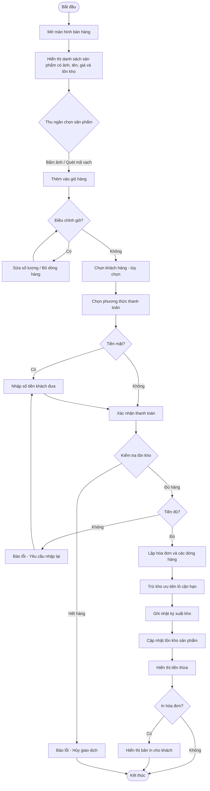

#### Biểu đồ hoạt động chức năng Nhập hàng theo lô

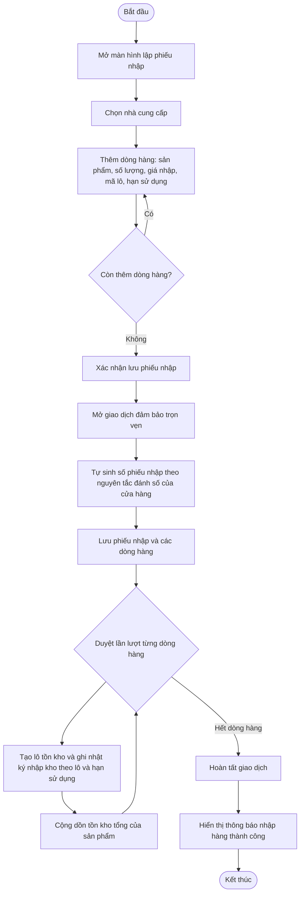

### 2.3.5 Biểu đồ tuần tự

#### Sequence: Bán hàng POS (luồng chính)

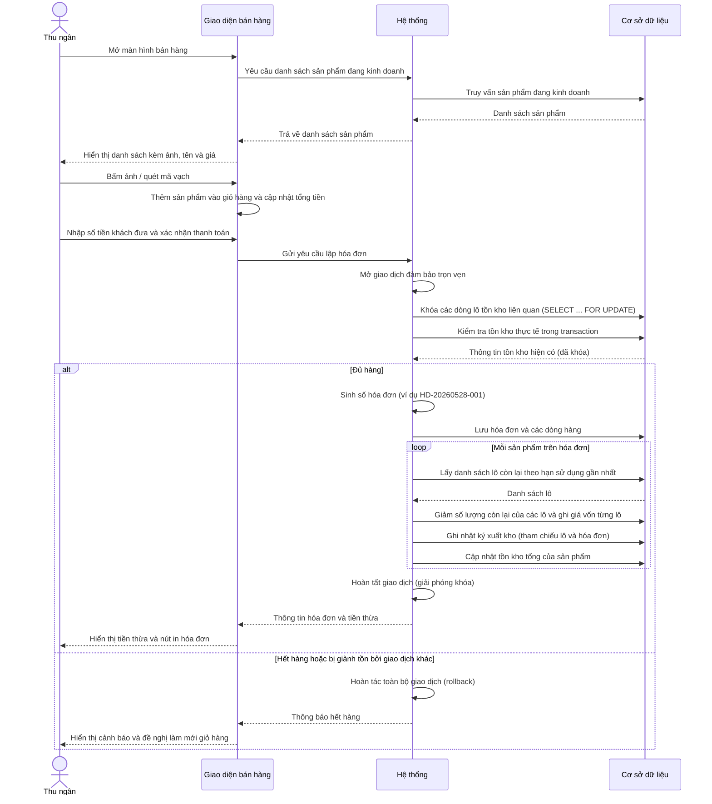

#### Sequence: Upload ảnh sản phẩm

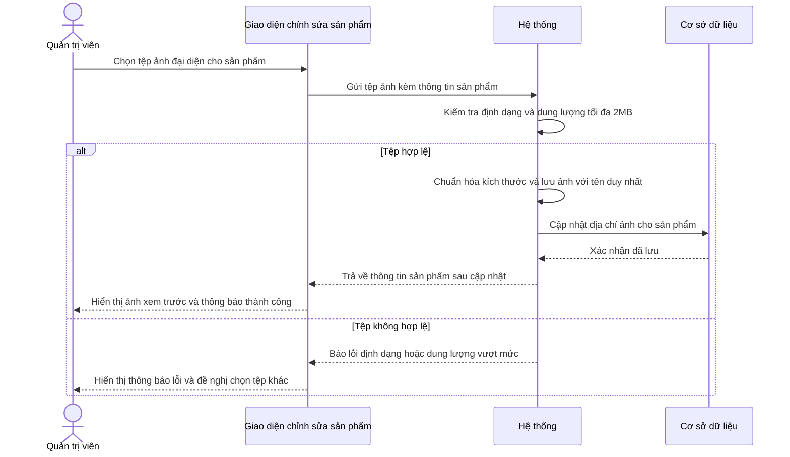

#### Sequence: Đăng nhập vào hệ thống

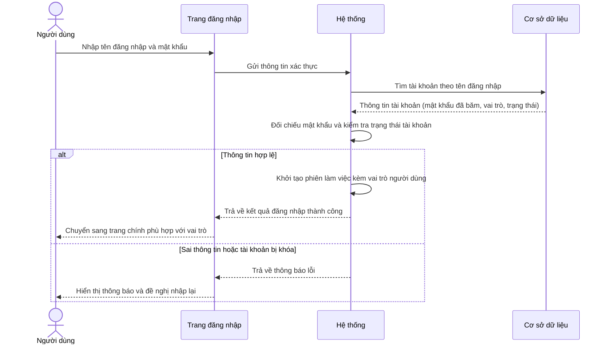

#### Sequence: Nhập hàng theo lô

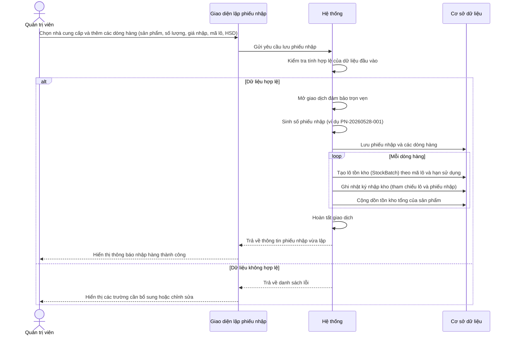

### 2.3.6 Xác định các thực thể trong hệ thống

Hệ thống quản lý tạp hóa bao gồm các thực thể chính sau:

- **Danh mục**: phân loại sản phẩm như đồ uống, bánh kẹo, đồ gia dụng…
- **Sản phẩm**: thông tin từng mặt hàng gồm tên, mã vạch, giá vốn, giá bán, số lượng tồn kho, đơn vị tính và ảnh đại diện hiển thị trên màn hình bán hàng.
- **Khách hàng**: thông tin khách hàng phục vụ việc lập hóa đơn và làm cơ sở cho chương trình tích điểm sau này.
- **Nhà cung cấp**: nguồn cấp hàng cho cửa hàng, sử dụng khi nhập hàng.
- **Lô tồn kho**: từng lô hàng còn trong kho theo nhà cung cấp, kèm mã lô, hạn sử dụng, giá nhập, số lượng nhập ban đầu và số lượng còn lại; là dữ liệu *trạng thái* phục vụ trực tiếp cơ chế xuất kho ưu tiên lô cận hạn (FIFO theo HSD).
- **Hóa đơn**: chứng từ bán hàng tại quầy, có ba trạng thái: tạm chờ, hoàn thành và đã hủy.
- **Chi tiết hóa đơn**: từng dòng hàng trên hóa đơn; ghi lại cả tên sản phẩm và giá vốn tại thời điểm bán để dữ liệu hóa đơn và báo cáo lợi nhuận không bị thay đổi nếu sau đó sản phẩm đổi tên, đổi giá hoặc ngừng kinh doanh.
- **Nhật ký kho**: ghi nhận *lịch sử* mọi biến động kho gồm nhập, xuất, hủy hàng và điều chỉnh tồn; mỗi dòng tham chiếu tới lô tồn kho bị tác động và tới chứng từ liên quan (hóa đơn, phiếu nhập, điều chỉnh) — tách bạch với dữ liệu trạng thái của lô tồn kho.
- **Phiếu nhập hàng và chi tiết phiếu nhập**: ghi nhận lần nhập hàng từ nhà cung cấp cùng các mặt hàng nhập kèm theo; mỗi dòng phiếu nhập sinh ra một lô tồn kho tương ứng.
- **Tài khoản người dùng**: tài khoản đăng nhập của nhân viên cửa hàng (Quản trị viên hoặc Thu ngân), tận dụng thành phần quản lý tài khoản có sẵn của nền tảng phát triển (khóa chính kiểu Guid theo chuẩn ABP Identity).

### 2.3.7 Sơ đồ ERD

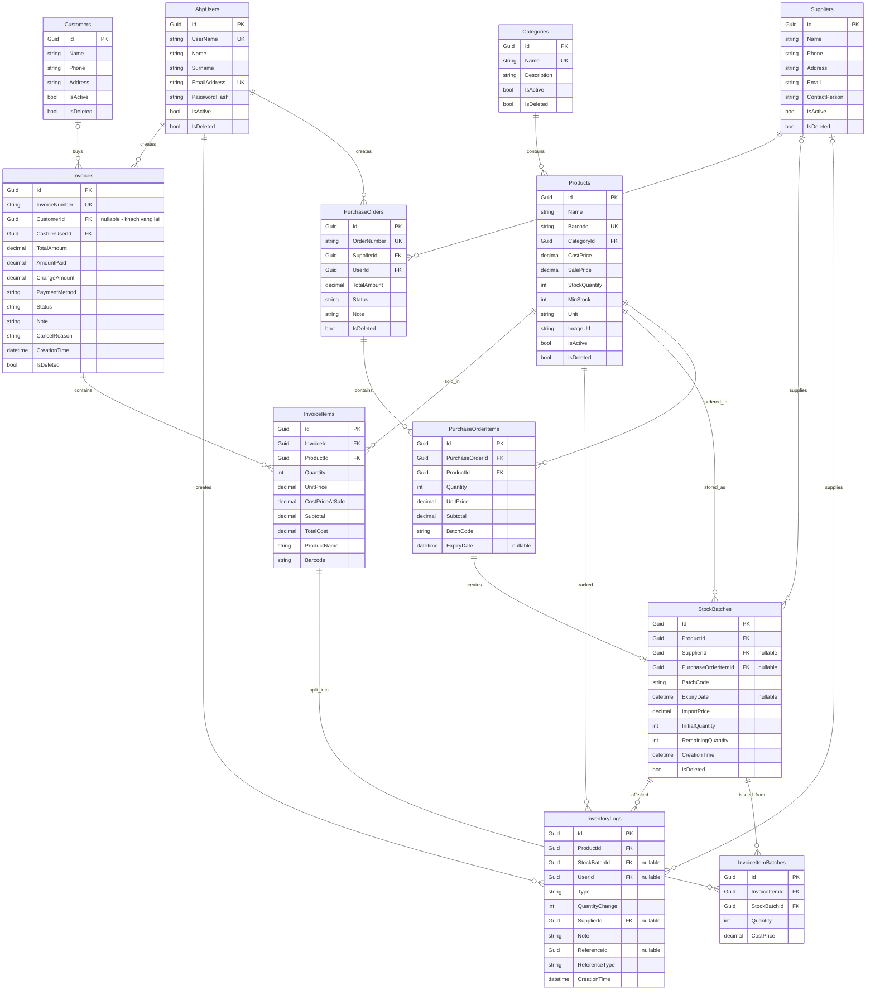

### 2.3.8 Class Diagram

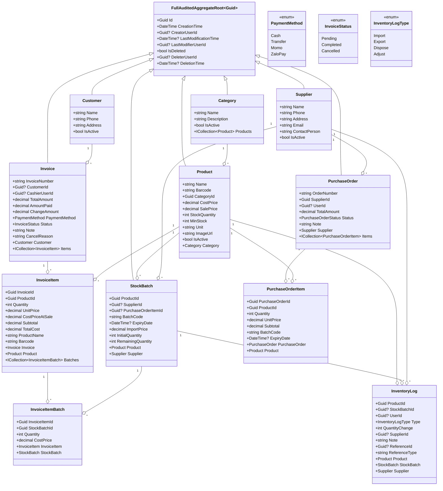

### 2.3.9 State Diagram - Vòng đời hóa đơn

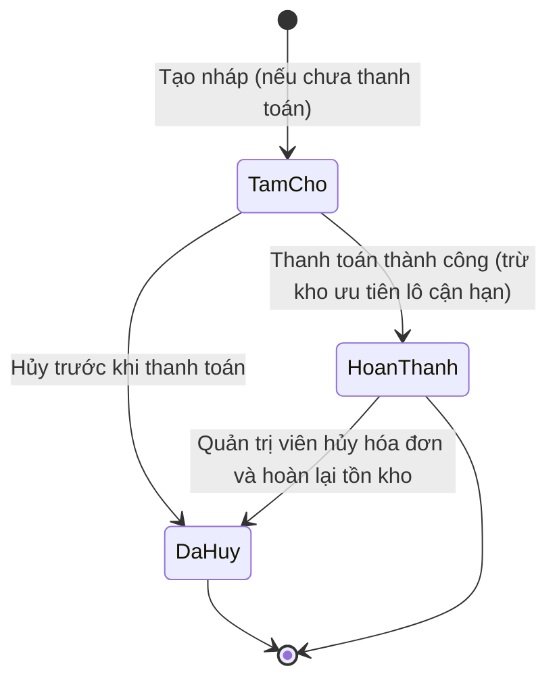

> Trong cách triển khai hiện tại, hóa đơn bán tại quầy được chuyển thẳng sang trạng thái Hoàn thành mà không đi qua trạng thái Tạm chờ, vì thu ngân thu tiền ngay tại quầy. Trạng thái Tạm chờ được giữ lại để sẵn sàng phục vụ nghiệp vụ "đặt hàng trước, thanh toán sau" nếu cửa hàng phát triển dịch vụ này trong tương lai.
>
