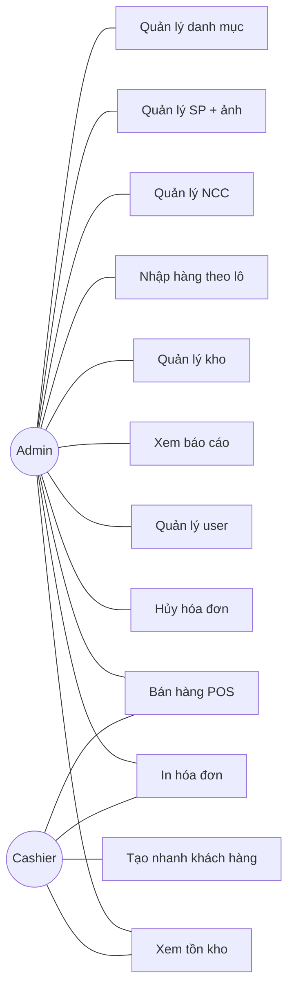
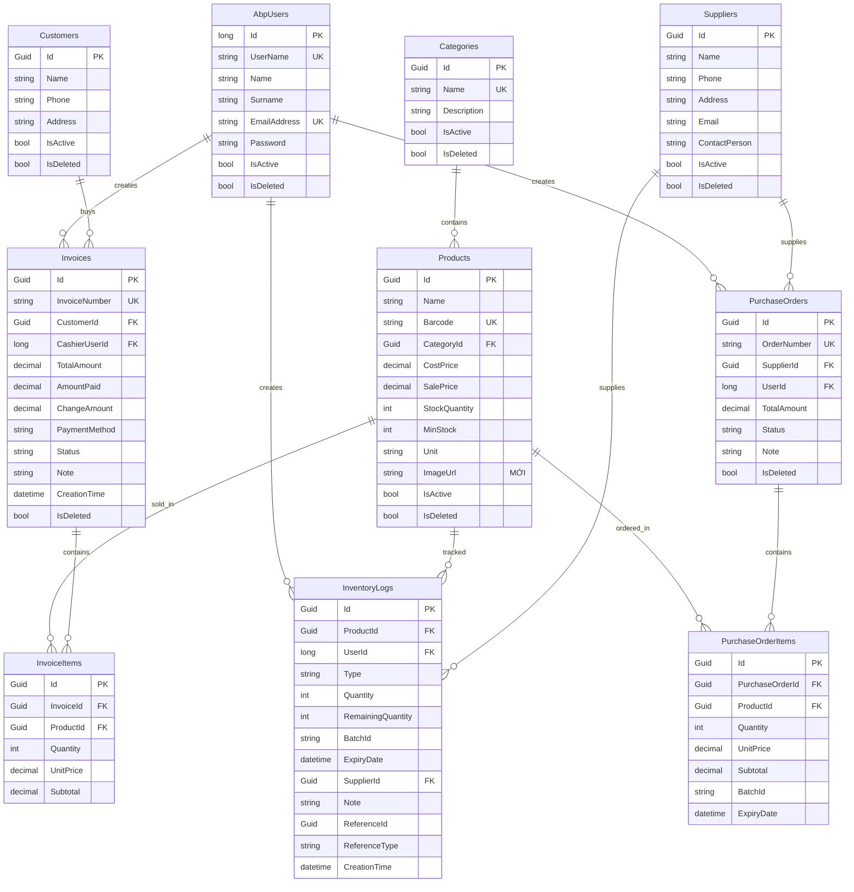
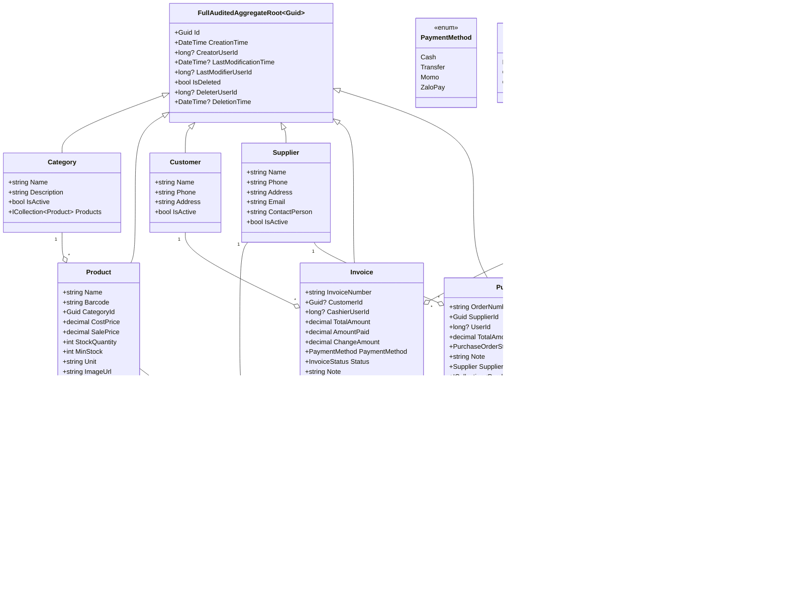
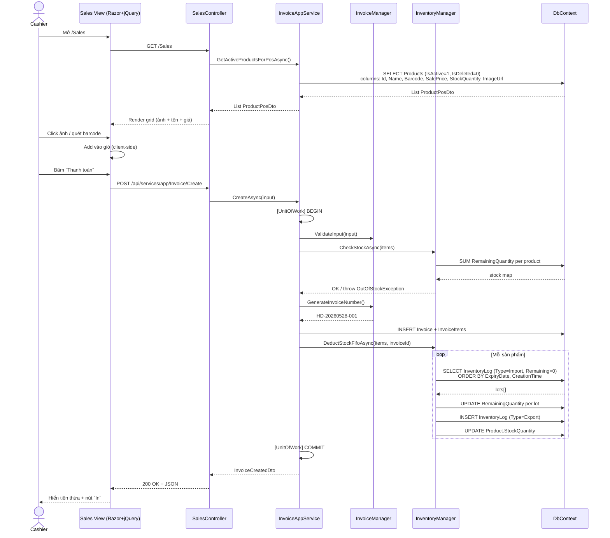
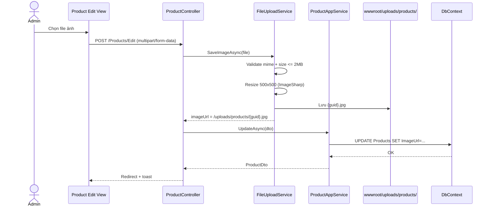
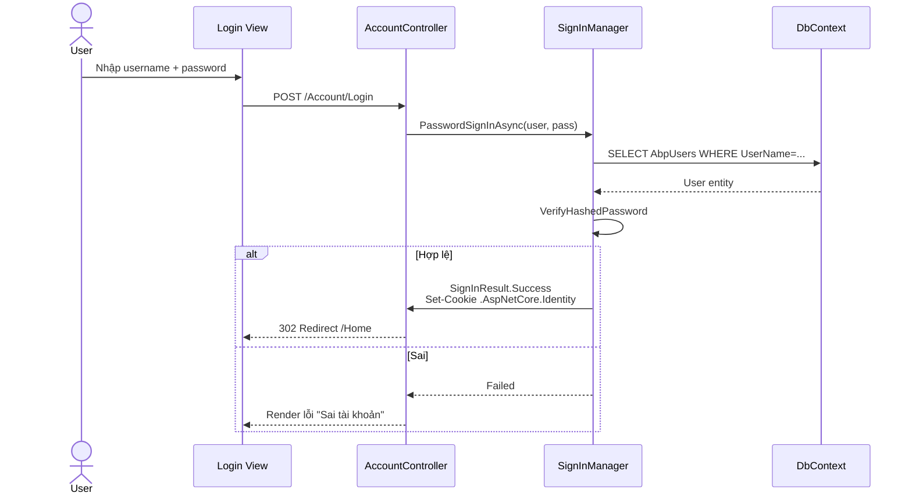
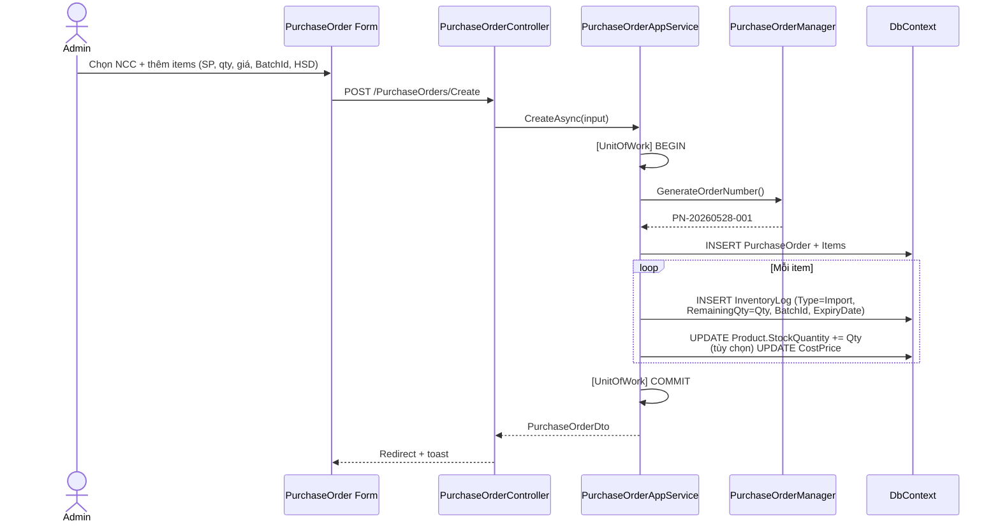
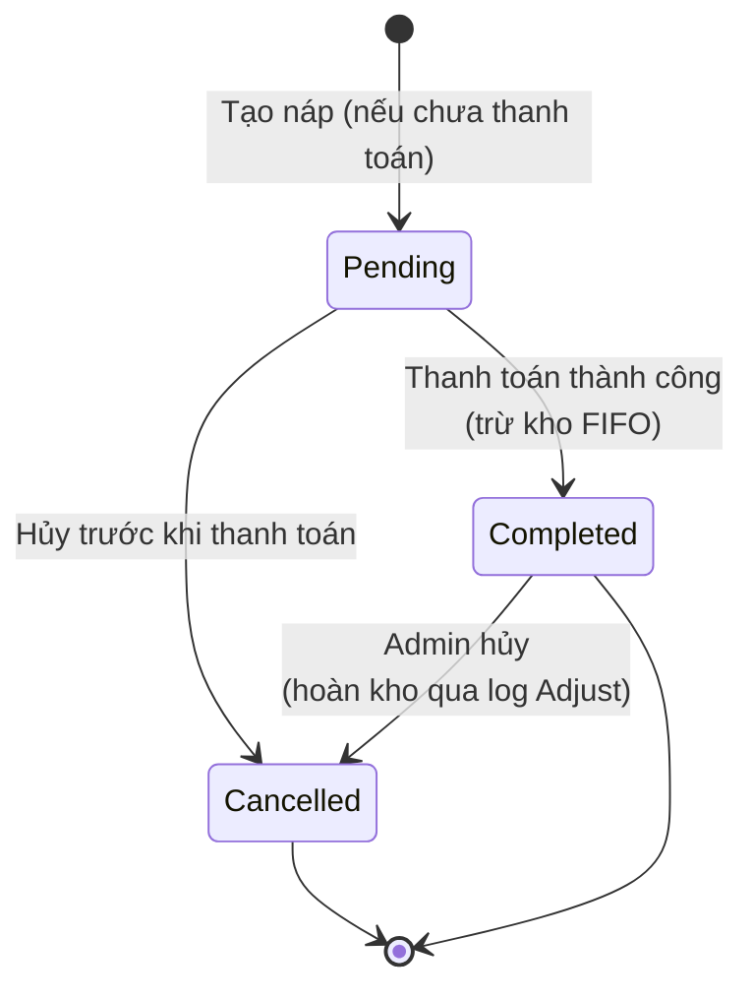

# Phân tích & Thiết kế hệ thống

# Phân tích & Thiết kế hệ thống — InternProject

> Tài liệu cho phần **Phân tích & Thiết kế** trong báo cáo. Đã cập nhật theo yêu cầu: màn POS hiển thị ảnh sản phẩm.
> 

<aside>
🎯

**Quyết định thiết kế cho ảnh sản phẩm**: Chỉ thêm trường `ImageUrl` (string, nullable, max 500) vào entity `Product`. KHÔNG tách bảng `ProductImage` riêng. **Ảnh lưu trên disk** (`wwwroot/uploads/products/`), DB chỉ lưu URL/path.

**Lý do**:
• Mỗi SP chỉ cần 1 ảnh đại diện cho POS — không cần gallery.
• Query nhanh: load grid POS chỉ 1 SELECT, không JOIN.
• Tránh bloat DB (ảnh kiểu BLOB làm bảng to, backup chậm).
• Nếu sau cần nhiều ảnh → mở rộng bằng `ProductImage` table, không phá vỡ schema.

</aside>

---

## I. PHÂN TÍCH YÊU CẦU

### 1.1 Yêu cầu chức năng

| Mã | Yêu cầu | Actor |
| --- | --- | --- |
| FR-01 | Đăng nhập / Đăng xuất | Tất cả |
| FR-02 | Quản lý danh mục (CRUD) | Admin |
| FR-03 | Quản lý sản phẩm + **upload ảnh** | Admin |
| FR-04 | Quản lý khách hàng | Admin, Cashier (tạo nhanh) |
| FR-05 | Quản lý nhà cung cấp | Admin |
| FR-06 | Nhập hàng theo lô + HSD | Admin |
| FR-07 | **Bán hàng POS — hiển thị ảnh + tên + giá** | Admin, Cashier |
| FR-08 | Xuất kho thủ công / Hủy hàng | Admin |
| FR-09 | Kiểm kê kho | Admin |
| FR-10 | Cảnh báo SP sắp hết hàng / hết hạn | Admin |
| FR-11 | Báo cáo doanh thu / lợi nhuận / tồn kho | Admin |
| FR-12 | Hủy hóa đơn + hoàn kho | Admin |
| FR-13 | In hóa đơn | Admin, Cashier |
| FR-14 | Quản lý user + phân quyền | Admin |

### 1.2 Yêu cầu phi chức năng

- **Hiệu năng**: màn POS load < 2s, tạo hóa đơn < 1s.
- **Bảo mật**: RBAC, JWT cho API, Cookie cho UI, Antiforgery cho mọi POST.
- **Ảnh SP**: validate mime + size <= 2MB, resize 500x500 px khi upload (giảm băng thông).
- **Đồ tin cậy**: Transaction cho nghiệp vụ tiền + kho. Soft delete để khôi phục.

---

## II. SƠ ĐỒ USE CASE



### Use Case chi tiết — UC9: Bán hàng POS

| Mục | Nội dung |
| --- | --- |
| **Actor** | Cashier (hoặc Admin) |
| **Mục tiêu** | Lập hóa đơn, thu tiền, in, trừ kho FIFO |
| **Tiền điều kiện** | Đã login, có permission `Sales.CreateInvoice` |
| **Hậu điều kiện** | Invoice = Completed, tồn kho giảm, log Export được ghi |
| **Luồng chính** | 1. Mở /Sales.
2. Hệ thống load **grid SP có ảnh + tên + giá + tồn**.
3. Click ảnh SP / quét barcode → add vào giỏ.
4. Điều chỉnh số lượng / xóa item.
5. (Tùy chọn) chọn khách.
6. Chọn payment method.
7. Nếu Cash: nhập số tiền khách đưa.
8. Bấm "Thanh toán".
9. Hệ thống validate, tạo invoice, trừ kho FIFO, hiển thị tiền thừa.
10. Bấm "In" → render trang in. |
| **Luồng phụ A** | SP hết hàng → báo lỗi, không tạo invoice. |
| **Luồng phụ B** | Tiền khách < tổng → báo lỗi, yêu cầu nhập lại. |
| **Luồng phụ C** | Concurrency: 2 cashier cùng bán SP cuối → 1 bên rollback, hiển "Hết hàng, làm mới". |

---

## III. SƠ ĐỒ ERD (ĐÃ CẬP NHẬT ẢNH SP)



### Điểm mới so với bản cũ

| Bảng | Trường mới | Kiểu | Mô tả |
| --- | --- | --- | --- |
| Products | `ImageUrl` | nvarchar(500) NULL | Đường dẫn tương đối, ví dụ `/uploads/products/{guid}.jpg`. NULL = chưa có ảnh, UI hiển placeholder. |

---

## IV. CLASS DIAGRAM (DOMAIN MODEL)



---

## V. SƠ ĐỒ TUẦN TỰ (SEQUENCE)

### 5.1 Sequence: Bán hàng POS (luồng chính)



### 5.2 Sequence: Upload ảnh sản phẩm



### 5.3 Sequence: Đăng nhập (Cookie cho MVC)



### 5.4 Sequence: Nhập hàng theo lô



---

## VI. STATE DIAGRAM — VÒNG ĐỜI HÓA ĐƠN



> Trong implementation hiện tại, hóa đơn POS tạo thẳng `Completed` (không qua `Pending`) vì thu ngân thanh toán ngay. `Pending` giữ lại để mở rộng cho "đặt hàng trước, trả tiền sau" trong tương lai.
> 

---

## VII. THAY ĐỔI CỤ THỂ TRONG CODE

### 7.1 Entity `Product.cs`

```csharp
public class Product : FullAuditedAggregateRoot<Guid>
{
    public string Name { get; set; }
    public string? Barcode { get; set; }
    public Guid? CategoryId { get; set; }
    public decimal CostPrice { get; set; } = 0;
    public decimal SalePrice { get; set; }
    public int StockQuantity { get; set; } = 0;
    public int MinStock { get; set; } = 10;
    public string Unit { get; set; } = "cái";
    public string? ImageUrl { get; set; }   // MỚI: đường dẫn ảnh đại diện
    public bool IsActive { get; set; } = true;
    public virtual Category Category { get; set; }
}
```

### 7.2 Fluent API trong `InternProjectDbContext`

```csharp
builder.Entity<Product>(b =>
{
    b.Property(x => x.ImageUrl).HasMaxLength(500);
    // ... các cấu hình khác giữ nguyên
});
```

### 7.3 Migration

```
dotnet ef migrations add Add_Product_ImageUrl -p src/InternProject.EntityFrameworkCore -s src/InternProject.Web.Mvc
dotnet ef database update -p src/InternProject.EntityFrameworkCore -s src/InternProject.Web.Mvc
```

### 7.4 DTO cho POS

```csharp
public class ProductPosDto
{
    public Guid Id { get; set; }
    public string Name { get; set; }
    public string? Barcode { get; set; }
    public decimal SalePrice { get; set; }
    public int StockQuantity { get; set; }
    public string Unit { get; set; }
    public string? ImageUrl { get; set; }  // hiển thị trên grid POS
}
```

### 7.5 FileUploadService (Web.Mvc)

```csharp
public class FileUploadService
{
    private readonly IWebHostEnvironment _env;
    private const long MaxSize = 2 * 1024 * 1024;  // 2MB
    private static readonly string[] AllowedMimes = { "image/jpeg", "image/png", "image/webp" };

    public async Task<string> SaveProductImageAsync(IFormFile file)
    {
        if (file.Length > MaxSize) throw new UserFriendlyException("Ảnh quá 2MB");
        if (!AllowedMimes.Contains(file.ContentType)) throw new UserFriendlyException("Định dạng ảnh không hợp lệ");

        var folder = Path.Combine(_env.WebRootPath, "uploads", "products");
        Directory.CreateDirectory(folder);
        var fileName = $"{Guid.NewGuid()}.jpg";
        var fullPath = Path.Combine(folder, fileName);

        // Resize + lưu JPEG bằng SixLabors.ImageSharp
        using var image = await Image.LoadAsync(file.OpenReadStream());
        image.Mutate(x => x.Resize(new ResizeOptions
        {
            Mode = ResizeMode.Max,
            Size = new Size(500, 500)
        }));
        await image.SaveAsJpegAsync(fullPath);

        return $"/uploads/products/{fileName}";
    }
}
```

### 7.6 POS View (snippet hiển grid ảnh)

```html
<div class="row" id="pos-products">
    @foreach (var p in Model.Products)
    {
        <div class="col-md-2 product-tile" data-id="@p.Id" data-price="@p.SalePrice">
            
            <div class="product-name">@p.Name</div>
            <div class="product-price">@p.SalePrice.ToString("N0") đ</div>
            <div class="product-stock">Tồn: @p.StockQuantity @p.Unit</div>
        </div>
    }
</div>
```

---

## VIII. CHECKLIST CHO BÁO CÁO

- [ ]  Vẽ lại Use Case Diagram (mở [draw.io](http://draw.io) / Visual Paradigm theo sơ đồ mermaid ở mục II).
- [ ]  Vẽ lại ERD trong PowerDesigner / MySQL Workbench / [draw.io](http://draw.io) theo mục III.
- [ ]  Vẽ lại Class Diagram theo mục IV.
- [ ]  Vẽ lại 4 Sequence theo mục V (POS, upload ảnh, đăng nhập, nhập hàng).
- [ ]  Vẽ State Diagram hóa đơn theo mục VI.
- [ ]  Viết bảng FR/NFR vào chương "Phân tích yêu cầu".
- [ ]  Thêm screenshot màn POS thực tế có hiển ảnh SP.
- [ ]  Giải thích ngắn tại sao chọn `ImageUrl` thay vì `ProductImage` table (mục đầu trang).

---

<aside>
💡

**Phát biểu nhanh khi thầy hỏi**: *"Em chỉ thêm 1 cột `ImageUrl` vào bảng Products vì mỗi sản phẩm chỉ cần 1 ảnh đại diện cho màn POS. Ảnh được lưu trên disk để tránh phình DB và dễ backup CDN sau này. Khi load màn POS, chỉ một SELECT đã lấy đủ ảnh, không cần JOIN. Nếu sau cần nhiều ảnh / gallery, em sẽ thêm bảng ProductImage 1-N mà không phá vỡ schema hiện tại."*

</aside>